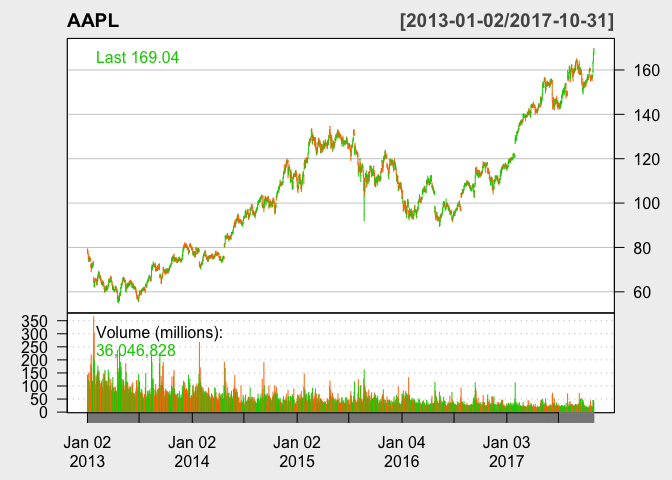
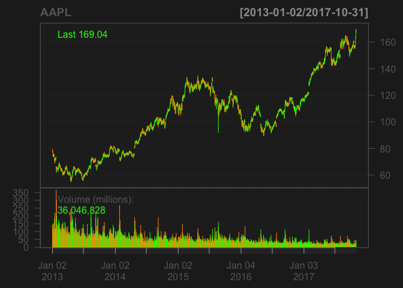
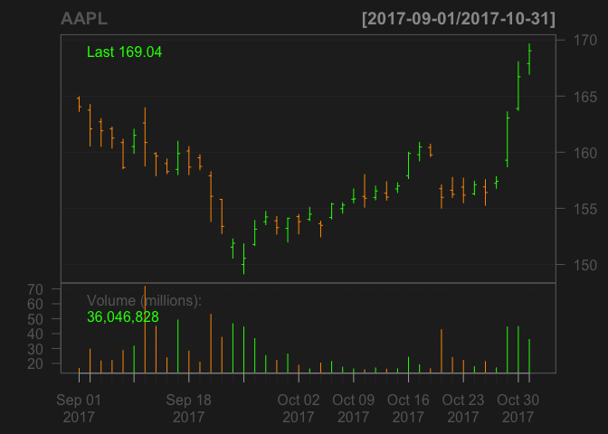
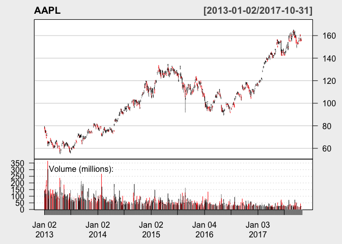
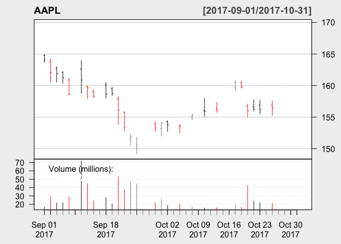
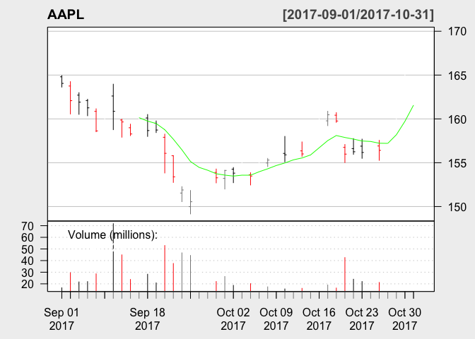
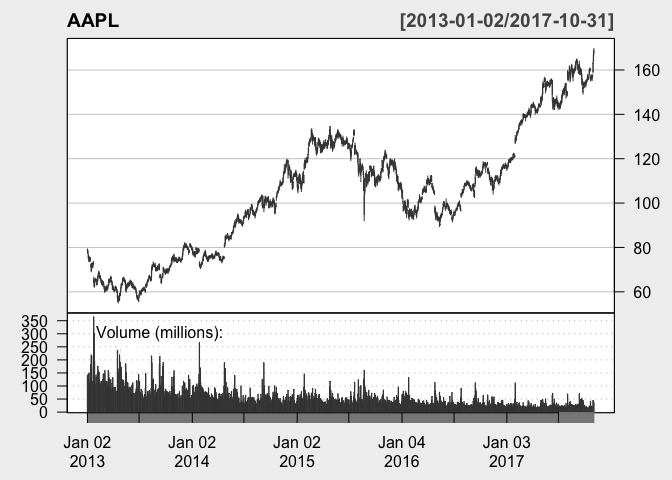
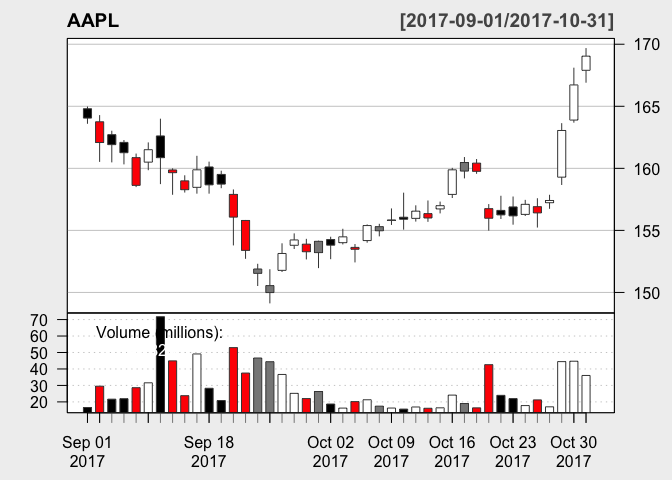
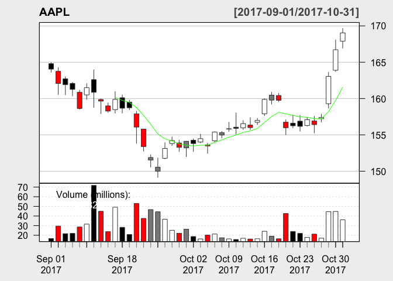

Introduction
------------

This document will provide users with the opportunity to learn about a variety of methods for reading and working with data in R. At the end of this tutorial, the user will have new tools to help tackle the various data sets he or she may encounter while using R. We will try to go above and beyond the scope of 133 and look at lesser-known packages intended for specific kinds of data.

The tutorial is organised into 3 different packages: quantmode, reshape2 and tidyr, followed by a conclusion and references. Each major headline marks the start of a new section.

------------------------------------------------------------------------

1st Package: Quantmod
---------------------

Say you have an interest in working with data related to stocks and the stock market, quantmod would be the package for you.

Run the block below to install and load the package.

``` r
#first download and install 
#install.packages('quantmod')
library(quantmod)
```

    ## Loading required package: xts

    ## Loading required package: zoo

    ## 
    ## Attaching package: 'zoo'

    ## The following objects are masked from 'package:base':
    ## 
    ##     as.Date, as.Date.numeric

    ## Loading required package: TTR

    ## Version 0.4-0 included new data defaults. See ?getSymbols.

Quantmod is now installed and loaded, run the command below to obtain info about apple stock:

-   Note: Here is how the code works: where the AAPL is inserted would be for the NASDAQ abbreviation of the stock you want to look at; while the google src section would be for the source of the stock you wanted, i.e in the case below we are looking at google.

``` r
getSymbols("AAPL",src="google")
```

    ## 'getSymbols' currently uses auto.assign=TRUE by default, but will
    ## use auto.assign=FALSE in 0.5-0. You will still be able to use
    ## 'loadSymbols' to automatically load data. getOption("getSymbols.env")
    ## and getOption("getSymbols.auto.assign") will still be checked for
    ## alternate defaults.
    ## 
    ## This message is shown once per session and may be disabled by setting 
    ## options("getSymbols.warning4.0"=FALSE). See ?getSymbols for details.

    ## [1] "AAPL"

The apple stock information is now loaded in the console, check it out in the code below.

``` r
#see first few lines
head(AAPL)
```

    ##            AAPL.Open AAPL.High AAPL.Low AAPL.Close AAPL.Volume
    ## 2007-01-03     12.33     12.37    11.70      11.97   311433248
    ## 2007-01-04     12.01     12.28    11.97      12.24   214031636
    ## 2007-01-05     12.25     12.31    12.06      12.15   208817119
    ## 2007-01-08     12.28     12.36    12.18      12.21   199431337
    ## 2007-01-09     12.35     13.28    12.16      13.22   838036682
    ## 2007-01-10     13.54     13.97    13.35      13.86   739605951

As you can see, the data frame provides the opening, closing, lowest and highest price of Apple stock from 2007 to today. You can change the date by adding y/m/d in the following form, see an example below:

``` r
# add  from= and to= to set a scope
getSymbols("AAPL",src="google",from="2013-01-01",to ="2017-11-01")
```

    ## [1] "AAPL"

``` r
head(AAPL)
```

    ##            AAPL.Open AAPL.High AAPL.Low AAPL.Close AAPL.Volume
    ## 2013-01-02     79.12     79.29    77.38      78.43   140124866
    ## 2013-01-03     78.27     78.52    77.29      77.44    88240950
    ## 2013-01-04     76.71     76.95    75.12      75.29   148581860
    ## 2013-01-07     74.60     75.60    73.60      74.80   121038176
    ## 2013-01-08     75.60     75.98    74.46      75.04   114676751
    ## 2013-01-09     74.64     75.00    73.71      73.87   101899959

The data frame is no longer showing variables from 2077

Let's look at graphing

``` r
#create a bar chart to take a look at how price has changed over time
barChart(AAPL) 
```


``` r
#Change background to white 
barChart(AAPL,theme="white")
```



Unfortunately, the functionality of the package does not allow the user to add their own individualised x and y axis. However, you can clearly see the x axis representing the date selection chosen, from January 2013 to today. While the y axis displays the price of one stock of Apple at that particular time. The bottom graph represents the volumes sold at each period in time.

You can add functions to the chart to facilitate analysis.

First, you can use the zoom chart function to go into detail on a particular time period.

``` r
barChart(AAPL)
```



``` r
zoomChart("last 2 months") # zoom in to the last two months
```



Notice how the graph now focuses on the time period from September 1 2017 to today, hence the last two months.

A popular tool used by traders is the Weighted Moving Average.Taken from Oanda, a forex trading website, the weighted moving average displays the average price at a given point in time, however, it puts more emphasis on recent data than other moving averages.It does this by assigning values that are linearly weighted to ensure that the most recent rates have a greater impact on the average than older periods.

The weighted moving average allows the person looking at the stock price to get a clearer picture of how the stock has been performing minus all the noise (the ups and downs on a given day) over time. Use the addWMA() to add the Weighted Moving Average to the Apple graph. It should be the light green line you now see on the graph.

``` r
barChart(AAPL,multi.col=TRUE,theme="white") #draw the chart 
```



``` r
zoomChart("last 2 months") #pick certain date range
```



``` r
addWMA() #draw the weighted average curve
```



Notice the use of colour in the graph above, this is achieved through the multi.col=TRUE feature. This feature will colour the bar chart line. The colours give the reader additional insight into the price movements of the stock; red bars reflect that the stock closed on a lower price than the day before. Grey colour reflects that the stock closed on a higher price than the day before. Black colour means that the closing price remained the same as the day before.

In addition to doing a bar chart, you can look at other ways to graph. Try using the candlechart below and compare the results you get.

``` r
candleChart(AAPL,multi.col=TRUE,theme='white')  #draw the chart 
```



``` r
zoomChart("last 2 months") #pick certain date range
```



``` r
addWMA() #draw the weighted average curve
```



The candle chart gives an even more representative picture of the price movements of the stock on a given day. There are four possible combinations of colours: a red filled candlestick, a red hollow candlestick, a black filled candlestick and a black hollow candlestick.

The first thing to do is distinguish between the black and the red, if the closing price on the day is greater than the prior closing price then the candlestick is black. A candlestick is red if the closing price on the day is below the prior closing price.

The hollowness refers to the opening price, for both, if the closing price is greater than the opening price of the day it is hollow.

There are many more functions you can use in quantmod. Check the reference section at the bottom for resources related to different functions you can use and what they mean.

------------------------------------------------------------------------

2nd Package: reshape2
---------------------

This package can be used to reshape and reorganise data sets of all kinds in a more digestible form. Download and load the package below:

``` r
#install.packages('reshape2')
library(reshape2)
```

It includes the two following commands: melt and cast.

The melt function changes data from wide format to a long format.This should be used in a situation where there too many columns with too few variables. The columns you choose are melted into rows. An example of the function can be seen below.

First create a data frame

``` r
#create a data frame to work with
Rank_in_Height <- c(1,2,3,4,5)
Hair_Colour <- c('Black','Grey','Brown','Brown','Blond')
Age <- c(18,17,19,20,21)
Name<- c('Chier','Karl','Shanos','Charles','Condor')

X<- data.frame(Rank_in_Height, Name, Age, Hair_Colour)
X
```

    ##   Rank_in_Height    Name Age Hair_Colour
    ## 1              1   Chier  18       Black
    ## 2              2    Karl  17        Grey
    ## 3              3  Shanos  19       Brown
    ## 4              4 Charles  20       Brown
    ## 5              5  Condor  21       Blond

Next use the melt function,

``` r
# the id variables you include are the columns which you want to keep the same
mt <- melt(X, id=(c('Name','Rank_in_Height')))
```

    ## Warning: attributes are not identical across measure variables; they will
    ## be dropped

``` r
mt
```

    ##       Name Rank_in_Height    variable value
    ## 1    Chier              1         Age    18
    ## 2     Karl              2         Age    17
    ## 3   Shanos              3         Age    19
    ## 4  Charles              4         Age    20
    ## 5   Condor              5         Age    21
    ## 6    Chier              1 Hair_Colour Black
    ## 7     Karl              2 Hair_Colour  Grey
    ## 8   Shanos              3 Hair_Colour Brown
    ## 9  Charles              4 Hair_Colour Brown
    ## 10  Condor              5 Hair_Colour Blond

As seen above, the melt function allows the columns of Age and Hair Colour to melted into the data set, creating significant less clutter column wise.

Another function in the package is the cast function.

Cast is more or less the reverse of melt. There are two version: dcast (returns a data frame as output) and acast (returns a matrix/array). This could be used when you see a variable being repeated over and over again in a column and corresponding to a different variable each time.

Using the data frame we just made, we can reconvert it. Check out the code below.

``` r
# the cast function follows the following format cast(data, formula, function), it has the reverse effect of melt
newmt <- dcast(mt, Name + Rank_in_Height + Age + Hair_Colour ~ variable)
newmt
```

    ##      Name Rank_in_Height Age Hair_Colour Age Hair_Colour
    ## 1 Charles              4  20       Brown  20       Brown
    ## 2   Chier              1  18       Black  18       Black
    ## 3  Condor              5  21       Blond  21       Blond
    ## 4    Karl              2  17        Grey  17        Grey
    ## 5  Shanos              3  19       Brown  19       Brown

------------------------------------------------------------------------

3rd Package: Tidyr
------------------

If you are looking to make the data look more neat and organised, this is the package for you.

Here some functions we will introduce:

gather() – more or less the same as melt from above, gathers columns into value pairs, moves from wide format to long.

spread() – opposite to gather, converts value pair into separate columns.

separate() – Use to split a column into multiple,separate columns.

unite() – reverse of separate

``` r
# first download and install 
#install.packages('tidyr')
library(tidyr)
```

    ## 
    ## Attaching package: 'tidyr'

    ## The following object is masked from 'package:reshape2':
    ## 
    ##     smiths

Use the following dataset to work with tidyr

``` r
#create this dataset
Company_Industry <- c('Healthcare','Transportation','Banking','Hedge Fund','Packaged good')
age_of_company_in_years <- c(18,17,19,20,21)
Revenue_Q1<- c(3,5,12,21,23)
Revenue_Q2<- c(5,15,13,22,21)
Revenue_Q3<- c(10,12,21,32,52)
dat<- data.frame(age_of_company_in_years,Company_Industry, Revenue_Q1,Revenue_Q2,Revenue_Q3)
dat
```

    ##   age_of_company_in_years Company_Industry Revenue_Q1 Revenue_Q2
    ## 1                      18       Healthcare          3          5
    ## 2                      17   Transportation          5         15
    ## 3                      19          Banking         12         13
    ## 4                      20       Hedge Fund         21         22
    ## 5                      21    Packaged good         23         21
    ##   Revenue_Q3
    ## 1         10
    ## 2         12
    ## 3         21
    ## 4         32
    ## 5         52

Here we can use the gather to move the table from a wide to a long format.

-&gt;Note in this function the key refers to the new column you want to form using the columns you are combining, while the value refers to the new column that will be incorperating the variables that used to be in the columns that are now being gathered,check the example if you need further clarification

``` r
#gather function is  gather(data, key, value, ..., na.rm = FALSE, convert = FALSE)
 
long_dat<- dat %>% gather(Quarter, Revenue, Revenue_Q1:Revenue_Q3)
long_dat
```

    ##    age_of_company_in_years Company_Industry    Quarter Revenue
    ## 1                       18       Healthcare Revenue_Q1       3
    ## 2                       17   Transportation Revenue_Q1       5
    ## 3                       19          Banking Revenue_Q1      12
    ## 4                       20       Hedge Fund Revenue_Q1      21
    ## 5                       21    Packaged good Revenue_Q1      23
    ## 6                       18       Healthcare Revenue_Q2       5
    ## 7                       17   Transportation Revenue_Q2      15
    ## 8                       19          Banking Revenue_Q2      13
    ## 9                       20       Hedge Fund Revenue_Q2      22
    ## 10                      21    Packaged good Revenue_Q2      21
    ## 11                      18       Healthcare Revenue_Q3      10
    ## 12                      17   Transportation Revenue_Q3      12
    ## 13                      19          Banking Revenue_Q3      21
    ## 14                      20       Hedge Fund Revenue_Q3      32
    ## 15                      21    Packaged good Revenue_Q3      52

Notice how gather is similar to melt.

Spread does the opposite.You can use spread when an observation is scattered across multiple rows. Using long\_dat from above,we can see that there is a repetition of variables Revenue\_Q1, Revenue\_Q2 and Revenue\_Q3 in the column Quarter.

Let's create individualised columns for these values.

-&gt; Note: 'key' is the column where you see the repetition and 'value' is the column with the values that you want to populate your new columns

``` r
short_dat<- spread(long_dat, key = Quarter, value = Revenue)
short_dat
```

    ##   age_of_company_in_years Company_Industry Revenue_Q1 Revenue_Q2
    ## 1                      17   Transportation          5         15
    ## 2                      18       Healthcare          3          5
    ## 3                      19          Banking         12         13
    ## 4                      20       Hedge Fund         21         22
    ## 5                      21    Packaged good         23         21
    ##   Revenue_Q3
    ## 1         12
    ## 2         10
    ## 3         21
    ## 4         32
    ## 5         52

The next two functions of tidyr are especially relevant when dealing with time.

When we encounter a variable containing a combination of date and time, we can use the separate function to split the variable into columns. Refer to the example below:

-&gt; Note, here is how you use separate separate(Column you want to separate, c('Column you want to form', 'Column you want to form','Column you want to form') Sep=how you want to identify the separation)

``` r
#create a data set
Temperature_in_Celsius <- c(-5, 4, 32, 23, 35, 16)
Height_of_Tree_in_m <- c(0.5, 1, 2, 10, 2, 20)
Time_Measure <- c("01/22/2015","02/02/2015", "03/03/2015", "04/01/2015", "05/02/2015", "06/01/2015")

#note that the Time_Measure column contains month, day and year all combined 

#build a data frame
d_treestuff <- data.frame(Temperature_in_Celsius,Height_of_Tree_in_m, Time_Measure)

#using separate function we can separate date, month, year into each of their own columns 

sep_dat <- d_treestuff %>% separate(Time_Measure, c('Month', 'Date','Year'), sep = "/")
sep_dat
```

    ##   Temperature_in_Celsius Height_of_Tree_in_m Month Date Year
    ## 1                     -5                 0.5    01   22 2015
    ## 2                      4                 1.0    02   02 2015
    ## 3                     32                 2.0    03   03 2015
    ## 4                     23                10.0    04   01 2015
    ## 5                     35                 2.0    05   02 2015
    ## 6                     16                20.0    06   01 2015

If you want to combine multiple columns into one, use the unite function

-&gt; Note here is how you use unite unite\_(your dataset , "new column name", c("column1 you want to combine ","column 2 you want to combine"),sep = " however you want to separate the values")

``` r
#using the previous dataset
sep_dat
```

    ##   Temperature_in_Celsius Height_of_Tree_in_m Month Date Year
    ## 1                     -5                 0.5    01   22 2015
    ## 2                      4                 1.0    02   02 2015
    ## 3                     32                 2.0    03   03 2015
    ## 4                     23                10.0    04   01 2015
    ## 5                     35                 2.0    05   02 2015
    ## 6                     16                20.0    06   01 2015

``` r
unite_(sep_dat, "Date",c('Month', 'Date','Year'),sep = " ")
```

    ##   Temperature_in_Celsius Height_of_Tree_in_m       Date
    ## 1                     -5                 0.5 01 22 2015
    ## 2                      4                 1.0 02 02 2015
    ## 3                     32                 2.0 03 03 2015
    ## 4                     23                10.0 04 01 2015
    ## 5                     35                 2.0 05 02 2015
    ## 6                     16                20.0 06 01 2015

Conclusion
==========

As the user can see,the packages I have outlined can be used for different datasets at different times. If you are dealing with stocks, quantmod would be optimal. If you are dealing with vast amounts of repetitive variables all trapped in a long column, or clunky information especially related to time and date, the reshape2 and tidyr packages may helpful to gain some clarity. Always remember to go back to basics first with ggplot and dplyr, but know that quantmode, reshape2 and tidyr can be used to supplement your manipulation.

References
==========

Quantmod

“Quantmod: Graphing.” Quantmod: Examples :: Charting, Quantmod , www.quantmod.com/examples/charting/.

“Package ‘Quantmod.’” 6 Oct. 2017, www.cran.r-project.org/web/packages/quantmod/quantmod.pdf.

“GET STARTED MOVING AVERAGE.” OANDA, www.oanda.com/forex-trading/learn/trading-tools-strategies/moving-averages.

Tidyr

Team, Analytics Vidhya Content, et al. “Do Faster Data Manipulation Using These 7 R Packages.” Analytics Vidhya, 16 Feb. 2016, www.analyticsvidhya.com/blog/2015/12/faster-data-manipulation-7-packages/.

“Introducing Tidyr.” RStudio Blog, RStudio Blog, www.blog.rstudio.com/2014/07/22/introducing-tidyr/.

Reshape2

Anderson, Sean. “An Introduction to reshape2.” An Introduction to reshape2, www.seananderson.ca/2013/10/19/reshape.html.

“Package ‘Reshape2.’”22 Oct. 2017,<https://cran.r-project.org/web/packages/reshape2/reshape2.pdf>

Comparing Reshape2 vs Tidyr

Giudici, Alberto. How to Reshape Data in R: Tidyr vs reshape2. 20 June 2016, www.milanor.net/blog/reshape-data-r-tidyr-vs-reshape2/.
