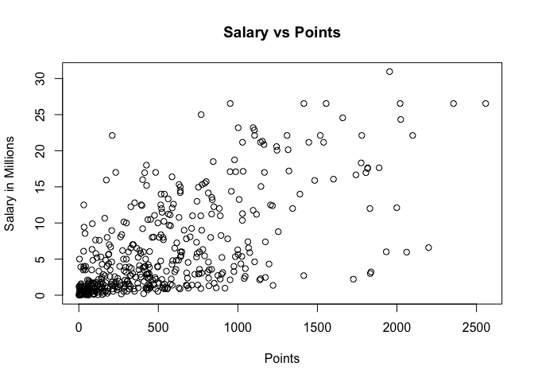
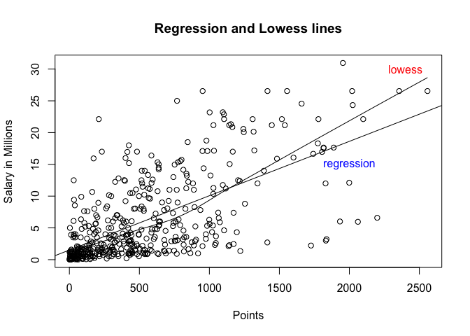
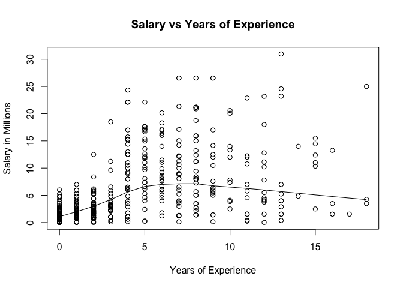
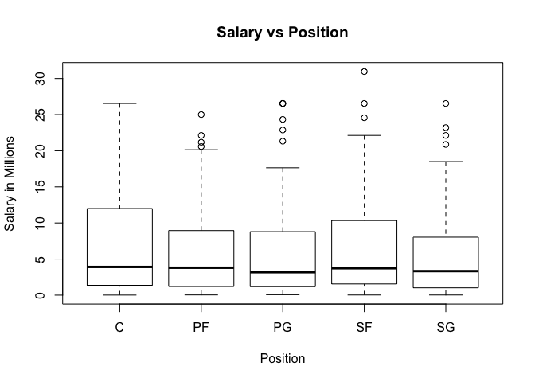

hw01-Olivier-Damas
================
Olivier Damas

This is an [R Markdown](http://rmarkdown.rstudio.com) Notebook. When you execute code within the notebook, the results appear beneath the code.

Try executing this chunk by clicking the *Run* button within the chunk or by placing your cursor inside it and pressing *Cmd+Shift+Enter*. \# download RData file into your working directory

``` r
# load data in your R session
load("/Users/macbookpro/stat133/stat133-hws-fall17/hw01/data/nba2017-salary-points.RData")
#head(player)
```

``` r
salary <- salary/1000000
salary <- round(salary, digits=2)
salary
```

    ##   [1] 26.54 12.00  8.27  1.45  1.41  6.59  6.29  1.83  4.74  5.00  1.22
    ##  [12]  3.09  3.58  1.91  8.00  7.81  0.02  0.26  0.27  0.01  9.70 12.80
    ##  [23]  1.55  0.54 21.17  5.24 17.64 30.96  2.50 15.33  1.59  7.33  1.58
    ##  [34] 26.54 14.20  0.54  2.70 14.38 12.00  1.92  0.87  5.30  1.20  6.05
    ##  [45] 12.25  3.73 22.12  1.20  1.19  0.54 15.94  5.00 16.96 12.00  7.40
    ##  [56]  5.89  0.54  2.87  3.39  1.50  2.71 23.18  8.40  0.39 15.73  4.00
    ##  [67]  2.50  4.84  1.02 20.07  0.42  3.85  2.28  3.00 17.10  5.37  1.55
    ##  [78] 12.52 15.20  0.92  9.61  1.40 10.50  1.81  6.35  2.57  2.37  2.70
    ##  [89] 10.23  4.58  0.65  8.80  1.05  1.80  4.00  4.00 10.77  2.46 18.31
    ## [100]  1.05 14.15  3.49  1.45  2.11  0.87  2.09 23.20  1.02  1.64 17.55
    ## [111]  1.71  3.18  5.78  0.75 14.00 13.22  2.90 15.89 22.12  4.00  5.78
    ## [122]  0.87  2.59  1.23  0.21  0.54  5.63  4.00  6.00  1.02 22.12  6.50
    ## [133]  1.55  7.00  0.87  1.70  6.00 10.99  3.68  4.62  0.65  2.26 14.96
    ## [144]  2.97 17.20  1.05  0.10  0.87  5.32  2.73  6.51  0.16 12.00  6.33
    ## [155] 12.25 13.00 12.50 20.87  6.00  0.54 24.56  0.14 11.24 21.32 17.00
    ## [166]  1.02  4.32  3.90  6.19  0.54  0.54  2.90  0.54  1.41  1.38  4.35
    ## [177] 17.00  5.00  7.25  0.98  2.61 17.00 15.00  6.54  0.03  3.91 11.75
    ## [188]  0.03  0.95 10.00  0.03  2.32  9.00  4.79  9.42  4.83  1.51  2.99
    ## [199]  1.03  1.02  8.00  0.09  0.87  8.55  1.33  6.09  0.12 21.17  1.56
    ## [210]  1.07 11.48  0.98  3.00  3.33  1.79  2.50  1.40  0.98  0.73  9.25
    ## [221] 11.13  1.17  1.55 15.33  1.02  0.98  1.40 26.54  1.18 16.66  0.38
    ## [232]  0.54  5.78 12.11  2.90  0.54 10.00  1.55  0.54  1.18  2.90  0.17
    ## [243]  0.87 17.64  1.19 20.58 14.00  3.58 15.50 14.45  0.68  0.54  1.30
    ## [254] 12.39  0.26 26.54  0.54  7.00  1.00  6.00 18.74  1.72  7.81  0.15
    ## [265]  1.32 11.00 20.14  1.55  1.27 22.87 21.17  0.54  7.38 13.25  2.20
    ## [276]  1.40  3.50  1.55  5.63 10.15  7.00  3.94 11.05  8.00 16.07  1.02
    ## [287]  2.25 11.00  0.60  0.94  1.41  2.12  2.43  2.34  5.99  2.18  2.44
    ## [298]  2.48 17.15  0.98  1.19  4.84  3.75  0.25 26.54  0.54  3.14  8.95
    ## [309]  6.55  0.94  5.70 22.12  1.37  2.90  0.98  1.29 21.17 26.54  5.51
    ## [320]  3.33  4.26  1.79  0.08 10.36  7.68 18.50  3.22 24.33  6.67 16.39
    ## [331]  0.60  1.92  8.99  9.21  2.75  0.87  1.35  0.54 15.05  8.07  3.24
    ## [342]  1.66  3.21  4.54  1.99 12.08  1.63  2.33  3.50  1.36  5.00  3.53
    ## [353] 11.20  4.60 22.12  0.02  0.54  2.98 16.96  0.58  8.08  0.17 11.29
    ## [364]  9.90  0.06 11.24  2.09  0.65  1.02  4.23 25.00  0.54  8.38 22.12
    ## [375]  4.10  0.06  4.38  0.54  0.87  2.90 17.10  0.21  8.00 12.50  4.01
    ## [386]  3.52  5.23  8.00  2.20  8.05  5.20  1.44 13.33  1.19  1.32 10.66
    ## [397]  3.55  2.02  6.01  3.50  7.64  2.35  3.91  5.96  3.87  3.80  0.14
    ## [408] 13.55  3.05  1.34  2.24  5.28  7.60  5.33  0.07  1.03 12.50  3.27
    ## [419]  1.21 18.00  1.55  5.44  6.19  1.05 16.00  1.73  0.87  4.82 12.61
    ## [430]  0.54  2.22  4.28  0.02 14.00 10.47  4.00  2.94  0.28  2.13  0.92
    ## [441] 12.41

``` r
experience <- replace(experience,  experience=="R" , 0)
experience 
```

    ##   [1] "9"  "11" "6"  "0"  "9"  "5"  "4"  "2"  "0"  "6"  "1"  "3"  "2"  "1" 
    ##  [15] "4"  "10" "12" "11" "5"  "1"  "5"  "12" "13" "0"  "8"  "13" "5"  "13"
    ##  [29] "15" "5"  "2"  "5"  "1"  "7"  "7"  "0"  "0"  "4"  "10" "2"  "1"  "5" 
    ##  [43] "0"  "6"  "7"  "2"  "4"  "7"  "1"  "0"  "8"  "8"  "6"  "9"  "5"  "3" 
    ##  [57] "0"  "0"  "3"  "0"  "3"  "12" "8"  "11" "4"  "12" "0"  "14" "3"  "10"
    ##  [71] "3"  "10" "3"  "3"  "6"  "2"  "17" "4"  "4"  "0"  "3"  "8"  "4"  "1" 
    ##  [85] "9"  "0"  "3"  "8"  "12" "11" "0"  "7"  "1"  "6"  "6"  "5"  "11" "1" 
    ##  [99] "6"  "1"  "9"  "8"  "1"  "1"  "1"  "0"  "13" "3"  "1"  "5"  "2"  "3" 
    ## [113] "2"  "0"  "10" "8"  "4"  "8"  "4"  "7"  "9"  "1"  "1"  "6"  "0"  "0" 
    ## [127] "2"  "13" "7"  "1"  "4"  "4"  "12" "1"  "1"  "0"  "6"  "5"  "3"  "5" 
    ## [141] "0"  "3"  "5"  "1"  "5"  "4"  "1"  "1"  "3"  "1"  "4"  "2"  "5"  "9" 
    ## [155] "11" "4"  "4"  "8"  "9"  "0"  "13" "0"  "8"  "7"  "9"  "3"  "1"  "4" 
    ## [169] "5"  "0"  "0"  "0"  "0"  "9"  "0"  "2"  "5"  "9"  "8"  "2"  "2"  "4" 
    ## [183] "8"  "7"  "0"  "1"  "5"  "0"  "0"  "4"  "0"  "0"  "7"  "1"  "8"  "0" 
    ## [197] "1"  "2"  "1"  "3"  "4"  "0"  "1"  "6"  "0"  "4"  "3"  "8"  "0"  "0" 
    ## [211] "6"  "2"  "2"  "2"  "4"  "10" "1"  "2"  "2"  "6"  "12" "0"  "13" "4" 
    ## [225] "3"  "2"  "8"  "9"  "1"  "5"  "13" "0"  "11" "7"  "13" "0"  "7"  "11"
    ## [239] "0"  "0"  "3"  "9"  "1"  "5"  "2"  "10" "14" "7"  "15" "15" "2"  "0" 
    ## [253] "2"  "8"  "0"  "7"  "0"  "11" "1"  "4"  "8"  "1"  "12" "0"  "7"  "4" 
    ## [267] "6"  "11" "0"  "11" "8"  "0"  "10" "16" "8"  "8"  "18" "11" "6"  "5" 
    ## [281] "13" "1"  "6"  "8"  "6"  "3"  "2"  "15" "0"  "1"  "2"  "3"  "5"  "1" 
    ## [295] "0"  "3"  "0"  "2"  "5"  "2"  "1"  "4"  "12" "5"  "8"  "0"  "3"  "7" 
    ## [309] "3"  "0"  "8"  "5"  "0"  "2"  "2"  "1"  "8"  "9"  "12" "3"  "18" "0" 
    ## [323] "0"  "15" "6"  "3"  "3"  "4"  "6"  "6"  "0"  "2"  "4"  "4"  "2"  "1" 
    ## [337] "2"  "0"  "7"  "7"  "1"  "2"  "0"  "12" "0"  "5"  "0"  "3"  "16" "1" 
    ## [351] "8"  "4"  "8"  "6"  "4"  "1"  "0"  "7"  "6"  "4"  "5"  "4"  "7"  "6" 
    ## [365] "0"  "3"  "2"  "0"  "3"  "12" "18" "0"  "2"  "4"  "10" "0"  "2"  "0" 
    ## [379] "1"  "3"  "7"  "0"  "8"  "9"  "3"  "0"  "7"  "6"  "0"  "8"  "2"  "0" 
    ## [393] "10" "0"  "7"  "7"  "1"  "2"  "2"  "8"  "6"  "3"  "7"  "1"  "0"  "1" 
    ## [407] "7"  "5"  "3"  "1"  "2"  "0"  "9"  "1"  "0"  "0"  "2"  "2"  "1"  "12"
    ## [421] "16" "9"  "2"  "4"  "6"  "2"  "1"  "3"  "5"  "0"  "1"  "0"  "2"  "6" 
    ## [435] "9"  "13" "0"  "11" "2"  "0"  "15"

``` r
as.numeric(experience)
```

    ##   [1]  9 11  6  0  9  5  4  2  0  6  1  3  2  1  4 10 12 11  5  1  5 12 13
    ##  [24]  0  8 13  5 13 15  5  2  5  1  7  7  0  0  4 10  2  1  5  0  6  7  2
    ##  [47]  4  7  1  0  8  8  6  9  5  3  0  0  3  0  3 12  8 11  4 12  0 14  3
    ##  [70] 10  3 10  3  3  6  2 17  4  4  0  3  8  4  1  9  0  3  8 12 11  0  7
    ##  [93]  1  6  6  5 11  1  6  1  9  8  1  1  1  0 13  3  1  5  2  3  2  0 10
    ## [116]  8  4  8  4  7  9  1  1  6  0  0  2 13  7  1  4  4 12  1  1  0  6  5
    ## [139]  3  5  0  3  5  1  5  4  1  1  3  1  4  2  5  9 11  4  4  8  9  0 13
    ## [162]  0  8  7  9  3  1  4  5  0  0  0  0  9  0  2  5  9  8  2  2  4  8  7
    ## [185]  0  1  5  0  0  4  0  0  7  1  8  0  1  2  1  3  4  0  1  6  0  4  3
    ## [208]  8  0  0  6  2  2  2  4 10  1  2  2  6 12  0 13  4  3  2  8  9  1  5
    ## [231] 13  0 11  7 13  0  7 11  0  0  3  9  1  5  2 10 14  7 15 15  2  0  2
    ## [254]  8  0  7  0 11  1  4  8  1 12  0  7  4  6 11  0 11  8  0 10 16  8  8
    ## [277] 18 11  6  5 13  1  6  8  6  3  2 15  0  1  2  3  5  1  0  3  0  2  5
    ## [300]  2  1  4 12  5  8  0  3  7  3  0  8  5  0  2  2  1  8  9 12  3 18  0
    ## [323]  0 15  6  3  3  4  6  6  0  2  4  4  2  1  2  0  7  7  1  2  0 12  0
    ## [346]  5  0  3 16  1  8  4  8  6  4  1  0  7  6  4  5  4  7  6  0  3  2  0
    ## [369]  3 12 18  0  2  4 10  0  2  0  1  3  7  0  8  9  3  0  7  6  0  8  2
    ## [392]  0 10  0  7  7  1  2  2  8  6  3  7  1  0  1  7  5  3  1  2  0  9  1
    ## [415]  0  0  2  2  1 12 16  9  2  4  6  2  1  3  5  0  1  0  2  6  9 13  0
    ## [438] 11  2  0 15

``` r
class(experience)
```

    ## [1] "character"

``` r
typeof(experience)
```

    ## [1] "character"

``` r
factor(position, labels = c("center","power_fwd","point_guard","small_fwd","shoot_guard"))
```

    ##   [1] center      power_fwd   shoot_guard point_guard small_fwd  
    ##   [6] point_guard small_fwd   shoot_guard small_fwd   power_fwd  
    ##  [11] power_fwd   center      shoot_guard point_guard center     
    ##  [16] center      small_fwd   point_guard power_fwd   center     
    ##  [21] shoot_guard shoot_guard small_fwd   point_guard power_fwd  
    ##  [26] shoot_guard point_guard small_fwd   small_fwd   center     
    ##  [31] small_fwd   shoot_guard point_guard shoot_guard small_fwd  
    ##  [36] point_guard center      center      point_guard center     
    ##  [41] shoot_guard small_fwd   power_fwd   power_fwd   power_fwd  
    ##  [46] small_fwd   shoot_guard point_guard power_fwd   center     
    ##  [51] center      center      point_guard center      power_fwd  
    ##  [56] small_fwd   shoot_guard shoot_guard point_guard small_fwd  
    ##  [61] point_guard center      power_fwd   point_guard small_fwd  
    ##  [66] power_fwd   point_guard small_fwd   center      power_fwd  
    ##  [71] power_fwd   small_fwd   shoot_guard small_fwd   center     
    ##  [76] power_fwd   shoot_guard center      small_fwd   shoot_guard
    ##  [81] point_guard power_fwd   power_fwd   shoot_guard power_fwd  
    ##  [86] center      shoot_guard point_guard center      small_fwd  
    ##  [91] power_fwd   point_guard point_guard power_fwd   shoot_guard
    ##  [96] power_fwd   shoot_guard center      small_fwd   power_fwd  
    ## [101] power_fwd   shoot_guard power_fwd   point_guard center     
    ## [106] shoot_guard shoot_guard shoot_guard point_guard small_fwd  
    ## [111] center      point_guard power_fwd   small_fwd   point_guard
    ## [116] center      shoot_guard point_guard center      power_fwd  
    ## [121] power_fwd   shoot_guard small_fwd   small_fwd   power_fwd  
    ## [126] shoot_guard point_guard center      shoot_guard center     
    ## [131] center      center      point_guard center      shoot_guard
    ## [136] power_fwd   point_guard power_fwd   shoot_guard small_fwd  
    ## [141] shoot_guard small_fwd   point_guard small_fwd   power_fwd  
    ## [146] point_guard point_guard power_fwd   power_fwd   center     
    ## [151] shoot_guard power_fwd   point_guard shoot_guard power_fwd  
    ## [156] small_fwd   center      shoot_guard point_guard shoot_guard
    ## [161] small_fwd   point_guard shoot_guard point_guard center     
    ## [166] shoot_guard power_fwd   center      power_fwd   center     
    ## [171] power_fwd   small_fwd   shoot_guard shoot_guard center     
    ## [176] small_fwd   center      point_guard point_guard small_fwd  
    ## [181] point_guard shoot_guard power_fwd   shoot_guard shoot_guard
    ## [186] small_fwd   center      shoot_guard center      small_fwd  
    ## [191] power_fwd   power_fwd   shoot_guard center      point_guard
    ## [196] center      small_fwd   shoot_guard center      small_fwd  
    ## [201] point_guard center      point_guard center      small_fwd  
    ## [206] power_fwd   shoot_guard center      small_fwd   point_guard
    ## [211] point_guard shoot_guard center      small_fwd   power_fwd  
    ## [216] shoot_guard small_fwd   shoot_guard point_guard power_fwd  
    ## [221] small_fwd   center      center      power_fwd   shoot_guard
    ## [226] power_fwd   center      small_fwd   center      shoot_guard
    ## [231] small_fwd   shoot_guard point_guard point_guard center     
    ## [236] shoot_guard shoot_guard power_fwd   power_fwd   point_guard
    ## [241] center      center      shoot_guard small_fwd   shoot_guard
    ## [246] power_fwd   shoot_guard point_guard center      point_guard
    ## [251] point_guard center      center      shoot_guard point_guard
    ## [256] point_guard power_fwd   shoot_guard center      shoot_guard
    ## [261] power_fwd   small_fwd   small_fwd   small_fwd   small_fwd  
    ## [266] shoot_guard power_fwd   power_fwd   power_fwd   point_guard
    ## [271] center      center      shoot_guard shoot_guard small_fwd  
    ## [276] center      small_fwd   point_guard small_fwd   shoot_guard
    ## [281] power_fwd   point_guard power_fwd   point_guard small_fwd  
    ## [286] center      small_fwd   small_fwd   power_fwd   point_guard
    ## [291] shoot_guard center      point_guard power_fwd   shoot_guard
    ## [296] small_fwd   power_fwd   small_fwd   center      small_fwd  
    ## [301] power_fwd   small_fwd   power_fwd   point_guard point_guard
    ## [306] point_guard center      power_fwd   shoot_guard point_guard
    ## [311] power_fwd   small_fwd   center      small_fwd   power_fwd  
    ## [316] power_fwd   center      point_guard shoot_guard shoot_guard
    ## [321] small_fwd   point_guard shoot_guard power_fwd   small_fwd  
    ## [326] shoot_guard shoot_guard point_guard power_fwd   small_fwd  
    ## [331] small_fwd   center      small_fwd   power_fwd   power_fwd  
    ## [336] shoot_guard point_guard shoot_guard small_fwd   power_fwd  
    ## [341] point_guard shoot_guard shoot_guard point_guard power_fwd  
    ## [346] power_fwd   shoot_guard center      small_fwd   center     
    ## [351] center      shoot_guard small_fwd   center      center     
    ## [356] small_fwd   power_fwd   small_fwd   center      power_fwd  
    ## [361] shoot_guard shoot_guard point_guard center      point_guard
    ## [366] small_fwd   point_guard center      shoot_guard point_guard
    ## [371] power_fwd   power_fwd   center      power_fwd   point_guard
    ## [376] power_fwd   center      small_fwd   center      point_guard
    ## [381] shoot_guard point_guard power_fwd   shoot_guard shoot_guard
    ## [386] shoot_guard point_guard shoot_guard center      center     
    ## [391] point_guard shoot_guard small_fwd   power_fwd   point_guard
    ## [396] small_fwd   center      power_fwd   small_fwd   shoot_guard
    ## [401] center      power_fwd   center      center      point_guard
    ## [406] power_fwd   small_fwd   point_guard small_fwd   point_guard
    ## [411] shoot_guard small_fwd   small_fwd   point_guard shoot_guard
    ## [416] center      shoot_guard power_fwd   power_fwd   small_fwd  
    ## [421] small_fwd   shoot_guard center      power_fwd   center     
    ## [426] point_guard center      center      shoot_guard small_fwd  
    ## [431] shoot_guard power_fwd   shoot_guard point_guard power_fwd  
    ## [436] shoot_guard power_fwd   point_guard small_fwd   point_guard
    ## [441] center     
    ## Levels: center power_fwd point_guard small_fwd shoot_guard

``` r
table(position)
```

    ## position
    ##  C PF PG SF SG 
    ## 89 89 85 83 95

``` r
plot(points, salary, main ="Salary vs Points",ylab = "Salary in Millions",xlab ="Points")
```



``` r
y <- sum(salary, na.rm = FALSE)/length(salary)
y
```

    ## [1] 6.186689

``` r
x <- sum(points, na.rm = FALSE)/length(points)
varx <- sum((points- x)^2)/(length(points)-1)
vary <- sum((salary- y)^2)/(length(salary)-1)
sdx <- varx ^0.5
sdy <- vary ^0.5
covxy <- sum((points- x)*(salary- x))/(length(salary)-1)
corxy <-(covxy)/ ((sdx)*(sdy))
corxy
```

    ## [1] 0.6367296

``` r
gg<-cor(points,salary)
```

\`\`

``` r
b1 <- gg * (sdy/sdx)
b0 <- y - (b1*x)
b1
```

    ## [1] 0.008557567

``` r
b0
```

    ## [1] 1.509077

``` r
Y <- b0 + b1*points
summary(Y)
```

    ##    Min. 1st Qu.  Median    Mean 3rd Qu.    Max. 
    ##   1.509   2.844   5.206   6.187   8.184  23.400

Answer
------

Ultimatly how big the coefficient b1 gives the effect that points have on salary, and the positive sign indicates that as points increase salary increases.

``` r
 Y0 <- b0 + b1*0 
 Y0
```

    ## [1] 1.509077

``` r
Y100 <- b0 + b1*100 
Y100
```

    ## [1] 2.364833

``` r
Y500 <- b0 + b1*500
Y500
```

    ## [1] 5.78786

``` r
Y1000 <- b0 + b1*1000
Y1000 
```

    ## [1] 10.06664

``` r
Y2000 <- b0 + b1*2000 
Y2000
```

    ## [1] 18.62421

``` r
plot(points, salary, main ="Regression and Lowess lines",ylab = "Salary in Millions",xlab ="Points")
abline(b0,b1)

lines(lowess(points, salary))

text(2400, 30, "lowess", col = "red") 
text(2000, 15, "regression", col = "blue") 
```



``` r
summary(salary-y)
```

    ##    Min. 1st Qu.  Median    Mean 3rd Qu.    Max. 
    ##  -6.177  -4.897  -2.687   0.000   3.063  24.770

``` r
TSS<- sum(salary-y)^2
RSS<- sum(salary-Y)^2
r2 <- 1 - RSS/TSS
r2
```

    ## [1] -6.379501e+32

``` r
plot(as.numeric(experience), salary, main ="Salary vs Years of Experience",ylab = "Salary in Millions",xlab ="Years of Experience")

lines(lowess(experience, salary))
```



``` r
boxplot(salary ~position, main ="Salary vs Position",ylab = "Salary in Millions",xlab ="Position")
```



from the scatterplot, experience does not seem to have an impact on salary. This is shown by the fact that players with higher years of experience were not receiving a greater salary than players with lower years of experience. This is shown by the relatively constant lows curve after the 5 year mark indicating that salary is not really changing as experience changes.
==================================================================================================================================================================================================================================================================================================================================================================================

from the box plot, salary appears to be relatively constant as the median looks to be the same across the positions. For centers, however, the the third quartile and maximum and highest of all the positions indicating that they do get paid more. Small forward offers a similar point of view but is not as dramatic as the center position. 8. Hardest part by far is uploading the document and loading the aspects. I thought graphing was relatively easy. I like the Data 8 Jupyter Notebook much better. About 5 hours. I did not get help. Loading the document took forever and is very frustrating, the rest is interesting.
