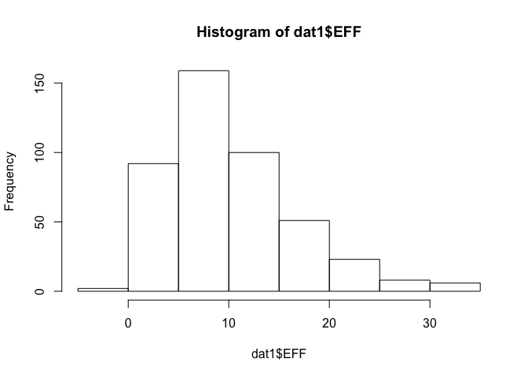
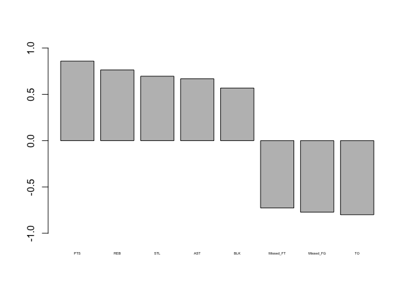
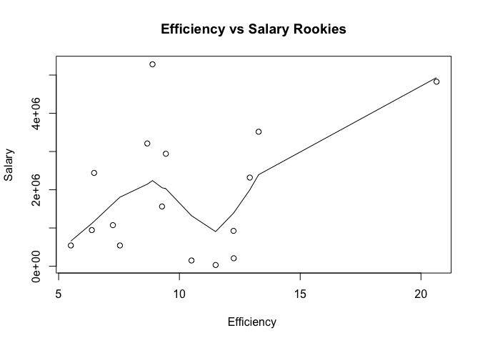

hw02-Olivier-Damas
================
Olivier Damas

``` r
# download RData file into your working directory
github <- "https://raw.githubusercontent.com/ucb-stat133/stat133-fall-2017/master/"
file <- "data/nba2017-player-statistics.csv"
csv <- paste0(github,file)
download.file(url = csv, destfile='nba2017-players-statistics.csv')
```

``` r
# R reader import
dat1 <- read.csv("https://raw.githubusercontent.com/ucb-stat133/stat133-fall-2017/master/data/nba2017-player-statistics.csv", colClasses=c("Player"="character","Team"="character", "Position"="factor", "Experience" ="character"))

#3 Changing Experience
dat1$Experience <- replace(dat1$Experience, dat1$Experience == "R", "0")
dat1$Experience = as.integer(dat1$Experience)
str(dat1)
```

    ## 'data.frame':    441 obs. of  24 variables:
    ##  $ Player      : chr  "Al Horford" "Amir Johnson" "Avery Bradley" "Demetrius Jackson" ...
    ##  $ Team        : chr  "BOS" "BOS" "BOS" "BOS" ...
    ##  $ Position    : Factor w/ 5 levels "C","PF","PG",..: 1 2 5 3 4 3 4 5 4 2 ...
    ##  $ Experience  : int  9 11 6 0 9 5 4 2 0 6 ...
    ##  $ Salary      : num  26540100 12000000 8269663 1450000 1410598 ...
    ##  $ Rank        : int  4 6 5 15 11 1 3 13 8 10 ...
    ##  $ Age         : int  30 29 26 22 31 27 26 21 20 29 ...
    ##  $ GP          : int  68 80 55 5 47 76 72 29 78 78 ...
    ##  $ GS          : int  68 77 55 0 0 76 72 0 20 6 ...
    ##  $ MIN         : int  2193 1608 1835 17 538 2569 2335 220 1341 1232 ...
    ##  $ FGM         : int  379 213 359 3 95 682 333 25 192 114 ...
    ##  $ FGA         : int  801 370 775 4 232 1473 720 58 423 262 ...
    ##  $ Points3     : int  86 27 108 1 39 245 157 12 46 45 ...
    ##  $ Points3_atts: int  242 66 277 1 111 646 394 35 135 130 ...
    ##  $ Points2     : int  293 186 251 2 56 437 176 13 146 69 ...
    ##  $ Points2_atts: int  559 304 498 3 121 827 326 23 288 132 ...
    ##  $ FTM         : int  108 67 68 3 33 590 176 6 85 26 ...
    ##  $ FTA         : int  135 100 93 6 41 649 217 9 124 37 ...
    ##  $ OREB        : int  95 117 65 2 17 43 48 6 45 60 ...
    ##  $ DREB        : int  369 248 269 2 68 162 367 20 175 213 ...
    ##  $ AST         : int  337 140 121 3 33 449 155 4 64 71 ...
    ##  $ STL         : int  52 52 68 0 9 70 72 10 35 26 ...
    ##  $ BLK         : int  87 62 11 0 7 13 23 2 18 17 ...
    ##  $ TO          : int  116 77 88 0 25 210 79 4 68 39 ...

``` r
#4 Calculating EFF
dat1$PTS <- NA
dat1$PTS <-  dat1$Points3*(3) + dat1$Points2*(2)+ dat1$FTM*1
dat1$REB <- NA
dat1$REB <-  dat1$OREB + dat1$DREB
dat1$MPG <- dat1$MIN/dat1$GP
dat1$Missed_FG <-  dat1$FGA - dat1$FGM
dat1$Missed_FT <-  dat1$FTA - dat1$FTM
dat1$EFF <- NA
dat1$EFF <-  (dat1$PTS + dat1$REB + dat1$AST + dat1$STL + dat1$BLK - dat1$Missed_FG - dat1$Missed_FT- dat1$TO)/ dat1$GP
summary(dat1$EFF)
```

    ##    Min. 1st Qu.  Median    Mean 3rd Qu.    Max. 
    ##  -0.600   5.452   9.090  10.140  13.250  33.840

``` r
hist(dat1$EFF)
```



``` r
#4 Manipulation top ten EFF
datnew <- subset(dat1, select=c("Player", "Team","EFF","Salary"))
datnew[order(datnew$EFF,decreasing=T)[1:10],]
```

    ##                    Player Team      EFF   Salary
    ## 305     Russell Westbrook  OKC 33.83951 26540100
    ## 256          James Harden  HOU 32.34568 26540100
    ## 355         Anthony Davis  NOP 31.16000 22116750
    ## 28           LeBron James  CLE 30.97297 30963450
    ## 404    Karl-Anthony Towns  MIN 30.32927  5960160
    ## 228          Kevin Durant  GSW 30.19355 26540100
    ## 74  Giannis Antetokounmpo  MIL 28.37500  2995421
    ## 359      DeMarcus Cousins  NOP 27.94118 16957900
    ## 110          Jimmy Butler  CHI 25.60526 17552209
    ## 119      Hassan Whiteside  MIA 25.36364 22116750

``` r
#4 Manipulation negative EFF
datnew1 <- subset(dat1, select=c("Player", "Team","EFF","Salary"))
datnew1 <- datnew1[datnew1$EFF < 0,]
datnew1 <- subset(datnew1, select=c("Player"))
datnew1
```

    ##              Player
    ## 188 Patricio Garino

``` r
#4 Last Part
p1 <- cor(dat1$PTS,dat1$EFF)
p2 <- cor(dat1$REB,dat1$EFF)
p3 <- cor(dat1$STL,dat1$EFF)
p4 <- cor(dat1$AST,dat1$EFF)
p5 <- cor(dat1$BLK,dat1$EFF)
p6 <- -cor(dat1$Missed_FT,dat1$EFF)
p7 <- -cor(dat1$Missed_FG,dat1$EFF)
p8 <- - cor(dat1$TO,dat1$EFF)
correlationvalue <-  c(p1,p2,p3,p4,p5,p6,p7,p8)
statbb <- c("PTS","REB","STL","AST","BLK","Missed_FT","Missed_FG","TO")
df = data.frame(statbb,correlationvalue) 
df
```

    ##      statbb correlationvalue
    ## 1       PTS        0.8588644
    ## 2       REB        0.7634501
    ## 3       STL        0.6957286
    ## 4       AST        0.6689232
    ## 5       BLK        0.5679571
    ## 6 Missed_FT       -0.7271456
    ## 7 Missed_FG       -0.7722477
    ## 8        TO       -0.8003289

``` r
counts <- table(df)
barplot(df$correlationvalue, width = 1, space = c(0.2,1), beside=TRUE, ylim = c(-1, 1),names = c("PTS","REB","STL","AST","BLK","Missed_FT","Missed_FG","TO"),cex.names=0.35)
```



``` r
#5 Last Part
plot(dat1$EFF, dat1$Salary, main="Efficiency vs Salary", 
    xlab="Efficiency ", ylab="Salary") 
lines(lowess(dat1$EFF,dat1$Salary))
```


``` r
cor(dat1$EFF,dat1$Salary)
```

    ## [1] 0.655624

``` r
players2 <-  dat1[dat1$Experience==0,]
players2<- players2[players2$MPG > 20,]
players2
```

    ##                  Player Team Position Experience  Salary Rank Age GP GS
    ## 80      Malcolm Brogdon  MIL       SG          0  925000    4  24 75 28
    ## 126     Rodney McGruder  MIA       SG          0  543471    5  25 78 65
    ## 191      Alex Poythress  PHI       PF          0   31969   16  23  6  1
    ## 192         Dario Saric  PHI       PF          0 2318280    3  22 81 36
    ## 196         Joel Embiid  PHI        C          0 4826160   11  22 31 31
    ## 209        Caris LeVert  BRK       SF          0 1562280    9  22 57 26
    ## 210    Isaiah Whitehead  BRK       PG          0 1074145    5  21 73 26
    ## 264       Troy Williams  HOU       SF          0  150000   14  22  6  3
    ## 297    Domantas Sabonis  OKC       PF          0 2440200    5  20 81 66
    ## 310     Andrew Harrison  MEM       PG          0  945000    8  22 72 18
    ## 343        Jamal Murray  DEN       SG          0 3210840    6  19 82 10
    ## 372 Dorian Finney-Smith  DAL       PF          0  543471    4  23 81 35
    ## 382        Yogi Ferrell  DAL       PG          0  207798    9  23 36 29
    ## 386         Buddy Hield  SAC       SG          0 3517200   12  23 25 18
    ## 412      Brandon Ingram  LAL       SF          0 5281680    2  19 79 40
    ## 437     Marquese Chriss  PHO       PF          0 2941440    4  19 82 75
    ##      MIN FGM FGA Points3 Points3_atts Points2 Points2_atts FTM FTA OREB
    ## 80  1982 290 635      78          193     212          442 109 126   47
    ## 126 1966 190 460      73          220     117          240  44  71   95
    ## 191  157  25  54       6           19      19           35   8  10   11
    ## 192 2129 381 927     106          341     275          586 172 220  112
    ## 196  786 200 429      36           98     164          331 191 244   61
    ## 209 1237 171 380      59          184     112          196  67  93   23
    ## 210 1643 204 508      44          149     160          359  91 113   32
    ## 264  139  22  44       8           21      14           23   6   7    9
    ## 297 1632 192 481      51          159     141          322  44  67   45
    ## 310 1474 117 360      43          156      74          204 148 194   23
    ## 343 1764 295 729     115          344     180          385 106 120   41
    ## 372 1642 124 333      56          191      68          142  46  61   55
    ## 382 1046 142 345      60          149      82          196  64  73   16
    ## 386  727 142 296      59          138      83          158  35  43   16
    ## 412 2279 276 686      55          187     221          499 133 214   60
    ## 437 1743 284 632      72          224     212          408 113 181   96
    ##     DREB AST STL BLK  TO  PTS REB      MPG Missed_FG Missed_FT       EFF
    ## 80   166 317  84  12 113  767 213 26.42667       345        17 12.240000
    ## 126  162 124  45  18  56  497 257 25.20513       270        27  7.538462
    ## 191   18   5   3   2   3   64  29 26.16667        29         2 11.500000
    ## 192  402 182  57  30 183 1040 514 26.28395       546        48 12.913580
    ## 196  182  66  27  76 117  627 243 25.35484       229        53 20.645161
    ## 209  165 110  49   8  59  468 188 21.70175       209        26  9.280702
    ## 210  152 192  42  36 142  543 184 22.50685       304        22  7.246575
    ## 264   15   6   3   1   6   58  24 23.16667        22         1 10.500000
    ## 297  242  82  39  32  83  479 287 20.14815       289        23  6.469136
    ## 310  113 198  54  20  85  425 136 20.47222       243        46  6.375000
    ## 343  173 170  53  24 113  811 214 21.51220       434        14  8.670732
    ## 372  166  67  52  25  45  350 221 20.27160       209        15  5.506173
    ## 382   83 155  40   7  56  408  99 29.05556       203         9 12.250000
    ## 386   87  44  20   2  53  378 103 29.08000       154         8 13.280000
    ## 412  257 166  50  36 116  740 317 28.84810       410        81  8.886076
    ## 437  252  60  67  70 108  753 348 21.25610       348        68  9.439024

``` r
plot(players2$EFF, players2$Salary, main="Efficiency vs Salary Rookies", 
    xlab="Efficiency ", ylab="Salary") 
lines(lowess(players2$EFF,players2$Salary))
```



``` r
cor(players2$EFF,players2$Salary)
```

    ## [1] 0.3803924

``` r
# R table import
library(tidyverse)
```

    ## Loading tidyverse: ggplot2
    ## Loading tidyverse: tibble
    ## Loading tidyverse: tidyr
    ## Loading tidyverse: readr
    ## Loading tidyverse: purrr
    ## Loading tidyverse: dplyr

    ## Conflicts with tidy packages ----------------------------------------------

    ## filter(): dplyr, stats
    ## lag():    dplyr, stats

``` r
dat2 <- read_csv("https://raw.githubusercontent.com/ucb-stat133/stat133-fall-2017/master/data/nba2017-player-statistics.csv", col_names= TRUE, cols( "Player"= col_character(),"Team"=col_character(), "Experience" =col_character()))
dat2$Position = as.factor(dat2$Position)
str(dat2)
```

    ## Classes 'tbl_df', 'tbl' and 'data.frame':    441 obs. of  24 variables:
    ##  $ Player      : chr  "Al Horford" "Amir Johnson" "Avery Bradley" "Demetrius Jackson" ...
    ##  $ Team        : chr  "BOS" "BOS" "BOS" "BOS" ...
    ##  $ Position    : Factor w/ 5 levels "C","PF","PG",..: 1 2 5 3 4 3 4 5 4 2 ...
    ##  $ Experience  : chr  "9" "11" "6" "R" ...
    ##  $ Salary      : num  26540100 12000000 8269663 1450000 1410598 ...
    ##  $ Rank        : int  4 6 5 15 11 1 3 13 8 10 ...
    ##  $ Age         : int  30 29 26 22 31 27 26 21 20 29 ...
    ##  $ GP          : int  68 80 55 5 47 76 72 29 78 78 ...
    ##  $ GS          : int  68 77 55 0 0 76 72 0 20 6 ...
    ##  $ MIN         : int  2193 1608 1835 17 538 2569 2335 220 1341 1232 ...
    ##  $ FGM         : int  379 213 359 3 95 682 333 25 192 114 ...
    ##  $ FGA         : int  801 370 775 4 232 1473 720 58 423 262 ...
    ##  $ Points3     : int  86 27 108 1 39 245 157 12 46 45 ...
    ##  $ Points3_atts: int  242 66 277 1 111 646 394 35 135 130 ...
    ##  $ Points2     : int  293 186 251 2 56 437 176 13 146 69 ...
    ##  $ Points2_atts: int  559 304 498 3 121 827 326 23 288 132 ...
    ##  $ FTM         : int  108 67 68 3 33 590 176 6 85 26 ...
    ##  $ FTA         : int  135 100 93 6 41 649 217 9 124 37 ...
    ##  $ OREB        : int  95 117 65 2 17 43 48 6 45 60 ...
    ##  $ DREB        : int  369 248 269 2 68 162 367 20 175 213 ...
    ##  $ AST         : int  337 140 121 3 33 449 155 4 64 71 ...
    ##  $ STL         : int  52 52 68 0 9 70 72 10 35 26 ...
    ##  $ BLK         : int  87 62 11 0 7 13 23 2 18 17 ...
    ##  $ TO          : int  116 77 88 0 25 210 79 4 68 39 ...
    ##  - attr(*, "spec")=List of 2
    ##   ..$ cols   :List of 24
    ##   .. ..$ Player      : list()
    ##   .. .. ..- attr(*, "class")= chr  "collector_character" "collector"
    ##   .. ..$ Team        : list()
    ##   .. .. ..- attr(*, "class")= chr  "collector_character" "collector"
    ##   .. ..$ Position    : list()
    ##   .. .. ..- attr(*, "class")= chr  "collector_character" "collector"
    ##   .. ..$ Experience  : list()
    ##   .. .. ..- attr(*, "class")= chr  "collector_character" "collector"
    ##   .. ..$ Salary      : list()
    ##   .. .. ..- attr(*, "class")= chr  "collector_double" "collector"
    ##   .. ..$ Rank        : list()
    ##   .. .. ..- attr(*, "class")= chr  "collector_integer" "collector"
    ##   .. ..$ Age         : list()
    ##   .. .. ..- attr(*, "class")= chr  "collector_integer" "collector"
    ##   .. ..$ GP          : list()
    ##   .. .. ..- attr(*, "class")= chr  "collector_integer" "collector"
    ##   .. ..$ GS          : list()
    ##   .. .. ..- attr(*, "class")= chr  "collector_integer" "collector"
    ##   .. ..$ MIN         : list()
    ##   .. .. ..- attr(*, "class")= chr  "collector_integer" "collector"
    ##   .. ..$ FGM         : list()
    ##   .. .. ..- attr(*, "class")= chr  "collector_integer" "collector"
    ##   .. ..$ FGA         : list()
    ##   .. .. ..- attr(*, "class")= chr  "collector_integer" "collector"
    ##   .. ..$ Points3     : list()
    ##   .. .. ..- attr(*, "class")= chr  "collector_integer" "collector"
    ##   .. ..$ Points3_atts: list()
    ##   .. .. ..- attr(*, "class")= chr  "collector_integer" "collector"
    ##   .. ..$ Points2     : list()
    ##   .. .. ..- attr(*, "class")= chr  "collector_integer" "collector"
    ##   .. ..$ Points2_atts: list()
    ##   .. .. ..- attr(*, "class")= chr  "collector_integer" "collector"
    ##   .. ..$ FTM         : list()
    ##   .. .. ..- attr(*, "class")= chr  "collector_integer" "collector"
    ##   .. ..$ FTA         : list()
    ##   .. .. ..- attr(*, "class")= chr  "collector_integer" "collector"
    ##   .. ..$ OREB        : list()
    ##   .. .. ..- attr(*, "class")= chr  "collector_integer" "collector"
    ##   .. ..$ DREB        : list()
    ##   .. .. ..- attr(*, "class")= chr  "collector_integer" "collector"
    ##   .. ..$ AST         : list()
    ##   .. .. ..- attr(*, "class")= chr  "collector_integer" "collector"
    ##   .. ..$ STL         : list()
    ##   .. .. ..- attr(*, "class")= chr  "collector_integer" "collector"
    ##   .. ..$ BLK         : list()
    ##   .. .. ..- attr(*, "class")= chr  "collector_integer" "collector"
    ##   .. ..$ TO          : list()
    ##   .. .. ..- attr(*, "class")= chr  "collector_integer" "collector"
    ##   ..$ default: list()
    ##   .. ..- attr(*, "class")= chr  "collector_guess" "collector"
    ##   ..- attr(*, "class")= chr "col_spec"
