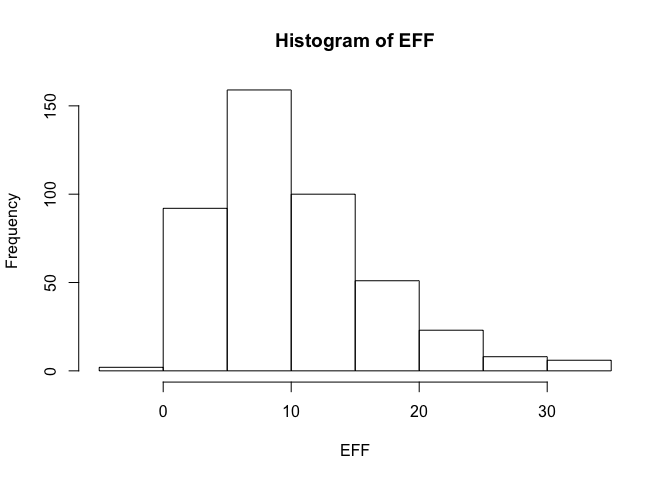
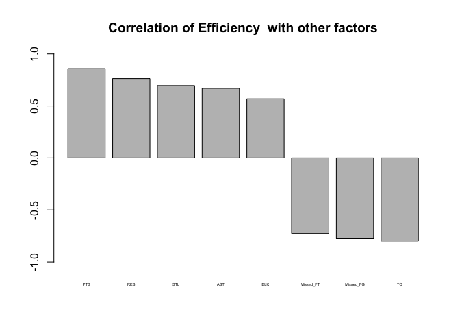
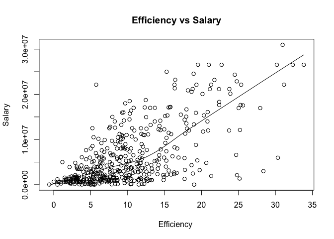
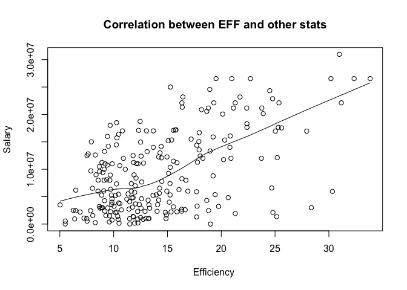

hw02-Olivier-Damas
================
Olivier Damas

``` r
dat1 <- read.csv("https://raw.githubusercontent.com/ucb-stat133/stat133-fall-2017/master/data/nba2017-player-statistics.csv", colClasses=c("Player"="character","Team"="character", "Position"="factor", "Experience" ="character"))

#3 Changing Experience to 
dat1$Experience <- replace(dat1$Experience, dat1$Experience == "R", "0")
dat1$Experience = as.integer(dat1$Experience)
str(dat1)
```

    ## 'data.frame':    441 obs. of  24 variables:
    ##  $ Player      : chr  "Al Horford" "Amir Johnson" "Avery Bradley" "Demetrius Jackson" ...
    ##  $ Team        : chr  "BOS" "BOS" "BOS" "BOS" ...
    ##  $ Position    : Factor w/ 5 levels "C","PF","PG",..: 1 2 5 3 4 3 4 5 4 2 ...
    ##  $ Experience  : int  9 11 6 0 9 5 4 2 0 6 ...
    ##  $ Salary      : num  26540100 12000000 8269663 1450000 1410598 ...
    ##  $ Rank        : int  4 6 5 15 11 1 3 13 8 10 ...
    ##  $ Age         : int  30 29 26 22 31 27 26 21 20 29 ...
    ##  $ GP          : int  68 80 55 5 47 76 72 29 78 78 ...
    ##  $ GS          : int  68 77 55 0 0 76 72 0 20 6 ...
    ##  $ MIN         : int  2193 1608 1835 17 538 2569 2335 220 1341 1232 ...
    ##  $ FGM         : int  379 213 359 3 95 682 333 25 192 114 ...
    ##  $ FGA         : int  801 370 775 4 232 1473 720 58 423 262 ...
    ##  $ Points3     : int  86 27 108 1 39 245 157 12 46 45 ...
    ##  $ Points3_atts: int  242 66 277 1 111 646 394 35 135 130 ...
    ##  $ Points2     : int  293 186 251 2 56 437 176 13 146 69 ...
    ##  $ Points2_atts: int  559 304 498 3 121 827 326 23 288 132 ...
    ##  $ FTM         : int  108 67 68 3 33 590 176 6 85 26 ...
    ##  $ FTA         : int  135 100 93 6 41 649 217 9 124 37 ...
    ##  $ OREB        : int  95 117 65 2 17 43 48 6 45 60 ...
    ##  $ DREB        : int  369 248 269 2 68 162 367 20 175 213 ...
    ##  $ AST         : int  337 140 121 3 33 449 155 4 64 71 ...
    ##  $ STL         : int  52 52 68 0 9 70 72 10 35 26 ...
    ##  $ BLK         : int  87 62 11 0 7 13 23 2 18 17 ...
    ##  $ TO          : int  116 77 88 0 25 210 79 4 68 39 ...

``` r
#4 Calculating EFF
#create all the new stats
dat1$PTS <- NA
dat1$PTS <-  dat1$Points3*(3) + dat1$Points2*(2)+ dat1$FTM*1
dat1$REB <- NA
dat1$REB <-  dat1$OREB + dat1$DREB
dat1$MPG <- dat1$MIN/dat1$GP
dat1$Missed_FG <-  dat1$FGA - dat1$FGM
dat1$Missed_FT <-  dat1$FTA - dat1$FTM
#create EFF
dat1$EFF <- NA
dat1$EFF <-  (dat1$PTS + dat1$REB + dat1$AST + dat1$STL + dat1$BLK - dat1$Missed_FG - dat1$Missed_FT- dat1$TO)/ dat1$GP
summary(dat1$EFF)
```

    ##    Min. 1st Qu.  Median    Mean 3rd Qu.    Max. 
    ##  -0.600   5.452   9.090  10.140  13.250  33.840

``` r
EFF <- dat1$EFF
hist(EFF)
```



``` r
#4 Manipulation find the top ten EFF
datnew <- subset(dat1, select=c("Player", "Team","EFF","Salary"))
datnew[order(datnew$EFF,decreasing=T)[1:10],]
```

    ##                    Player Team      EFF   Salary
    ## 305     Russell Westbrook  OKC 33.83951 26540100
    ## 256          James Harden  HOU 32.34568 26540100
    ## 355         Anthony Davis  NOP 31.16000 22116750
    ## 28           LeBron James  CLE 30.97297 30963450
    ## 404    Karl-Anthony Towns  MIN 30.32927  5960160
    ## 228          Kevin Durant  GSW 30.19355 26540100
    ## 74  Giannis Antetokounmpo  MIL 28.37500  2995421
    ## 359      DeMarcus Cousins  NOP 27.94118 16957900
    ## 110          Jimmy Butler  CHI 25.60526 17552209
    ## 119      Hassan Whiteside  MIA 25.36364 22116750

``` r
#4 Manipulation find the negative EFF
datnew1 <- subset(dat1, select=c("Player", "Team","EFF","Salary"))
datnew1 <- datnew1[datnew1$EFF < 0,]
datnew1 <- subset(datnew1, select=c("Player"))
datnew1
```

    ##              Player
    ## 188 Patricio Garino

``` r
#4Last Part correlation
p1 <- cor(dat1$PTS,dat1$EFF)
p2 <- cor(dat1$REB,dat1$EFF)
p3 <- cor(dat1$STL,dat1$EFF)
p4 <- cor(dat1$AST,dat1$EFF)
p5 <- cor(dat1$BLK,dat1$EFF)
p6 <- -cor(dat1$Missed_FT,dat1$EFF)
p7 <- -cor(dat1$Missed_FG,dat1$EFF)
p8 <- - cor(dat1$TO,dat1$EFF)
correlationvalue <-  c(p1,p2,p3,p4,p5,p6,p7,p8)
statbb <- c("PTS","REB","STL","AST","BLK","Missed_FT","Missed_FG","TO")
df = data.frame(statbb,correlationvalue) 
df
```

    ##      statbb correlationvalue
    ## 1       PTS        0.8588644
    ## 2       REB        0.7634501
    ## 3       STL        0.6957286
    ## 4       AST        0.6689232
    ## 5       BLK        0.5679571
    ## 6 Missed_FT       -0.7271456
    ## 7 Missed_FG       -0.7722477
    ## 8        TO       -0.8003289

``` r
counts <- table(df)
#barplote
barplot(df$correlationvalue,main="Correlation of Efficiency  with other factors", width = 1, space = c(0.2,1), beside=TRUE, ylim = c(-1, 1),names = c("PTS","REB","STL","AST","BLK","Missed_FT","Missed_FG","TO"),cex.names=0.35)
```



``` r
#5 Efficiency and Salary
#Looking at established players
plot(dat1$EFF, dat1$Salary, main="Efficiency vs Salary", 
    xlab="Efficiency ", ylab="Salary") 
lines(lowess(dat1$EFF,dat1$Salary))
```



``` r
cor(dat1$EFF,dat1$Salary)
```

    ## [1] 0.655624

``` r
#The closer the correlation  coefficient is to 1.0, the stronger the relationship between the efficiency and salary. A correlation of 0.65 the presence of a  somewhat strong relationship.Moreover the positive value means as efficiency increases salary increases.

#5 Looking at rookies
players2 <- dat1[dat1$MPG > 20,]
plot(players2$EFF, players2$Salary, main="Correlation between EFF and other stats", 
    xlab="Efficiency ", ylab="Salary") 
lines(lowess(players2$EFF,players2$Salary))
```



``` r
cor(players2$EFF,players2$Salary)
```

    ## [1] 0.5367224

``` r
#The correlation coefficient of 0.65 for the experienced players means that the relationship is somewhat stronger for EFF and salary than in the less experienced group with a correlation coefficient of 0.53. This may be due to these players being less proven and terefore not as entitled to the salary raise. 
```

``` r
#2 Readr table import
library(tidyverse)
```

    ## Loading tidyverse: ggplot2
    ## Loading tidyverse: tibble
    ## Loading tidyverse: tidyr
    ## Loading tidyverse: readr
    ## Loading tidyverse: purrr
    ## Loading tidyverse: dplyr

    ## Conflicts with tidy packages ----------------------------------------------

    ## filter(): dplyr, stats
    ## lag():    dplyr, stats

``` r
dat2 <- read_csv("https://raw.githubusercontent.com/ucb-stat133/stat133-fall-2017/master/data/nba2017-player-statistics.csv", col_names= TRUE, cols( "Player"= col_character(),"Team"=col_character(), "Experience" =col_character()))
dat2$Position = as.factor(dat2$Position)
str(dat2)
```

    ## Classes 'tbl_df', 'tbl' and 'data.frame':    441 obs. of  24 variables:
    ##  $ Player      : chr  "Al Horford" "Amir Johnson" "Avery Bradley" "Demetrius Jackson" ...
    ##  $ Team        : chr  "BOS" "BOS" "BOS" "BOS" ...
    ##  $ Position    : Factor w/ 5 levels "C","PF","PG",..: 1 2 5 3 4 3 4 5 4 2 ...
    ##  $ Experience  : chr  "9" "11" "6" "R" ...
    ##  $ Salary      : num  26540100 12000000 8269663 1450000 1410598 ...
    ##  $ Rank        : int  4 6 5 15 11 1 3 13 8 10 ...
    ##  $ Age         : int  30 29 26 22 31 27 26 21 20 29 ...
    ##  $ GP          : int  68 80 55 5 47 76 72 29 78 78 ...
    ##  $ GS          : int  68 77 55 0 0 76 72 0 20 6 ...
    ##  $ MIN         : int  2193 1608 1835 17 538 2569 2335 220 1341 1232 ...
    ##  $ FGM         : int  379 213 359 3 95 682 333 25 192 114 ...
    ##  $ FGA         : int  801 370 775 4 232 1473 720 58 423 262 ...
    ##  $ Points3     : int  86 27 108 1 39 245 157 12 46 45 ...
    ##  $ Points3_atts: int  242 66 277 1 111 646 394 35 135 130 ...
    ##  $ Points2     : int  293 186 251 2 56 437 176 13 146 69 ...
    ##  $ Points2_atts: int  559 304 498 3 121 827 326 23 288 132 ...
    ##  $ FTM         : int  108 67 68 3 33 590 176 6 85 26 ...
    ##  $ FTA         : int  135 100 93 6 41 649 217 9 124 37 ...
    ##  $ OREB        : int  95 117 65 2 17 43 48 6 45 60 ...
    ##  $ DREB        : int  369 248 269 2 68 162 367 20 175 213 ...
    ##  $ AST         : int  337 140 121 3 33 449 155 4 64 71 ...
    ##  $ STL         : int  52 52 68 0 9 70 72 10 35 26 ...
    ##  $ BLK         : int  87 62 11 0 7 13 23 2 18 17 ...
    ##  $ TO          : int  116 77 88 0 25 210 79 4 68 39 ...
    ##  - attr(*, "spec")=List of 2
    ##   ..$ cols   :List of 24
    ##   .. ..$ Player      : list()
    ##   .. .. ..- attr(*, "class")= chr  "collector_character" "collector"
    ##   .. ..$ Team        : list()
    ##   .. .. ..- attr(*, "class")= chr  "collector_character" "collector"
    ##   .. ..$ Position    : list()
    ##   .. .. ..- attr(*, "class")= chr  "collector_character" "collector"
    ##   .. ..$ Experience  : list()
    ##   .. .. ..- attr(*, "class")= chr  "collector_character" "collector"
    ##   .. ..$ Salary      : list()
    ##   .. .. ..- attr(*, "class")= chr  "collector_double" "collector"
    ##   .. ..$ Rank        : list()
    ##   .. .. ..- attr(*, "class")= chr  "collector_integer" "collector"
    ##   .. ..$ Age         : list()
    ##   .. .. ..- attr(*, "class")= chr  "collector_integer" "collector"
    ##   .. ..$ GP          : list()
    ##   .. .. ..- attr(*, "class")= chr  "collector_integer" "collector"
    ##   .. ..$ GS          : list()
    ##   .. .. ..- attr(*, "class")= chr  "collector_integer" "collector"
    ##   .. ..$ MIN         : list()
    ##   .. .. ..- attr(*, "class")= chr  "collector_integer" "collector"
    ##   .. ..$ FGM         : list()
    ##   .. .. ..- attr(*, "class")= chr  "collector_integer" "collector"
    ##   .. ..$ FGA         : list()
    ##   .. .. ..- attr(*, "class")= chr  "collector_integer" "collector"
    ##   .. ..$ Points3     : list()
    ##   .. .. ..- attr(*, "class")= chr  "collector_integer" "collector"
    ##   .. ..$ Points3_atts: list()
    ##   .. .. ..- attr(*, "class")= chr  "collector_integer" "collector"
    ##   .. ..$ Points2     : list()
    ##   .. .. ..- attr(*, "class")= chr  "collector_integer" "collector"
    ##   .. ..$ Points2_atts: list()
    ##   .. .. ..- attr(*, "class")= chr  "collector_integer" "collector"
    ##   .. ..$ FTM         : list()
    ##   .. .. ..- attr(*, "class")= chr  "collector_integer" "collector"
    ##   .. ..$ FTA         : list()
    ##   .. .. ..- attr(*, "class")= chr  "collector_integer" "collector"
    ##   .. ..$ OREB        : list()
    ##   .. .. ..- attr(*, "class")= chr  "collector_integer" "collector"
    ##   .. ..$ DREB        : list()
    ##   .. .. ..- attr(*, "class")= chr  "collector_integer" "collector"
    ##   .. ..$ AST         : list()
    ##   .. .. ..- attr(*, "class")= chr  "collector_integer" "collector"
    ##   .. ..$ STL         : list()
    ##   .. .. ..- attr(*, "class")= chr  "collector_integer" "collector"
    ##   .. ..$ BLK         : list()
    ##   .. .. ..- attr(*, "class")= chr  "collector_integer" "collector"
    ##   .. ..$ TO          : list()
    ##   .. .. ..- attr(*, "class")= chr  "collector_integer" "collector"
    ##   ..$ default: list()
    ##   .. ..- attr(*, "class")= chr  "collector_guess" "collector"
    ##   ..- attr(*, "class")= chr "col_spec"

``` r
#6 Hardest part by far is uploading the document and loading the aspects. I thought graphing was relatively easy. I like the Data 8 Jupyter Notebook much better. About 5 hours. I did not get help. Loading the document took forever and is very frustrating, the rest is interesting.
```
