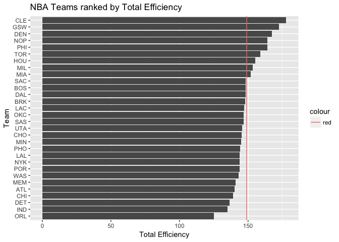
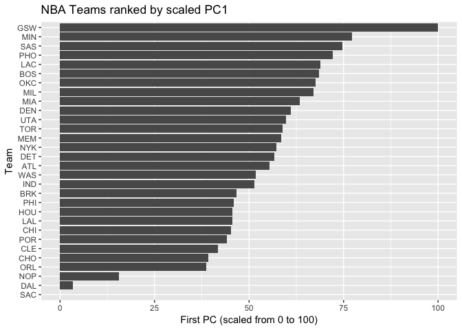

HW03
================

``` r
## Download the files
library(dplyr)
```

    ## 
    ## Attaching package: 'dplyr'

    ## The following objects are masked from 'package:stats':
    ## 
    ##     filter, lag

    ## The following objects are masked from 'package:base':
    ## 
    ##     intersect, setdiff, setequal, union

``` r
library(ggplot2)
setwd('/Users/macbookpro/stat133/stat133-hws-fall17/hw03')
nba_stats <- read.csv('../hw03/data/nba2017-stats.csv', stringsAsFactors = FALSE)
nba_roster <- read.csv('../hw03/data/nba2017-roster .csv', stringsAsFactors = FALSE)
str(nba_stats)
```

    ## 'data.frame':    441 obs. of  22 variables:
    ##  $ player          : chr  "Al Horford" "Amir Johnson" "Avery Bradley" "Demetrius Jackson" ...
    ##  $ games_played    : int  68 80 55 5 47 76 72 29 78 78 ...
    ##  $ minutes         : int  2193 1608 1835 17 538 2569 2335 220 1341 1232 ...
    ##  $ field_goals_made: int  379 213 359 3 95 682 333 25 192 114 ...
    ##  $ field_goals_atts: int  801 370 775 4 232 1473 720 58 423 262 ...
    ##  $ field_goals_perc: num  0.473 0.576 0.463 0.75 0.409 0.463 0.463 0.431 0.454 0.435 ...
    ##  $ points3_made    : int  86 27 108 1 39 245 157 12 46 45 ...
    ##  $ points3_atts    : int  242 66 277 1 111 646 394 35 135 130 ...
    ##  $ points3_perc    : num  0.355 0.409 0.39 1 0.351 0.379 0.398 0.343 0.341 0.346 ...
    ##  $ points2_made    : int  293 186 251 2 56 437 176 13 146 69 ...
    ##  $ points2_atts    : int  559 304 498 3 121 827 326 23 288 132 ...
    ##  $ points2_perc    : num  0.524 0.612 0.504 0.667 0.463 0.528 0.54 0.565 0.507 0.523 ...
    ##  $ points1_made    : int  108 67 68 3 33 590 176 6 85 26 ...
    ##  $ points1_atts    : int  135 100 93 6 41 649 217 9 124 37 ...
    ##  $ points1_perc    : num  0.8 0.67 0.731 0.5 0.805 0.909 0.811 0.667 0.685 0.703 ...
    ##  $ off_rebounds    : int  95 117 65 2 17 43 48 6 45 60 ...
    ##  $ def_rebounds    : int  369 248 269 2 68 162 367 20 175 213 ...
    ##  $ assists         : int  337 140 121 3 33 449 155 4 64 71 ...
    ##  $ steals          : int  52 52 68 0 9 70 72 10 35 26 ...
    ##  $ blocks          : int  87 62 11 0 7 13 23 2 18 17 ...
    ##  $ turnovers       : int  116 77 88 0 25 210 79 4 68 39 ...
    ##  $ fouls           : int  138 211 141 0 48 167 161 15 142 122 ...

``` r
##Adding new variables
nba_stats <- mutate(nba_stats, missed_fg = field_goals_atts - field_goals_made)
nba_stats <- mutate(nba_stats, points = 3*points3_made + 2*points2_made + points1_made)
nba_stats <- mutate(nba_stats, rebounds = off_rebounds + def_rebounds)
nba_stats <- mutate(nba_stats,  missed_ft = points1_atts - points1_made)
nba_stats <- mutate(nba_stats, efficiency = (points + rebounds + assists + steals + blocks - missed_fg - missed_ft - turnovers) / games_played)

##Merging Tables
nba2017_teams <- merge(nba_stats,nba_roster,by="player")
nba2017_teams
```

    ##                       player games_played minutes field_goals_made
    ## 1               A.J. Hammons           22     163               17
    ## 2               Aaron Brooks           65     894              121
    ## 3               Aaron Gordon           80    2298              393
    ## 4              Adreian Payne           18     135               23
    ## 5                 Al Horford           68    2193              379
    ## 6               Al Jefferson           66     931              235
    ## 7            Al-Farouq Aminu           61    1773              183
    ## 8              Alan Anderson           30     308               30
    ## 9              Alan Williams           47     708              138
    ## 10                Alec Burks           42     653               99
    ## 11              Alex Abrines           68    1055              134
    ## 12                  Alex Len           77    1560              230
    ## 13            Alex Poythress            6     157               25
    ## 14             Alexis Ajinca           39     584               89
    ## 15              Allen Crabbe           79    2254              303
    ## 16              Amir Johnson           80    1608              213
    ## 17            Andre Drummond           81    2409              483
    ## 18            Andre Iguodala           76    1998              219
    ## 19            Andre Roberson           79    2376              215
    ## 20           Andrew Harrison           72    1474              117
    ## 21          Andrew Nicholson           10     111               13
    ## 22            Andrew Wiggins           82    3048              709
    ## 23             Anthony Davis           75    2708              770
    ## 24            Anthony Morrow            9      87               12
    ## 25          Anthony Tolliver           65    1477              155
    ## 26            Archie Goodwin           12     184               34
    ## 27               Aron Baynes           75    1163              143
    ## 28             Arron Afflalo           61    1580              185
    ## 29             Austin Rivers           74    2054              323
    ## 30             Avery Bradley           55    1835              359
    ## 31              Axel Toupane            2      41                5
    ## 32              Ben McLemore           61    1176              180
    ## 33                Beno Udrih           39     560               92
    ## 34           Bismack Biyombo           81    1793              179
    ## 35             Blake Griffin           61    2076              479
    ## 36          Boban Marjanovic           35     293               72
    ## 37               Bobby Brown           25     123               23
    ## 38              Bobby Portis           64    1000              183
    ## 39          Bojan Bogdanovic           26     601              107
    ## 40                Boris Diaw           73    1283              146
    ## 41              Bradley Beal           77    2684              637
    ## 42            Brandan Wright           28     447               83
    ## 43              Brandon Bass           52     577              107
    ## 44            Brandon Ingram           79    2279              276
    ## 45          Brandon Jennings           23     374               29
    ## 46            Brandon Knight           54    1140              209
    ## 47              Brandon Rush           47    1030               70
    ## 48             Brian Roberts           41     416               46
    ## 49             Briante Weber           13     159               20
    ## 50             Brice Johnson            3       9                2
    ## 51               Brook Lopez           75    2222              555
    ## 52             Bruno Caboclo            9      40                6
    ## 53               Bryn Forbes           36     285               36
    ## 54               Buddy Hield           25     727              142
    ## 55             C.J. McCollum           80    2796              692
    ## 56                C.J. Miles           76    1776              281
    ## 57               C.J. Watson           62    1012               96
    ## 58             Cameron Payne           11     142               21
    ## 59              Caris LeVert           57    1237              171
    ## 60           Carmelo Anthony           74    2538              602
    ## 61          Chandler Parsons           34     675               75
    ## 62             Channing Frye           74    1398              238
    ## 63            Chasson Randle           18     225               28
    ## 64             Cheick Diallo           17     199               36
    ## 65            Chinanu Onuaku            5      52                5
    ## 66          Chris McCullough            2       8                0
    ## 67                Chris Paul           61    1921              374
    ## 68            Christian Wood           13     107               12
    ## 69              Clint Capela           65    1551              362
    ## 70               Cody Zeller           62    1725              253
    ## 71              Cole Aldrich           62     531               45
    ## 72              Corey Brewer           24     358               53
    ## 73               Cory Joseph           80    2003              299
    ## 74              Courtney Lee           77    2459              321
    ## 75         Cristiano Felicio           66    1040              128
    ## 76             D.J. Augustin           78    1538              195
    ## 77          D'Angelo Russell           63    1811              351
    ## 78             Dahntay Jones            1      12                3
    ## 79              Damian Jones           10      85                8
    ## 80            Damian Lillard           75    2694              661
    ## 81              Damjan Rudez           45     314               31
    ## 82             Daniel Ochefu           19      75               12
    ## 83          Danilo Gallinari           63    2134              335
    ## 84               Danny Green           68    1807              176
    ## 85          Dante Cunningham           66    1649              174
    ## 86                Dante Exum           66    1228              155
    ## 87               Dario Saric           81    2129              381
    ## 88            Darrell Arthur           41     639               95
    ## 89           Darren Collison           68    2063              340
    ## 90           Darrun Hilliard           39     381               47
    ## 91                 David Lee           79    1477              248
    ## 92               David Nwaba           20     397               47
    ## 93                David West           68     854              135
    ## 94             Davis Bertans           67     808              103
    ## 95            DeAndre Jordan           81    2570              412
    ## 96           DeAndre Liggins            1      25                3
    ## 97           DeAndre' Bembry           38     371               47
    ## 98           Dejounte Murray           38     322               50
    ## 99              Delon Wright           27     446               49
    ## 100            DeMar DeRozan           74    2620              721
    ## 101         DeMarcus Cousins           17     574              142
    ## 102          DeMarre Carroll           72    1882              220
    ## 103        Demetrius Jackson            5      17                3
    ## 104          Dennis Schroder           79    2485              548
    ## 105         Denzel Valentine           57     976              102
    ## 106           Deron Williams           24     486               68
    ## 107           Derrick Favors           50    1186              203
    ## 108            Derrick Jones           32     545               68
    ## 109             Derrick Rose           64    2082              460
    ## 110         Derrick Williams           25     427               54
    ## 111             Devin Booker           78    2730              606
    ## 112             Devin Harris           65    1087              136
    ## 113           Dewayne Dedmon           76    1330              161
    ## 114            Deyonta Davis           36     238               24
    ## 115            Diamond Stone            7      24                3
    ## 116             Dion Waiters           46    1384              281
    ## 117            Dirk Nowitzki           54    1424              296
    ## 118         Domantas Sabonis           81    1632              192
    ## 119       Donatas Motiejunas           34     479               57
    ## 120      Dorian Finney-Smith           81    1642              124
    ## 121           Doug McDermott           22     430               56
    ## 122            Dragan Bender           43     574               57
    ## 123           Draymond Green           76    2471              272
    ## 124            Dwight Howard           74    2199              388
    ## 125            Dwight Powell           77    1333              194
    ## 126              Dwyane Wade           60    1792              414
    ## 127            E'Twaun Moore           73    1820              283
    ## 128                 Ed Davis           46     789               75
    ## 129              Edy Tavares            1      24                3
    ## 130            Elfrid Payton           82    2412              430
    ## 131           Elijah Millsap            2      23                1
    ## 132          Emmanuel Mudiay           55    1406              208
    ## 133              Enes Kanter           72    1533              402
    ## 134             Eric Bledsoe           66    2176              449
    ## 135              Eric Gordon           75    2323              412
    ## 136           Ersan Ilyasova           26     633               93
    ## 137            Evan Fournier           68    2234              408
    ## 138              Evan Turner           65    1658              235
    ## 139           Frank Kaminsky           75    1954              320
    ## 140            Fred VanVleet           37     294               39
    ## 141           Garrett Temple           65    1728              183
    ## 142              Gary Harris           57    1782              320
    ## 143              George Hill           49    1544              289
    ## 144            Georges Niang           23      93                9
    ## 145     Georgios Papagiannis           22     355               56
    ## 146             Gerald Green           47     538               95
    ## 147         Gerald Henderson           72    1667              234
    ## 148    Giannis Antetokounmpo           80    2845              656
    ## 149             Goran Dragic           73    2459              534
    ## 150           Gordon Hayward           73    2516              545
    ## 151             Gorgui Dieng           82    2653              332
    ## 152              Greg Monroe           81    1823              387
    ## 153          Harrison Barnes           79    2803              599
    ## 154         Hassan Whiteside           77    2513              542
    ## 155           Henry Ellenson           19     146               23
    ## 156                Ian Clark           77    1137              211
    ## 157              Ian Mahinmi           31     555               65
    ## 158            Iman Shumpert           76    1937              201
    ## 159            Isaiah Canaan           39     592               63
    ## 160            Isaiah Taylor            4      52                1
    ## 161            Isaiah Thomas           76    2569              682
    ## 162         Isaiah Whitehead           73    1643              204
    ## 163                Ish Smith           81    1955              329
    ## 164              Ivica Zubac           38     609              126
    ## 165               J.J. Barea           35     771              142
    ## 166              J.J. Redick           78    2198              396
    ## 167               J.R. Smith           41    1187              123
    ## 168            Jabari Parker           51    1728              399
    ## 169              Jae Crowder           72    2335              333
    ## 170            Jahlil Okafor           50    1134              242
    ## 171              Jake Layman           35     249               26
    ## 172             Jakob Poeltl           54     626               67
    ## 173           Jamal Crawford           82    2157              359
    ## 174             Jamal Murray           82    1764              295
    ## 175            Jameer Nelson           75    2045              268
    ## 176              James Ennis           64    1501              146
    ## 177             James Harden           81    2947              674
    ## 178            James Johnson           76    2085              368
    ## 179              James Jones           48     381               44
    ## 180     James Michael McAdoo           52     457               62
    ## 181              James Young           29     220               25
    ## 182           JaMychal Green           77    2101              250
    ## 183             Jared Dudley           64    1362              157
    ## 184            Jarell Martin           42     558               58
    ## 185            Jarrod Uthoff            9     115               16
    ## 186              Jason Smith           74    1068              174
    ## 187              Jason Terry           74    1365              105
    ## 188             JaVale McGee           77     739              208
    ## 189             Jaylen Brown           78    1341              192
    ## 190               Jeff Green           69    1534              220
    ## 191              Jeff Teague           82    2657              402
    ## 192              Jeff Withey           51     432               55
    ## 193             Jerami Grant           78    1490              146
    ## 194              Jeremy Lamb           62    1143              226
    ## 195               Jeremy Lin           36     883              175
    ## 196             Jerian Grant           63    1028              128
    ## 197           Jerryd Bayless            3      71               11
    ## 198             Jimmy Butler           76    2809              570
    ## 199              Joakim Noah           46    1015               99
    ## 200              Jodie Meeks           36     738              103
    ## 201               Joe Harris           52    1138              154
    ## 202               Joe Ingles           82    1972              204
    ## 203              Joe Johnson           78    1843              273
    ## 204                Joe Young           33     135               26
    ## 205             Joel Anthony           19     122               10
    ## 206            Joel Bolomboy           12      53                9
    ## 207              Joel Embiid           31     786              200
    ## 208        Joffrey Lauvergne           20     241               37
    ## 209              John Henson           58    1123              159
    ## 210                John Wall           78    2836              647
    ## 211          Johnny O'Bryant            4      34                8
    ## 212                Jon Leuer           75    1944              310
    ## 213            Jonas Jerebko           78    1232              114
    ## 214        Jonas Valanciunas           80    2066              391
    ## 215         Jonathon Simmons           78    1392              177
    ## 216          Jordan Clarkson           82    2397              477
    ## 217          Jordan Crawford           19     442              105
    ## 218              Jordan Hill            7      47                5
    ## 219            Jordan Mickey           25     141               15
    ## 220            Jose Calderon           17     247               23
    ## 221             Josh Huestis            2      31                6
    ## 222           Josh McRoberts           22     381               44
    ## 223          Josh Richardson           53    1614              202
    ## 224             Jrue Holiday           67    2190              405
    ## 225         Juan Hernangomez           62     842              101
    ## 226            Julius Randle           74    2132              377
    ## 227          Justin Anderson           24     518               75
    ## 228          Justin Hamilton           64    1177              174
    ## 229           Justin Holiday           82    1639              233
    ## 230          Justise Winslow           18     625               80
    ## 231             Jusuf Nurkic           20     584              120
    ## 232           K.J. McDaniels           20     293               46
    ## 233       Karl-Anthony Towns           82    3030              802
    ## 234            Kawhi Leonard           74    2474              636
    ## 235               Kay Felder           42     386               62
    ## 236             Kelly Olynyk           75    1538              260
    ## 237             Kemba Walker           79    2739              643
    ## 238           Kenneth Faried           61    1296              228
    ## 239            Kent Bazemore           73    1963              295
    ## 240 Kentavious Caldwell-Pope           76    2529              370
    ## 241             Kevin Durant           62    2070              551
    ## 242               Kevin Love           60    1885              370
    ## 243           Kevin Seraphin           49     559              109
    ## 244             Kevon Looney           53     447               56
    ## 245          Khris Middleton           29     889              150
    ## 246            Klay Thompson           78    2649              644
    ## 247             Kosta Koufos           71    1419              216
    ## 248                Kris Dunn           78    1333              118
    ## 249           Kris Humphries           56     689               87
    ## 250       Kristaps Porzingis           66    2164              443
    ## 251            Kyle Anderson           72    1020               93
    ## 252              Kyle Korver           35     859              131
    ## 253               Kyle Lowry           60    2244              426
    ## 254             Kyle O'Quinn           79    1229              215
    ## 255             Kyle Singler           32     385               34
    ## 256             Kyle Wiltjer           14      44                4
    ## 257             Kyrie Irving           72    2525              671
    ## 258        LaMarcus Aldridge           72    2335              500
    ## 259         Lance Stephenson            6     132               18
    ## 260             Lance Thomas           46     968               97
    ## 261        Langston Galloway           19     375               42
    ## 262          Larry Nance Jr.           63    1442              190
    ## 263              Lavoy Allen           61     871               77
    ## 264          Leandro Barbosa           67     963              172
    ## 265             LeBron James           74    2794              736
    ## 266             Lou Williams           23     591              102
    ## 267         Luc Mbah a Moute           80    1787              191
    ## 268           Lucas Nogueira           57    1088              103
    ## 269             Luke Babbitt           68    1065              113
    ## 270                Luol Deng           56    1486              164
    ## 271       Malachi Richardson           22     198               28
    ## 272          Malcolm Brogdon           75    1982              290
    ## 273          Malcolm Delaney           73    1248              145
    ## 274            Malik Beasley           22     165               33
    ## 275            Manu Ginobili           69    1291              171
    ## 276               Marc Gasol           74    2531              532
    ## 277            Marcin Gortat           82    2556              390
    ## 278          Marco Belinelli           74    1778              264
    ## 279      Marcus Georges-Hunt            5      48                2
    ## 280            Marcus Morris           79    2565              421
    ## 281             Marcus Smart           79    2399              269
    ## 282            Mario Hezonja           65     960              117
    ## 283          Markieff Morris           76    2374              406
    ## 284          Marquese Chriss           82    1743              284
    ## 285        Marreese Speights           82    1286              244
    ## 286         Marshall Plumlee           21     170               16
    ## 287          Marvin Williams           76    2295              297
    ## 288            Mason Plumlee           27     632               99
    ## 289              Matt Barnes           20     410               38
    ## 290      Matthew Dellavedova           76    1986              208
    ## 291         Maurice Harkless           77    2223              314
    ## 292            Maurice Ndour           32     331               39
    ## 293        Metta World Peace           25     160               19
    ## 294           Meyers Leonard           74    1222              146
    ## 295          Michael Beasley           56     935              216
    ## 296  Michael Carter-Williams           45     846              112
    ## 297          Michael Gbinije            9      32                1
    ## 298   Michael Kidd-Gilchrist           81    2349              295
    ## 299              Mike Conley           69    2292              464
    ## 300            Mike Dunleavy           30     475               57
    ## 301              Mike Miller           20     151                9
    ## 302             Mike Muscala           70    1237              170
    ## 303            Miles Plumlee           13     174               14
    ## 304     Mindaugas Kuzminskas           68    1016              158
    ## 305          Mirza Teletovic           70    1133              156
    ## 306              Monta Ellis           74    1998              247
    ## 307         Montrezl Harrell           58    1064              225
    ## 308             Myles Turner           81    2541              444
    ## 309          Nemanja Bjelica           65    1190              151
    ## 310             Nerlens Noel           22     483               77
    ## 311            Nick Collison           20     128               14
    ## 312               Nick Young           60    1556              272
    ## 313            Nicolas Batum           77    2617              393
    ## 314         Nicolas Brussino           54     521               52
    ## 315             Nik Stauskas           80    2188              251
    ## 316             Nikola Jokic           73    2038              494
    ## 317           Nikola Mirotic           70    1679              258
    ## 318           Nikola Vucevic           75    2163              483
    ## 319              Noah Vonleh           74    1265              130
    ## 320            Norman Powell           76    1368              227
    ## 321              Norris Cole           13     125               16
    ## 322              Okaro White           35     471               33
    ## 323                Omer Asik           31     482               31
    ## 324              Omri Casspi           13     222               19
    ## 325              Otto Porter           80    2605              414
    ## 326              P.J. Tucker           24     609               52
    ## 327            Pascal Siakam           55     859              103
    ## 328          Pat Connaughton           39     316               37
    ## 329          Patricio Garino            5      43                0
    ## 330         Patrick Beverley           67    2058              228
    ## 331            Patrick McCaw           71    1074              106
    ## 332        Patrick Patterson           65    1599              154
    ## 333              Patty Mills           80    1754              273
    ## 334                Pau Gasol           64    1627              303
    ## 335              Paul George           75    2689              622
    ## 336             Paul Millsap           69    2343              430
    ## 337              Paul Pierce           25     277               28
    ## 338              Paul Zipser           44     843               88
    ## 339               Quincy Acy           32     510               65
    ## 340               Quinn Cook            9     111               22
    ## 341              Rajon Rondo           69    1843              229
    ## 342         Rakeem Christmas           29     219               19
    ## 343           Ramon Sessions           50     811              100
    ## 344               Randy Foye           69    1284              118
    ## 345            Rashad Vaughn           41     458               57
    ## 346                Raul Neto           40     346               41
    ## 347           Raymond Felton           80    1700              221
    ## 348           Reggie Bullock           31     467               54
    ## 349           Reggie Jackson           52    1424              284
    ## 350        Richard Jefferson           79    1614              153
    ## 351           Richaun Holmes           57    1193              230
    ## 352              Ricky Rubio           75    2469              261
    ## 353         Robert Covington           67    2119              292
    ## 354              Robin Lopez           81    2271              382
    ## 355              Rodney Hood           59    1593              272
    ## 356          Rodney McGruder           78    1966              190
    ## 357                Ron Baker           52     857               82
    ## 358  Rondae Hollis-Jefferson           78    1761              235
    ## 359             Ronnie Price           14     134                4
    ## 360              Roy Hibbert            6      11                2
    ## 361                 Rudy Gay           30    1013              201
    ## 362              Rudy Gobert           81    2744              413
    ## 363        Russell Westbrook           81    2802              824
    ## 364            Ryan Anderson           72    2116              323
    ## 365               Ryan Kelly           16     110                8
    ## 366              Salah Mejri           73     905               88
    ## 367               Sam Dekker           77    1419              203
    ## 368            Sasha Vujacic           42     408               42
    ## 369          Sean Kilpatrick           70    1754              305
    ## 370           Semaj Christon           64     973               77
    ## 371              Serge Ibaka           23     712              128
    ## 372         Sergio Rodriguez           68    1518              210
    ## 373               Seth Curry           70    2029              338
    ## 374         Shabazz Muhammad           78    1516              288
    ## 375           Shabazz Napier           53     512               73
    ## 376         Shaun Livingston           76    1345              173
    ## 377               Shawn Long           18     234               61
    ## 378        Sheldon McClellan           30     287               30
    ## 379             Shelvin Mack           55    1205              170
    ## 380          Skal Labissiere           33     612              117
    ## 381             Solomon Hill           80    2374              183
    ## 382        Spencer Dinwiddie           59    1334              134
    ## 383            Spencer Hawes           19     171               30
    ## 384          Stanley Johnson           77    1371              129
    ## 385            Stephen Curry           79    2638              675
    ## 386        Stephen Zimmerman           19     108               10
    ## 387             Steven Adams           80    2389              374
    ## 388           T.J. McConnell           81    2133              236
    ## 389              T.J. Warren           66    2048              403
    ## 390               Taj Gibson           23     487               89
    ## 391              Tarik Black           67    1091              150
    ## 392            Terrence Ross           24     748              115
    ## 393             Terry Rozier           74    1263              151
    ## 394          Thabo Sefolosha           62    1596              174
    ## 395           Thaddeus Young           74    2237              362
    ## 396          Thomas Robinson           48     560              105
    ## 397               Thon Maker           57     562               83
    ## 398           Tiago Splitter            8      76               14
    ## 399              Tim Frazier           65    1525              163
    ## 400             Tim Hardaway           79    2154              415
    ## 401           Tim Quarterman           16      80               13
    ## 402           Timofey Mozgov           54    1104              169
    ## 403  Timothe Luwawu-Cabarrot           69    1190              145
    ## 404            Tobias Harris           82    2567              511
    ## 405         Tomas Satoransky           57     719               61
    ## 406               Tony Allen           71    1914              274
    ## 407              Tony Parker           63    1587              265
    ## 408               Tony Snell           80    2336              246
    ## 409           Treveon Graham           27     189               19
    ## 410             Trevor Ariza           80    2773              326
    ## 411            Trevor Booker           71    1754              305
    ## 412               Trey Burke           57     703              116
    ## 413               Trey Lyles           71    1158              159
    ## 414         Tristan Thompson           78    2336              262
    ## 415             Troy Daniels           67    1183              185
    ## 416            Troy Williams            6     139               22
    ## 417                Ty Lawson           69    1732              237
    ## 418              Tyler Ennis           22     392               65
    ## 419            Tyler Johnson           73    2178              357
    ## 420               Tyler Ulis           61    1123              184
    ## 421             Tyler Zeller           51     525               78
    ## 422             Tyreke Evans           14     314               59
    ## 423           Tyson Chandler           47    1298              153
    ## 424               Tyus Jones           60     774               75
    ## 425            Udonis Haslem           17     130               11
    ## 426           Victor Oladipo           67    2222              412
    ## 427             Vince Carter           73    1799              193
    ## 428             Wade Baldwin           33     405               36
    ## 429          Wayne Ellington           62    1500              231
    ## 430             Wayne Selden           11     189               20
    ## 431           Wesley Johnson           68     810               73
    ## 432          Wesley Matthews           73    2495              333
    ## 433              Will Barton           60    1705              295
    ## 434      Willie Cauley-Stein           75    1421              255
    ## 435              Willie Reed           71    1031              162
    ## 436        Willy Hernangomez           72    1324              246
    ## 437          Wilson Chandler           71    2197              433
    ## 438             Yogi Ferrell           36    1046              142
    ## 439              Zach LaVine           47    1749              326
    ## 440            Zach Randolph           73    1786              433
    ## 441            Zaza Pachulia           70    1268              164
    ##     field_goals_atts field_goals_perc points3_made points3_atts
    ## 1                 42            0.405            5           10
    ## 2                300            0.403           48          128
    ## 3                865            0.454           77          267
    ## 4                 54            0.426            3           15
    ## 5                801            0.473           86          242
    ## 6                471            0.499            0            1
    ## 7                466            0.393           70          212
    ## 8                 80            0.375           14           44
    ## 9                267            0.517            0            1
    ## 10               248            0.399           25           76
    ## 11               341            0.393           94          247
    ## 12               463            0.497            3           12
    ## 13                54            0.463            6           19
    ## 14               178            0.500            0            4
    ## 15               647            0.468          134          302
    ## 16               370            0.576           27           66
    ## 17               911            0.530            2            7
    ## 18               415            0.528           64          177
    ## 19               463            0.464           45          184
    ## 20               360            0.325           43          156
    ## 21                34            0.382            2           11
    ## 22              1570            0.452          103          289
    ## 23              1527            0.504           40          134
    ## 24                29            0.414            6           14
    ## 25               351            0.442           90          230
    ## 26                61            0.557            4           13
    ## 27               279            0.513            0            0
    ## 28               420            0.440           62          151
    ## 29               731            0.442          111          299
    ## 30               775            0.463          108          277
    ## 31                 8            0.625            1            3
    ## 32               419            0.430           65          170
    ## 33               197            0.467           11           32
    ## 34               339            0.528            0            0
    ## 35               971            0.493           38          113
    ## 36               132            0.545            0            0
    ## 37                60            0.383           14           35
    ## 38               375            0.488           32           96
    ## 39               234            0.457           45          115
    ## 40               327            0.446           20           81
    ## 41              1322            0.482          223          552
    ## 42               135            0.615            0            1
    ## 43               186            0.575            1            3
    ## 44               686            0.402           55          187
    ## 45               106            0.274           11           52
    ## 46               525            0.398           45          139
    ## 47               187            0.374           44          114
    ## 48               122            0.377           17           44
    ## 49                46            0.435            1            7
    ## 50                 7            0.286            0            0
    ## 51              1172            0.474          134          387
    ## 52                16            0.375            2            6
    ## 53                99            0.364           17           53
    ## 54               296            0.480           59          138
    ## 55              1441            0.480          185          440
    ## 56               647            0.434          169          409
    ## 57               248            0.387           32          105
    ## 58                63            0.333           11           34
    ## 59               380            0.450           59          184
    ## 60              1389            0.433          151          421
    ## 61               222            0.338           25           93
    ## 62               520            0.458          137          335
    ## 63                72            0.389           10           32
    ## 64                76            0.474            0            0
    ## 65                 7            0.714            0            0
    ## 66                 1            0.000            0            1
    ## 67               785            0.476          124          302
    ## 68                23            0.522            0            5
    ## 69               563            0.643            0            0
    ## 70               443            0.571            0            1
    ## 71                86            0.523            0            0
    ## 72               121            0.438            5           24
    ## 73               661            0.452           48          135
    ## 74               704            0.456          108          269
    ## 75               222            0.577            0            0
    ## 76               517            0.377           95          274
    ## 77               867            0.405          135          384
    ## 78                 8            0.375            0            2
    ## 79                16            0.500            0            0
    ## 80              1488            0.444          214          578
    ## 81                88            0.352           20           64
    ## 82                27            0.444            0            0
    ## 83               750            0.447          126          325
    ## 84               449            0.392          118          311
    ## 85               359            0.485           71          181
    ## 86               364            0.426           44          149
    ## 87               927            0.411          106          341
    ## 88               215            0.442           53          117
    ## 89               714            0.476           73          175
    ## 90               126            0.373           12           46
    ## 91               420            0.590            0            0
    ## 92                81            0.580            1            5
    ## 93               252            0.536            3            8
    ## 94               234            0.440           69          173
    ## 95               577            0.714            0            2
    ## 96                 6            0.500            0            1
    ## 97                98            0.480            1           18
    ## 98               116            0.431            9           23
    ## 99               116            0.422           10           30
    ## 100             1545            0.467           33          124
    ## 101              314            0.452           36           96
    ## 102              549            0.401          109          320
    ## 103                4            0.750            1            1
    ## 104             1215            0.451          100          294
    ## 105              288            0.354           73          208
    ## 106              147            0.463           22           53
    ## 107              417            0.487            3           10
    ## 108              121            0.562            3           11
    ## 109              977            0.471           13           60
    ## 110              107            0.505           21           52
    ## 111             1431            0.423          147          405
    ## 112              341            0.399           58          177
    ## 113              259            0.622            0            0
    ## 114               47            0.511            0            0
    ## 115               13            0.231            0            0
    ## 116              663            0.424           85          215
    ## 117              678            0.437           79          209
    ## 118              481            0.399           51          159
    ## 119              138            0.413           11           47
    ## 120              333            0.372           56          191
    ## 121              124            0.452           21           58
    ## 122              161            0.354           28          101
    ## 123              650            0.418           81          263
    ## 124              613            0.633            0            2
    ## 125              377            0.515           21           74
    ## 126              955            0.434           45          145
    ## 127              619            0.457           77          208
    ## 128              142            0.528            0            0
    ## 129                4            0.750            0            0
    ## 130              912            0.471           40          146
    ## 131                7            0.143            0            2
    ## 132              551            0.377           56          177
    ## 133              737            0.545            5           38
    ## 134             1034            0.434          104          310
    ## 135             1016            0.406          246          661
    ## 136              226            0.412           32           92
    ## 137              930            0.439          128          360
    ## 138              552            0.426           31          118
    ## 139              802            0.399          116          354
    ## 140              111            0.351           11           29
    ## 141              432            0.424           82          220
    ## 142              636            0.503          107          255
    ## 143              606            0.477           94          233
    ## 144               36            0.250            1           12
    ## 145              102            0.549            0            2
    ## 146              232            0.409           39          111
    ## 147              553            0.423           61          173
    ## 148             1259            0.521           49          180
    ## 149             1124            0.475          117          289
    ## 150             1156            0.471          149          374
    ## 151              661            0.502           16           43
    ## 152              726            0.533            0            4
    ## 153             1280            0.468           78          222
    ## 154              973            0.557            0            0
    ## 155               64            0.359           10           35
    ## 156              433            0.487           61          163
    ## 157              111            0.586            0            0
    ## 158              489            0.411           94          261
    ## 159              173            0.364           25           94
    ## 160                7            0.143            0            2
    ## 161             1473            0.463          245          646
    ## 162              508            0.402           44          149
    ## 163              749            0.439           28          105
    ## 164              238            0.529            0            3
    ## 165              343            0.414           53          148
    ## 166              890            0.445          201          468
    ## 167              356            0.346           95          271
    ## 168              814            0.490           65          178
    ## 169              720            0.463          157          394
    ## 170              471            0.514            0            0
    ## 171               89            0.292           13           51
    ## 172              115            0.583            0            0
    ## 173              869            0.413          116          322
    ## 174              729            0.405          115          344
    ## 175              604            0.444          106          273
    ## 176              321            0.455           51          137
    ## 177             1533            0.440          262          756
    ## 178              769            0.479           87          256
    ## 179               92            0.478           31           66
    ## 180              117            0.530            2            8
    ## 181               58            0.431           12           35
    ## 182              500            0.500           55          145
    ## 183              346            0.454           77          203
    ## 184              151            0.384            9           25
    ## 185               38            0.421            3            9
    ## 186              329            0.529           37           78
    ## 187              243            0.432           73          171
    ## 188              319            0.652            0            4
    ## 189              423            0.454           46          135
    ## 190              558            0.394           53          193
    ## 191              909            0.442           90          252
    ## 192              103            0.534            0            1
    ## 193              311            0.469           43          114
    ## 194              491            0.460           41          146
    ## 195              400            0.438           58          156
    ## 196              301            0.425           49          134
    ## 197               32            0.344            2            5
    ## 198             1252            0.455           91          248
    ## 199              201            0.493            0            1
    ## 200              256            0.402           56          137
    ## 201              362            0.425           85          221
    ## 202              451            0.452          123          279
    ## 203              626            0.436          106          258
    ## 204               72            0.361            5           23
    ## 205               16            0.625            0            0
    ## 206               16            0.563            1            4
    ## 207              429            0.466           36           98
    ## 208               92            0.402            6           20
    ## 209              309            0.515            0            1
    ## 210             1435            0.451           89          272
    ## 211               15            0.533            1            3
    ## 212              646            0.480           49          167
    ## 213              262            0.435           45          130
    ## 214              702            0.557            1            2
    ## 215              421            0.420           30          102
    ## 216             1071            0.445          117          356
    ## 217              218            0.482           37           95
    ## 218               13            0.385            0            0
    ## 219               34            0.441            0            1
    ## 220               57            0.404            8           30
    ## 221               11            0.545            2            4
    ## 222              118            0.373           13           31
    ## 223              513            0.394           75          227
    ## 224              894            0.453          100          281
    ## 225              223            0.453           46          112
    ## 226              773            0.488           17           63
    ## 227              162            0.463           21           72
    ## 228              379            0.459           55          181
    ## 229              538            0.433           97          273
    ## 230              225            0.356            7           35
    ## 231              236            0.508            0            1
    ## 232              101            0.455           11           39
    ## 233             1479            0.542          101          275
    ## 234             1311            0.485          147          386
    ## 235              158            0.392            7           22
    ## 236              508            0.512           68          192
    ## 237             1449            0.444          240          602
    ## 238              415            0.549            0            6
    ## 239              721            0.409           92          266
    ## 240              928            0.399          153          437
    ## 241             1026            0.537          117          312
    ## 242              867            0.427          145          389
    ## 243              198            0.551            0            2
    ## 244              107            0.523            2            9
    ## 245              333            0.450           45          104
    ## 246             1376            0.468          268          647
    ## 247              392            0.551            0            1
    ## 248              313            0.377           21           73
    ## 249              214            0.407           19           54
    ## 250              985            0.450          112          314
    ## 251              209            0.445           15           40
    ## 252              269            0.487           97          200
    ## 253              918            0.464          193          468
    ## 254              413            0.521            2           17
    ## 255               83            0.410            7           37
    ## 256               14            0.286            4           13
    ## 257             1420            0.473          177          441
    ## 258             1049            0.477           23           56
    ## 259               44            0.409            5            8
    ## 260              244            0.398           38           85
    ## 261              104            0.404           19           40
    ## 262              361            0.526           10           36
    ## 263              168            0.458            0            1
    ## 264              392            0.439           35           98
    ## 265             1344            0.548          124          342
    ## 266              264            0.386           41          129
    ## 267              378            0.505           43          110
    ## 268              156            0.660            3           12
    ## 269              281            0.402           87          210
    ## 270              424            0.387           51          165
    ## 271               68            0.412            8           28
    ## 272              635            0.457           78          193
    ## 273              388            0.374           26          110
    ## 274               73            0.452            9           28
    ## 275              439            0.390           89          227
    ## 276             1160            0.459          104          268
    ## 277              674            0.579            0            2
    ## 278              615            0.429          102          283
    ## 279                7            0.286            1            2
    ## 280             1007            0.418          118          357
    ## 281              749            0.359           94          332
    ## 282              330            0.355           43          144
    ## 283              889            0.457           71          196
    ## 284              632            0.449           72          224
    ## 285              548            0.445          103          277
    ## 286               30            0.533            0            0
    ## 287              704            0.422          124          354
    ## 288              181            0.547            0            1
    ## 289               90            0.422           18           52
    ## 290              534            0.390           79          215
    ## 291              624            0.503           68          194
    ## 292               86            0.453            1            7
    ## 293               68            0.279            9           38
    ## 294              378            0.386           74          213
    ## 295              406            0.532           18           43
    ## 296              306            0.366           15           64
    ## 297               10            0.100            0            4
    ## 298              618            0.477            1            9
    ## 299             1009            0.460          171          419
    ## 300              130            0.438           33           77
    ## 301               23            0.391            8           20
    ## 302              337            0.504           46          110
    ## 303               24            0.583            0            0
    ## 304              369            0.428           54          168
    ## 305              418            0.373          104          305
    ## 306              557            0.443           43          135
    ## 307              345            0.652            1            7
    ## 308              869            0.511           40          115
    ## 309              356            0.424           56          177
    ## 310              134            0.575            0            0
    ## 311               23            0.609            0            1
    ## 312              633            0.430          170          421
    ## 313              975            0.403          135          405
    ## 314              141            0.369           29           95
    ## 315              634            0.396          132          359
    ## 316              856            0.577           45          139
    ## 317              625            0.413          129          377
    ## 318             1031            0.468           23           75
    ## 319              270            0.481            7           20
    ## 320              506            0.449           56          173
    ## 321               52            0.308            3           13
    ## 322               87            0.379           12           34
    ## 323               65            0.477            0            0
    ## 324               39            0.487            2           10
    ## 325              803            0.516          148          341
    ## 326              128            0.406           24           60
    ## 327              205            0.502            1            7
    ## 328               72            0.514           17           33
    ## 329                7            0.000            0            5
    ## 330              543            0.420          110          288
    ## 331              245            0.433           41          123
    ## 332              384            0.401           94          253
    ## 333              622            0.439          147          356
    ## 334              604            0.502           56          104
    ## 335             1349            0.461          195          496
    ## 336              972            0.442           75          241
    ## 337               70            0.400           15           43
    ## 338              221            0.398           33           99
    ## 339              153            0.425           36           83
    ## 340               41            0.537            6           12
    ## 341              561            0.408           50          133
    ## 342               43            0.442            0            0
    ## 343              263            0.380           21           62
    ## 344              325            0.363           67          203
    ## 345              156            0.365           26           81
    ## 346               91            0.451           10           31
    ## 347              514            0.430           46          144
    ## 348              128            0.422           28           73
    ## 349              677            0.419           66          184
    ## 350              343            0.446           62          186
    ## 351              412            0.558           27           77
    ## 352              650            0.402           60          196
    ## 353              732            0.399          137          412
    ## 354              775            0.493            0            2
    ## 355              666            0.408          114          306
    ## 356              460            0.413           73          220
    ## 357              217            0.378           23           86
    ## 358              542            0.434           15           67
    ## 359               24            0.167            3           17
    ## 360                3            0.667            0            0
    ## 361              442            0.455           42          113
    ## 362              623            0.663            0            1
    ## 363             1941            0.425          200          583
    ## 364              773            0.418          204          506
    ## 365               28            0.286            4           10
    ## 366              137            0.642            1            3
    ## 367              429            0.473           60          187
    ## 368              136            0.309           23           74
    ## 369              735            0.415          105          308
    ## 370              223            0.345           12           63
    ## 371              279            0.459           41          103
    ## 372              536            0.392           92          252
    ## 373              703            0.481          137          322
    ## 374              598            0.482           49          146
    ## 375              183            0.399           34           92
    ## 376              316            0.547            1            3
    ## 377              109            0.560            7           19
    ## 378               75            0.400            7           30
    ## 379              381            0.446           37          120
    ## 380              218            0.537            3            8
    ## 381              477            0.384           94          270
    ## 382              302            0.444           38          101
    ## 383               59            0.508            9           26
    ## 384              365            0.353           45          154
    ## 385             1443            0.468          324          789
    ## 386               31            0.323            0            0
    ## 387              655            0.571            0            1
    ## 388              512            0.461           11           55
    ## 389              814            0.495           26           98
    ## 390              179            0.497            1            1
    ## 391              294            0.510            1            2
    ## 392              267            0.431           46          135
    ## 393              411            0.367           57          179
    ## 394              395            0.441           41          120
    ## 395              687            0.527           45          118
    ## 396              196            0.536            0            1
    ## 397              181            0.459           28           74
    ## 398               31            0.452            2            6
    ## 399              404            0.403           40          128
    ## 400              912            0.455          149          417
    ## 401               29            0.448            5           13
    ## 402              328            0.515            0            1
    ## 403              361            0.402           50          161
    ## 404             1063            0.481          109          314
    ## 405              146            0.418            9           37
    ## 406              595            0.461           15           54
    ## 407              569            0.466           23           69
    ## 408              541            0.455          144          355
    ## 409               40            0.475            9           15
    ## 410              798            0.409          191          555
    ## 411              591            0.516           25           78
    ## 412              255            0.455           31           70
    ## 413              439            0.362           65          204
    ## 414              437            0.600            0            3
    ## 415              495            0.374          138          355
    ## 416               44            0.500            8           21
    ## 417              522            0.454           34          118
    ## 418              144            0.451           21           54
    ## 419              824            0.433           93          250
    ## 420              437            0.421           21           79
    ## 421              158            0.494            0            1
    ## 422              143            0.413           21           48
    ## 423              228            0.671            0            0
    ## 424              181            0.414           26           73
    ## 425               23            0.478            0            3
    ## 426              932            0.442          127          352
    ## 427              490            0.394          112          296
    ## 428              115            0.313            3           22
    ## 429              555            0.416          149          394
    ## 430               50            0.400            3           21
    ## 431              200            0.365           29          118
    ## 432              847            0.393          174          479
    ## 433              667            0.442           87          235
    ## 434              481            0.530            0            2
    ## 435              285            0.568            1            4
    ## 436              465            0.529            4           15
    ## 437              940            0.461          110          326
    ## 438              345            0.412           60          149
    ## 439              710            0.459          120          310
    ## 440              964            0.449           21           94
    ## 441              307            0.534            0            2
    ##     points3_perc points2_made points2_atts points2_perc points1_made
    ## 1          0.500           12           32        0.375            9
    ## 2          0.375           73          172        0.424           32
    ## 3          0.288          316          598        0.528          156
    ## 4          0.200           20           39        0.513           14
    ## 5          0.355          293          559        0.524          108
    ## 6          0.000          235          470        0.500           65
    ## 7          0.330          113          254        0.445           96
    ## 8          0.318           16           36        0.444           12
    ## 9          0.000          138          266        0.519           70
    ## 10         0.329           74          172        0.430           60
    ## 11         0.381           40           94        0.426           44
    ## 12         0.250          227          451        0.503          150
    ## 13         0.316           19           35        0.543            8
    ## 14         0.000           89          174        0.511           29
    ## 15         0.444          169          345        0.490          105
    ## 16         0.409          186          304        0.612           67
    ## 17         0.286          481          904        0.532          137
    ## 18         0.362          155          238        0.651           72
    ## 19         0.245          170          279        0.609           47
    ## 20         0.276           74          204        0.363          148
    ## 21         0.182           11           23        0.478            2
    ## 22         0.356          606         1281        0.473          412
    ## 23         0.299          730         1393        0.524          519
    ## 24         0.429            6           15        0.400           11
    ## 25         0.391           65          121        0.537           61
    ## 26         0.308           30           48        0.625           23
    ## 27            NA          143          279        0.513           79
    ## 28         0.411          123          269        0.457           83
    ## 29         0.371          212          432        0.491          132
    ## 30         0.390          251          498        0.504           68
    ## 31         0.333            4            5        0.800            0
    ## 32         0.382          115          249        0.462           70
    ## 33         0.344           81          165        0.491           32
    ## 34            NA          179          339        0.528          125
    ## 35         0.336          441          858        0.514          320
    ## 36            NA           72          132        0.545           47
    ## 37         0.400            9           25        0.360            2
    ## 38         0.333          151          279        0.541           39
    ## 39         0.391           62          119        0.521           71
    ## 40         0.247          126          246        0.512           26
    ## 41         0.404          414          770        0.538          282
    ## 42         0.000           83          134        0.619           23
    ## 43         0.333          106          183        0.579           77
    ## 44         0.294          221          499        0.443          133
    ## 45         0.212           18           54        0.333           12
    ## 46         0.324          164          386        0.425          132
    ## 47         0.386           26           73        0.356           13
    ## 48         0.386           29           78        0.372           33
    ## 49         0.143           19           39        0.487            9
    ## 50            NA            2            7        0.286            0
    ## 51         0.346          421          785        0.536          295
    ## 52         0.333            4           10        0.400            0
    ## 53         0.321           19           46        0.413            5
    ## 54         0.428           83          158        0.525           35
    ## 55         0.420          507         1001        0.506          268
    ## 56         0.413          112          238        0.471           84
    ## 57         0.305           64          143        0.448           57
    ## 58         0.324           10           29        0.345            1
    ## 59         0.321          112          196        0.571           67
    ## 60         0.359          451          968        0.466          304
    ## 61         0.269           50          129        0.388           35
    ## 62         0.409          101          185        0.546           63
    ## 63         0.313           18           40        0.450           29
    ## 64            NA           36           76        0.474           15
    ## 65            NA            5            7        0.714            4
    ## 66         0.000            0            0           NA            1
    ## 67         0.411          250          483        0.518          232
    ## 68         0.000           12           18        0.667           11
    ## 69            NA          362          563        0.643           94
    ## 70         0.000          253          442        0.572          133
    ## 71            NA           45           86        0.523           15
    ## 72         0.208           48           97        0.495           18
    ## 73         0.356          251          526        0.477           94
    ## 74         0.401          213          435        0.490           85
    ## 75            NA          128          222        0.577           60
    ## 76         0.347          100          243        0.412          131
    ## 77         0.352          216          483        0.447          147
    ## 78         0.000            3            6        0.500            3
    ## 79            NA            8           16        0.500            3
    ## 80         0.370          447          910        0.491          488
    ## 81         0.313           11           24        0.458            0
    ## 82            NA           12           27        0.444            0
    ## 83         0.388          209          425        0.492          349
    ## 84         0.379           58          138        0.420           27
    ## 85         0.392          103          178        0.579           16
    ## 86         0.295          111          215        0.516           58
    ## 87         0.311          275          586        0.469          172
    ## 88         0.453           42           98        0.429           19
    ## 89         0.417          267          539        0.495          147
    ## 90         0.261           35           80        0.438           21
    ## 91            NA          248          420        0.590           80
    ## 92         0.200           46           76        0.605           25
    ## 93         0.375          132          244        0.541           43
    ## 94         0.399           34           61        0.557           28
    ## 95         0.000          412          575        0.717          205
    ## 96         0.000            3            5        0.600            2
    ## 97         0.056           46           80        0.575            6
    ## 98         0.391           41           93        0.441           21
    ## 99         0.333           39           86        0.453           42
    ## 100        0.266          688         1421        0.484          545
    ## 101        0.375          106          218        0.486           94
    ## 102        0.341          111          229        0.485           89
    ## 103        1.000            2            3        0.667            3
    ## 104        0.340          448          921        0.486          218
    ## 105        0.351           29           80        0.363           14
    ## 106        0.415           46           94        0.489           21
    ## 107        0.300          200          407        0.491           67
    ## 108        0.273           65          110        0.591           29
    ## 109        0.217          447          917        0.487          221
    ## 110        0.404           33           55        0.600           27
    ## 111        0.363          459         1026        0.447          367
    ## 112        0.328           78          164        0.476          107
    ## 113           NA          161          259        0.622           65
    ## 114           NA           24           47        0.511           10
    ## 115           NA            3           13        0.231            4
    ## 116        0.395          196          448        0.438           82
    ## 117        0.378          217          469        0.463           98
    ## 118        0.321          141          322        0.438           44
    ## 119        0.234           46           91        0.505           25
    ## 120        0.293           68          142        0.479           46
    ## 121        0.362           35           66        0.530           12
    ## 122        0.277           29           60        0.483            4
    ## 123        0.308          191          387        0.494          151
    ## 124        0.000          388          611        0.635          226
    ## 125        0.284          173          303        0.571          107
    ## 126        0.310          369          810        0.456          223
    ## 127        0.370          206          411        0.501           57
    ## 128           NA           75          142        0.528           50
    ## 129           NA            3            4        0.750            0
    ## 130        0.274          390          766        0.509          146
    ## 131        0.000            1            5        0.200            1
    ## 132        0.316          152          374        0.406          131
    ## 133        0.132          397          699        0.568          224
    ## 134        0.335          345          724        0.477          388
    ## 135        0.372          166          355        0.468          147
    ## 136        0.348           61          134        0.455           52
    ## 137        0.356          280          570        0.491          223
    ## 138        0.263          204          434        0.470           85
    ## 139        0.328          204          448        0.455          118
    ## 140        0.379           28           82        0.341           18
    ## 141        0.373          101          212        0.476           58
    ## 142        0.420          213          381        0.559          104
    ## 143        0.403          195          373        0.523          157
    ## 144        0.083            8           24        0.333            2
    ## 145        0.000           56          100        0.560           12
    ## 146        0.351           56          121        0.463           33
    ## 147        0.353          173          380        0.455          133
    ## 148        0.272          607         1079        0.563          471
    ## 149        0.405          417          835        0.499          298
    ## 150        0.398          396          782        0.506          362
    ## 151        0.372          316          618        0.511          136
    ## 152        0.000          387          722        0.536          177
    ## 153        0.351          521         1058        0.492          242
    ## 154           NA          542          973        0.557          225
    ## 155        0.286           13           29        0.448            4
    ## 156        0.374          150          270        0.556           44
    ## 157           NA           65          111        0.586           43
    ## 158        0.360          107          228        0.469           71
    ## 159        0.266           38           79        0.481           30
    ## 160        0.000            1            5        0.200            1
    ## 161        0.379          437          827        0.528          590
    ## 162        0.295          160          359        0.446           91
    ## 163        0.267          301          644        0.467           72
    ## 164        0.000          126          235        0.536           32
    ## 165        0.358           89          195        0.456           44
    ## 166        0.429          195          422        0.462          180
    ## 167        0.351           28           85        0.329           10
    ## 168        0.365          334          636        0.525          162
    ## 169        0.398          176          326        0.540          176
    ## 170           NA          242          471        0.514          106
    ## 171        0.255           13           38        0.342           13
    ## 172           NA           67          115        0.583           31
    ## 173        0.360          243          547        0.444          174
    ## 174        0.334          180          385        0.468          106
    ## 175        0.388          162          331        0.489           45
    ## 176        0.372           95          184        0.516           86
    ## 177        0.347          412          777        0.530          746
    ## 178        0.340          281          513        0.548          152
    ## 179        0.470           13           26        0.500           13
    ## 180        0.250           60          109        0.550           21
    ## 181        0.343           13           23        0.565            6
    ## 182        0.379          195          355        0.549          134
    ## 183        0.379           80          143        0.559           43
    ## 184        0.360           49          126        0.389           40
    ## 185        0.333           13           29        0.448            5
    ## 186        0.474          137          251        0.546           35
    ## 187        0.427           32           72        0.444           24
    ## 188        0.000          208          315        0.660           56
    ## 189        0.341          146          288        0.507           85
    ## 190        0.275          167          365        0.458          145
    ## 191        0.357          312          657        0.475          360
    ## 192        0.000           55          102        0.539           36
    ## 193        0.377          103          197        0.523           86
    ## 194        0.281          185          345        0.536          110
    ## 195        0.372          117          244        0.480          115
    ## 196        0.366           79          167        0.473           65
    ## 197        0.400            9           27        0.333            9
    ## 198        0.367          479         1004        0.477          585
    ## 199        0.000           99          200        0.495           34
    ## 200        0.409           47          119        0.395           65
    ## 201        0.385           69          141        0.489           35
    ## 202        0.441           81          172        0.471           50
    ## 203        0.411          167          368        0.454           63
    ## 204        0.217           21           49        0.429           11
    ## 205           NA           10           16        0.625            5
    ## 206        0.250            8           12        0.667            3
    ## 207        0.367          164          331        0.495          191
    ## 208        0.300           31           72        0.431            9
    ## 209        0.000          159          308        0.516           74
    ## 210        0.327          558         1163        0.480          422
    ## 211        0.333            7           12        0.583            1
    ## 212        0.293          261          479        0.545           98
    ## 213        0.346           69          132        0.523           26
    ## 214        0.500          390          700        0.557          176
    ## 215        0.294          147          319        0.461           99
    ## 216        0.329          360          715        0.503          134
    ## 217        0.389           68          123        0.553           20
    ## 218           NA            5           13        0.385            2
    ## 219        0.000           15           33        0.455            8
    ## 220        0.267           15           27        0.556            7
    ## 221        0.500            4            7        0.571            0
    ## 222        0.419           31           87        0.356            6
    ## 223        0.330          127          286        0.444           60
    ## 224        0.356          305          613        0.498          119
    ## 225        0.411           55          111        0.495           57
    ## 226        0.270          360          710        0.507          204
    ## 227        0.292           54           90        0.600           32
    ## 228        0.304          119          198        0.601           39
    ## 229        0.355          136          265        0.513           66
    ## 230        0.200           73          190        0.384           29
    ## 231        0.000          120          235        0.511           64
    ## 232        0.282           35           62        0.565           23
    ## 233        0.367          701         1204        0.582          356
    ## 234        0.381          489          925        0.529          469
    ## 235        0.318           55          136        0.404           35
    ## 236        0.354          192          316        0.608           90
    ## 237        0.399          403          847        0.476          304
    ## 238        0.000          228          409        0.557          131
    ## 239        0.346          203          455        0.446          119
    ## 240        0.350          217          491        0.442          154
    ## 241        0.375          434          714        0.608          336
    ## 242        0.373          225          478        0.471          257
    ## 243        0.000          109          196        0.556           14
    ## 244        0.222           54           98        0.551           21
    ## 245        0.433          105          229        0.459           81
    ## 246        0.414          376          729        0.516          186
    ## 247        0.000          216          391        0.552           38
    ## 248        0.288           97          240        0.404           36
    ## 249        0.352           68          160        0.425           64
    ## 250        0.357          331          671        0.493          198
    ## 251        0.375           78          169        0.462           45
    ## 252        0.485           34           69        0.493           14
    ## 253        0.412          233          450        0.518          299
    ## 254        0.118          213          396        0.538           64
    ## 255        0.189           27           46        0.587           13
    ## 256        0.308            0            1        0.000            1
    ## 257        0.401          494          979        0.505          297
    ## 258        0.411          477          993        0.480          220
    ## 259        0.625           13           36        0.361            2
    ## 260        0.447           59          159        0.371           43
    ## 261        0.475           23           64        0.359           11
    ## 262        0.278          180          325        0.554           59
    ## 263        0.000           77          167        0.461           23
    ## 264        0.357          137          294        0.466           40
    ## 265        0.363          612         1002        0.611          358
    ## 266        0.318           61          135        0.452           98
    ## 267        0.391          148          268        0.552           59
    ## 268        0.250          100          144        0.694           44
    ## 269        0.414           26           71        0.366           11
    ## 270        0.309          113          259        0.436           46
    ## 271        0.286           20           40        0.500           15
    ## 272        0.404          212          442        0.480          109
    ## 273        0.236          119          278        0.428           75
    ## 274        0.321           24           45        0.533            8
    ## 275        0.392           82          212        0.387           86
    ## 276        0.388          428          892        0.480          278
    ## 277        0.000          390          672        0.580          103
    ## 278        0.360          162          332        0.488          150
    ## 279        0.500            1            5        0.200            9
    ## 280        0.331          303          650        0.466          145
    ## 281        0.283          175          417        0.420          203
    ## 282        0.299           74          186        0.398           40
    ## 283        0.362          335          693        0.483          180
    ## 284        0.321          212          408        0.520          113
    ## 285        0.372          141          271        0.520          120
    ## 286           NA           16           30        0.533            8
    ## 287        0.350          173          350        0.494          131
    ## 288        0.000           99          180        0.550           47
    ## 289        0.346           20           38        0.526           20
    ## 290        0.367          129          319        0.404           82
    ## 291        0.351          246          430        0.572           77
    ## 292        0.143           38           79        0.481           19
    ## 293        0.237           10           30        0.333           10
    ## 294        0.347           72          165        0.436           35
    ## 295        0.419          198          363        0.545           78
    ## 296        0.234           97          242        0.401           58
    ## 297        0.000            1            6        0.167            2
    ## 298        0.111          294          609        0.483          152
    ## 299        0.408          293          590        0.497          316
    ## 300        0.429           24           53        0.453           22
    ## 301        0.400            1            3        0.333            2
    ## 302        0.418          124          227        0.546           49
    ## 303           NA           14           24        0.583            3
    ## 304        0.321          104          201        0.517           55
    ## 305        0.341           52          113        0.460           35
    ## 306        0.319          204          422        0.483           93
    ## 307        0.143          224          338        0.663           76
    ## 308        0.348          404          754        0.536          245
    ## 309        0.316           95          179        0.531           45
    ## 310           NA           77          134        0.575           34
    ## 311        0.000           14           22        0.636            5
    ## 312        0.404          102          212        0.481           77
    ## 313        0.333          258          570        0.453          243
    ## 314        0.305           23           46        0.500           17
    ## 315        0.368          119          275        0.433          122
    ## 316        0.324          449          717        0.626          188
    ## 317        0.342          129          248        0.520           99
    ## 318        0.307          460          956        0.481          107
    ## 319        0.350          123          250        0.492           60
    ## 320        0.324          171          333        0.514          126
    ## 321        0.231           13           39        0.333            8
    ## 322        0.353           21           53        0.396           20
    ## 323           NA           31           65        0.477           23
    ## 324        0.200           17           29        0.586            5
    ## 325        0.434          266          462        0.576           99
    ## 326        0.400           28           68        0.412           11
    ## 327        0.143          102          198        0.515           22
    ## 328        0.515           20           39        0.513            7
    ## 329        0.000            0            2        0.000            0
    ## 330        0.382          118          255        0.463           73
    ## 331        0.333           65          122        0.533           29
    ## 332        0.372           60          131        0.458           43
    ## 333        0.413          126          266        0.474           66
    ## 334        0.538          247          500        0.494          130
    ## 335        0.393          427          853        0.501          336
    ## 336        0.311          355          731        0.486          311
    ## 337        0.349           13           27        0.481           10
    ## 338        0.333           55          122        0.451           31
    ## 339        0.434           29           70        0.414           43
    ## 340        0.500           16           29        0.552            2
    ## 341        0.376          179          428        0.418           30
    ## 342           NA           19           43        0.442           21
    ## 343        0.339           79          201        0.393           91
    ## 344        0.330           51          122        0.418           54
    ## 345        0.321           31           75        0.413            2
    ## 346        0.323           31           60        0.517            8
    ## 347        0.319          175          370        0.473           50
    ## 348        0.384           26           55        0.473            5
    ## 349        0.359          218          493        0.442          118
    ## 350        0.333           91          157        0.580           80
    ## 351        0.351          203          335        0.606           72
    ## 352        0.306          201          454        0.443          254
    ## 353        0.333          155          320        0.484          143
    ## 354        0.000          382          773        0.494           75
    ## 355        0.373          158          360        0.439           90
    ## 356        0.332          117          240        0.488           44
    ## 357        0.267           59          131        0.450           28
    ## 358        0.224          220          475        0.463          190
    ## 359        0.176            1            7        0.143            3
    ## 360           NA            2            3        0.667            0
    ## 361        0.372          159          329        0.483          118
    ## 362        0.000          413          622        0.664          311
    ## 363        0.343          624         1358        0.459          710
    ## 364        0.403          119          267        0.446          129
    ## 365        0.400            4           18        0.222            5
    ## 366        0.333           87          134        0.649           36
    ## 367        0.321          143          242        0.591           38
    ## 368        0.311           19           62        0.306           17
    ## 369        0.341          200          427        0.468          204
    ## 370        0.190           65          160        0.406           17
    ## 371        0.398           87          176        0.494           30
    ## 372        0.365          118          284        0.415           18
    ## 373        0.425          201          381        0.528           85
    ## 374        0.336          239          452        0.529          147
    ## 375        0.370           39           91        0.429           38
    ## 376        0.333          172          313        0.550           42
    ## 377        0.368           54           90        0.600           19
    ## 378        0.233           23           45        0.511           23
    ## 379        0.308          133          261        0.510           53
    ## 380        0.375          114          210        0.543           52
    ## 381        0.348           89          207        0.430          103
    ## 382        0.376           96          201        0.478          126
    ## 383        0.346           21           33        0.636           14
    ## 384        0.292           84          211        0.398           36
    ## 385        0.411          351          654        0.537          325
    ## 386           NA           10           31        0.323            3
    ## 387        0.000          374          654        0.572          157
    ## 388        0.200          225          457        0.492           73
    ## 389        0.265          377          716        0.527          119
    ## 390        1.000           88          178        0.494           28
    ## 391        0.500          149          292        0.510           82
    ## 392        0.341           69          132        0.523           23
    ## 393        0.318           94          232        0.405           51
    ## 394        0.342          133          275        0.484           55
    ## 395        0.381          317          569        0.557           45
    ## 396        0.000          105          195        0.538           31
    ## 397        0.378           55          107        0.514           32
    ## 398        0.333           12           25        0.480            9
    ## 399        0.313          123          276        0.446           98
    ## 400        0.357          266          495        0.537          164
    ## 401        0.385            8           16        0.500            0
    ## 402        0.000          169          327        0.517           63
    ## 403        0.311           95          200        0.475          105
    ## 404        0.347          402          749        0.537          190
    ## 405        0.243           52          109        0.477           23
    ## 406        0.278          259          541        0.479           80
    ## 407        0.333          242          500        0.484           85
    ## 408        0.406          102          186        0.548           47
    ## 409        0.600           10           25        0.400           10
    ## 410        0.344          135          243        0.556           93
    ## 411        0.321          280          513        0.546           74
    ## 412        0.443           85          185        0.459           22
    ## 413        0.319           94          235        0.400           57
    ## 414        0.000          262          434        0.604          106
    ## 415        0.389           47          140        0.336           43
    ## 416        0.381           14           23        0.609            6
    ## 417        0.288          203          404        0.502          173
    ## 418        0.389           44           90        0.489           19
    ## 419        0.372          264          574        0.460          195
    ## 420        0.266          163          358        0.455           55
    ## 421        0.000           78          157        0.497           22
    ## 422        0.438           38           95        0.400           24
    ## 423           NA          153          228        0.671           91
    ## 424        0.356           49          108        0.454           33
    ## 425        0.000           11           20        0.550            9
    ## 426        0.361          285          580        0.491          116
    ## 427        0.378           81          194        0.418           88
    ## 428        0.136           33           93        0.355           31
    ## 429        0.378           82          161        0.509           37
    ## 430        0.143           17           29        0.586           12
    ## 431        0.246           44           82        0.537           11
    ## 432        0.363          159          368        0.432          146
    ## 433        0.370          208          432        0.481          143
    ## 434        0.000          255          479        0.532          101
    ## 435        0.250          161          281        0.573           49
    ## 436        0.267          242          450        0.538           91
    ## 437        0.337          323          614        0.526          141
    ## 438        0.403           82          196        0.418           64
    ## 439        0.387          206          400        0.515          117
    ## 440        0.223          412          870        0.474          141
    ## 441        0.000          164          305        0.538           98
    ##     points1_atts points1_perc off_rebounds def_rebounds assists steals
    ## 1             20        0.450            8           28       4      1
    ## 2             40        0.800           18           51     125     25
    ## 3            217        0.719          116          289     150     64
    ## 4             19        0.737            9           24       7      8
    ## 5            135        0.800           95          369     337     52
    ## 6             85        0.765           75          203      57     19
    ## 7            136        0.706           77          374      99     60
    ## 8             16        0.750            3           21      11      3
    ## 9            112        0.625           94          198      23     27
    ## 10            78        0.769           17          103      30     18
    ## 11            49        0.898           18           68      40     37
    ## 12           208        0.721          156          354      44     37
    ## 13            10        0.800           11           18       5      3
    ## 14            40        0.725           46          131      12     20
    ## 15           124        0.847           19          206      93     54
    ## 16           100        0.670          117          248     140     52
    ## 17           355        0.386          345          771      89    124
    ## 18           102        0.706           51          253     262     76
    ## 19           111        0.423           98          304      79     94
    ## 20           194        0.763           23          113     198     54
    ## 21             2        1.000            4           23       3      5
    ## 22           542        0.760          103          226     189     82
    ## 23           647        0.802          174          712     157     94
    ## 24            11        1.000            1            1       6      2
    ## 25            82        0.744           51          188      77     33
    ## 26            32        0.719            7           21      23      4
    ## 27            94        0.840          111          222      32     17
    ## 28            93        0.892            9          116      78     21
    ## 29           191        0.691           20          141     204     48
    ## 30            93        0.731           65          269     121     68
    ## 31             0           NA            0            1       0      1
    ## 32            93        0.753           19          111      51     29
    ## 33            34        0.941            6           51     131     13
    ## 34           234        0.534          157          410      74     25
    ## 35           421        0.760          111          385     300     58
    ## 36            58        0.810           46           84       9      6
    ## 37             2        1.000            0            6      14      1
    ## 38            59        0.661           75          220      35     16
    ## 39            76        0.934           14           66      21     10
    ## 40            35        0.743           46          112     170     18
    ## 41           342        0.825           53          186     267     83
    ## 42            35        0.657           31           47      15     11
    ## 43            88        0.875           43           86      21     14
    ## 44           214        0.621           60          257     166     50
    ## 45            17        0.706            8           36     108     15
    ## 46           154        0.857           25           93     130     27
    ## 47            18        0.722           16           83      45     22
    ## 48            39        0.846            5           34      52      9
    ## 49            13        0.692            8           14      16      9
    ## 50             0           NA            1            2       1      2
    ## 51           364        0.810          121          282     176     38
    ## 52             0           NA            5            5       4      2
    ## 53             6        0.833            2           21      23      1
    ## 54            43        0.814           16           87      44     20
    ## 55           294        0.912           60          231     285     72
    ## 56            93        0.903           30          199      48     46
    ## 57            66        0.864           16           73     114     43
    ## 58             4        0.250            1           16      15      4
    ## 59            93        0.720           23          165     110     49
    ## 60           365        0.833           62          374     213     60
    ## 61            43        0.814            6           78      55     20
    ## 62            74        0.851           37          253      45     33
    ## 63            31        0.935            6           21      28      6
    ## 64            21        0.714           23           50       4      4
    ## 65             4        1.000            2            8       3      3
    ## 66             2        0.500            0            2       0      1
    ## 67           260        0.892           41          263     563    118
    ## 68            15        0.733           14           15       2      3
    ## 69           177        0.531          178          348      64     34
    ## 70           196        0.679          135          270      99     62
    ## 71            22        0.682           51          107      25     25
    ## 72            24        0.750           11           41      36     24
    ## 73           122        0.770           52          184     265     66
    ## 74            98        0.867           53          207     179     81
    ## 75            93        0.645          124          187      40     25
    ## 76           161        0.814           15          102     209     31
    ## 77           188        0.782           31          191     303     87
    ## 78             4        0.750            1            1       1      0
    ## 79            10        0.300            9           14       0      1
    ## 80           545        0.895           46          322     439     68
    ## 81             0           NA            5           20      20     12
    ## 82             2        0.000            5           17       3      2
    ## 83           387        0.902           39          287     136     41
    ## 84            32        0.844           31          193     124     71
    ## 85            27        0.593           56          221      36     39
    ## 86            73        0.795           30          102     112     21
    ## 87           220        0.782          112          402     182     57
    ## 88            22        0.864           25           87      42     19
    ## 89           171        0.860           23          130     312     67
    ## 90            28        0.750            2           31      33     11
    ## 91           113        0.708          148          292     124     31
    ## 92            39        0.641           16           46      14     13
    ## 93            56        0.768           47          156     151     42
    ## 94            34        0.824           22           77      46     20
    ## 95           425        0.482          297          817      96     52
    ## 96             3        0.667            3            4       0      2
    ## 97            16        0.375           14           45      28      8
    ## 98            30        0.700            6           36      48      8
    ## 99            55        0.764           16           32      57     27
    ## 100          647        0.842           70          316     290     78
    ## 101          121        0.777           38          174      66     25
    ## 102          117        0.761           63          212      74     81
    ## 103            6        0.500            2            2       3      0
    ## 104          255        0.855           42          206     499     74
    ## 105           18        0.778           11          140      63     30
    ## 106           25        0.840            1           44      86      6
    ## 107          109        0.615           92          213      56     45
    ## 108           41        0.707           39           40      12     14
    ## 109          253        0.874           66          180     283     44
    ## 110           39        0.692            3           54      14      5
    ## 111          441        0.832           46          203     268     72
    ## 112          129        0.829           11          116     136     43
    ## 113           93        0.699          129          366      44     37
    ## 114           18        0.556           20           40       2      3
    ## 115            4        1.000            1            5       0      0
    ## 116          127        0.646           18          136     200     41
    ## 117          112        0.875           23          330      82     30
    ## 118           67        0.657           45          242      82     39
    ## 119           49        0.510           26           75      34     18
    ## 120           61        0.754           55          166      67     52
    ## 121           17        0.706            6           43      13      2
    ## 122           11        0.364           23           80      23     10
    ## 123          213        0.709           98          501     533    154
    ## 124          424        0.533          296          644     104     64
    ## 125          141        0.759           94          213      49     61
    ## 126          281        0.794           64          207     229     86
    ## 127           74        0.770           33          119     164     50
    ## 128           81        0.617           96          147      27     15
    ## 129            1        0.000            4            6       1      0
    ## 130          211        0.692           89          298     529     88
    ## 131            2        0.500            3            3       1      0
    ## 132          167        0.784           30          150     217     41
    ## 133          285        0.786          195          287      67     32
    ## 134          458        0.847           52          268     418     92
    ## 135          175        0.840           29          172     188     48
    ## 136           65        0.800           42          109      43     22
    ## 137          277        0.805           44          165     202     66
    ## 138          103        0.825           36          211     205     53
    ## 139          156        0.756           57          279     162     47
    ## 140           22        0.818            4           38      35     17
    ## 141           74        0.784           32          151     169     84
    ## 142          134        0.776           48          130     164     71
    ## 143          196        0.801           23          144     203     50
    ## 144            2        1.000            2           15       5      3
    ## 145           14        0.857           24           62      20      3
    ## 146           41        0.805           17           68      33      9
    ## 147          165        0.806           34          151     112     41
    ## 148          612        0.770          142          558     434    131
    ## 149          377        0.790           61          217     423     89
    ## 150          429        0.844           49          344     252     73
    ## 151          167        0.814          188          459     158     88
    ## 152          239        0.741          167          365     187     92
    ## 153          281        0.861           94          303     117     66
    ## 154          358        0.628          293          795      57     56
    ## 155            8        0.500            8           33       7      1
    ## 156           58        0.759           22          100      90     39
    ## 157           75        0.573           47          103      19     33
    ## 158           90        0.789           39          180     109     62
    ## 159           33        0.909            6           43      37     22
    ## 160            2        0.500            1            2       3      1
    ## 161          649        0.909           43          162     449     70
    ## 162          113        0.805           32          152     192     42
    ## 163          102        0.706           21          214     418     61
    ## 164           49        0.653           41          118      30     14
    ## 165           51        0.863            9           75     193     14
    ## 166          202        0.891           11          160     110     55
    ## 167           15        0.667           17           96      62     40
    ## 168          218        0.743           79          235     142     51
    ## 169          217        0.811           48          367     155     72
    ## 170          158        0.671           81          159      58     20
    ## 171           17        0.765            6           18      11      9
    ## 172           57        0.544           78           87      12     18
    ## 173          203        0.857           17          112     213     59
    ## 174          120        0.883           41          173     170     53
    ## 175           63        0.714           28          164     385     53
    ## 176          110        0.782           69          190      64     46
    ## 177          881        0.847           95          564     906    120
    ## 178          215        0.707           66          309     276     76
    ## 179           20        0.650            3           35      14      7
    ## 180           42        0.500           34           56      17     18
    ## 181            9        0.667            6           20       4     10
    ## 182          167        0.802          167          377      84     46
    ## 183           65        0.662           31          194     121     42
    ## 184           50        0.800           42          120       8     17
    ## 185            7        0.714            8           14       9      2
    ## 186           51        0.686           64          194      37     21
    ## 187           29        0.828           15           91      98     45
    ## 188          111        0.505          100          144      17     19
    ## 189          124        0.685           45          175      64     35
    ## 190          168        0.863           39          175      81     37
    ## 191          415        0.867           33          298     639    100
    ## 192           48        0.750           52           69       7     16
    ## 193          139        0.619           38          161      46     33
    ## 194          129        0.853           30          234      75     27
    ## 195          141        0.816           11          124     184     41
    ## 196           73        0.890           17           94     120     47
    ## 197           10        0.900            3            9      13      0
    ## 198          676        0.865          128          342     417    143
    ## 199           78        0.436          161          241     103     30
    ## 200           74        0.878            5           72      45     34
    ## 201           49        0.714           16          131      54     30
    ## 202           68        0.735           23          237     224     96
    ## 203           77        0.818           33          209     144     35
    ## 204           15        0.733            1           16      15      4
    ## 205            8        0.625            8           23       3      2
    ## 206            6        0.500            4           13       2      1
    ## 207          244        0.783           61          182      66     27
    ## 208           15        0.600           21           47      19      7
    ## 209          107        0.692           92          203      57     29
    ## 210          527        0.801           58          268     831    157
    ## 211            2        0.500            4            4       4      0
    ## 212          113        0.867          102          300     111     31
    ## 213           37        0.703           60          213      71     26
    ## 214          217        0.811          226          533      57     37
    ## 215          132        0.750           20          140     126     47
    ## 216          168        0.798           49          197     213     88
    ## 217           26        0.769            4           30      57     11
    ## 218            2        1.000            8            6       0      1
    ## 219           14        0.571           13           21       7      3
    ## 220            8        0.875            7           25      37      4
    ## 221            1        0.000            4            5       3      0
    ## 222            9        0.667           23           51      50     10
    ## 223           77        0.779           35          133     140     60
    ## 224          168        0.708           46          218     488    100
    ## 225           76        0.750           43          144      29     29
    ## 226          282        0.723          151          485     264     49
    ## 227           41        0.780           30           66      34     13
    ## 228           52        0.750           71          191      55     29
    ## 229           80        0.825           27          198     102     65
    ## 230           47        0.617           23           71      66     27
    ## 231           97        0.660           65          142      63     25
    ## 232           28        0.821            9           43       9     12
    ## 233          428        0.832          296          711     220     57
    ## 234          533        0.880           80          350     260    132
    ## 235           49        0.714            3           38      58     18
    ## 236          123        0.732           72          288     148     43
    ## 237          359        0.847           45          263     435     85
    ## 238          189        0.693          180          279      55     43
    ## 239          168        0.708           45          186     177     91
    ## 240          185        0.832           55          193     193     89
    ## 241          384        0.875           39          474     300     66
    ## 242          295        0.871          148          518     116     53
    ## 243           22        0.636           41          101      23      7
    ## 244           34        0.618           44           80      29     14
    ## 245           92        0.880           11          112      99     41
    ## 246          218        0.853           49          236     160     66
    ## 247           62        0.613          118          285      47     36
    ## 248           59        0.610           24          142     188     78
    ## 249           82        0.780           60          146      29     15
    ## 250          252        0.786          111          364      97     47
    ## 251           57        0.789           33          175      91     51
    ## 252           15        0.933            7           90      35     11
    ## 253          365        0.819           48          239     417     88
    ## 254           83        0.771          157          282     117     36
    ## 255           17        0.765            8           40       9      7
    ## 256            2        0.500            4            6       2      3
    ## 257          328        0.905           52          178     418     83
    ## 258          271        0.812          174          350     139     46
    ## 259            3        0.667            1           23      25      3
    ## 260           51        0.843           32          110      35     21
    ## 261           12        0.917            7           28      28      6
    ## 262           80        0.738          120          249      96     82
    ## 263           33        0.697          105          115      57     18
    ## 264           45        0.889           15           89      81     31
    ## 265          531        0.674           97          543     646     92
    ## 266          113        0.867           12           58      56     15
    ## 267           87        0.678           47          127      39     81
    ## 268           67        0.657           82          161      42     52
    ## 269           15        0.733           13          129      36     21
    ## 270           63        0.730           63          232      74     48
    ## 271           19        0.789            3           20      11      5
    ## 272          126        0.865           47          166     317     84
    ## 273           93        0.806           11          113     193     39
    ## 274           10        0.800            5           12      11      7
    ## 275          107        0.804           28          129     183     82
    ## 276          332        0.837           60          402     338     67
    ## 277          159        0.648          238          611     121     40
    ## 278          168        0.893           14          164     147     44
    ## 279           10        0.900            1            8       3      1
    ## 280          185        0.784           77          289     160     52
    ## 281          250        0.812           78          228     364    125
    ## 282           50        0.800           20          126      62     30
    ## 283          215        0.837          107          385     126     82
    ## 284          181        0.624           96          252      60     67
    ## 285          137        0.876           88          285      66     23
    ## 286           19        0.421           23           28      10      4
    ## 287          150        0.873           89          409     106     58
    ## 288           76        0.618           50          123      70     19
    ## 289           23        0.870           15           76      45     12
    ## 290           96        0.854           24          123     357     53
    ## 291          124        0.621          125          216      89     85
    ## 292           26        0.731           22           42       8     15
    ## 293           16        0.625            5           15      11      9
    ## 294           40        0.875           27          209      71     13
    ## 295          105        0.743           40          153      53     28
    ## 296           77        0.753           24          128     113     38
    ## 297            2        1.000            2            1       2      0
    ## 298          194        0.784          156          409     114     81
    ## 299          368        0.859           31          211     433     92
    ## 300           26        0.846           13           55      30      9
    ## 301            2        1.000            3           36      22      2
    ## 302           64        0.766           76          164      95     30
    ## 303            4        0.750           15           27       3      7
    ## 304           68        0.809           47           79      69     29
    ## 305           45        0.778           11          151      48     12
    ## 306          128        0.727           19          185     236     79
    ## 307          121        0.628           81          138      64     20
    ## 308          303        0.809          139          448     106     74
    ## 309           61        0.738           57          187      79     40
    ## 310           48        0.708           47          103      20     22
    ## 311            8        0.625            9           21      12      2
    ## 312           90        0.856           25          112      58     37
    ## 313          284        0.856           46          435     455     86
    ## 314           22        0.773           26           69      47     17
    ## 315          150        0.813           21          205     188     46
    ## 316          228        0.825          212          503     358     60
    ## 317          128        0.773           61          323      75     53
    ## 318          160        0.669          176          603     208     77
    ## 319           94        0.638          131          256      31     30
    ## 320          159        0.792           26          142      82     51
    ## 321           10        0.800            0           11      14      8
    ## 322           22        0.909           25           57      21     10
    ## 323           39        0.590           48          115      15      5
    ## 324            8        0.625            6           14      11     13
    ## 325          119        0.832          118          397     121    116
    ## 326           16        0.688           23          106      26     31
    ## 327           32        0.688           64          122      17     26
    ## 328            9        0.778           10           42      28      6
    ## 329            0           NA            1            6       0      0
    ## 330           95        0.768           95          299     281     99
    ## 331           37        0.784           22           79      77     32
    ## 332           60        0.717           62          229      76     40
    ## 333           80        0.825           24          118     280     65
    ## 334          184        0.707          107          394     150     24
    ## 335          374        0.898           58          434     251    117
    ## 336          405        0.768          111          422     252     90
    ## 337           13        0.769            1           47      10      4
    ## 338           40        0.775           15          110      36     15
    ## 339           57        0.754           18           89      18     14
    ## 340            3        0.667            1            3      14      3
    ## 341           50        0.600           73          282     461     99
    ## 342           29        0.724           26           30       4      3
    ## 343          118        0.771           11           62     129     26
    ## 344           63        0.857            9          146     135     35
    ## 345            5        0.400            4           45      23     19
    ## 346            9        0.889            4           26      34     21
    ## 347           64        0.781           33          184     191     67
    ## 348            7        0.714           13           51      29     18
    ## 349          136        0.868           21           92     270     35
    ## 350          108        0.741           28          174      78     26
    ## 351          103        0.699           94          217      58     42
    ## 352          285        0.891           68          237     682    128
    ## 353          174        0.822           92          344     102    127
    ## 354          104        0.721          244          276      80     18
    ## 355          115        0.783           16          186      96     39
    ## 356           71        0.620           95          162     124     45
    ## 357           43        0.651           12           86     107     34
    ## 358          253        0.751           96          356     154     82
    ## 359            4        0.750            3            8      18     11
    ## 360            0           NA            1            1       1      0
    ## 361          138        0.855           35          155      82     44
    ## 362          476        0.653          314          721      97     49
    ## 363          840        0.845          137          727     840    133
    ## 364          150        0.860          112          218      68     32
    ## 365            6        0.833            1           17       8      4
    ## 366           61        0.590           97          211      14     32
    ## 367           68        0.559           94          190      76     38
    ## 368           24        0.708           12           47      52     13
    ## 369          242        0.843           22          258     157     46
    ## 370           31        0.548           19           69     130     28
    ## 371           34        0.882           29          127      15      7
    ## 372           27        0.667           21          136     344     48
    ## 373          100        0.850           25          153     188     79
    ## 374          190        0.774           84          136      35     22
    ## 375           49        0.776            8           53      67     32
    ## 376           60        0.700           28          123     139     38
    ## 377           35        0.543           41           44      13      9
    ## 378           27        0.852            4           30      15      8
    ## 379           77        0.688           20          108     154     42
    ## 380           74        0.703           51          111      27     16
    ## 381          128        0.805           51          256     141     71
    ## 382          159        0.792           27          137     185     44
    ## 383           18        0.778            6           39      19      2
    ## 384           53        0.679           36          153     105     56
    ## 385          362        0.898           61          292     523    143
    ## 386            5        0.600           11           24       4      2
    ## 387          257        0.611          282          333      86     88
    ## 388           90        0.811           39          212     534    133
    ## 389          154        0.773          125          214      75     76
    ## 390           39        0.718           38           65      13     14
    ## 391          109        0.752          143          199      39     30
    ## 392           27        0.852            4           64      43     34
    ## 393           66        0.773           40          187     131     45
    ## 394           75        0.733           54          216     107     96
    ## 395           86        0.523          131          318     122    114
    ## 396           66        0.470           84          139      31     26
    ## 397           49        0.653           40           74      23     10
    ## 398           11        0.818            8           14       4      1
    ## 399          129        0.760           34          139     335     56
    ## 400          214        0.766           35          189     182     55
    ## 401            3        0.000            4           10      11      2
    ## 402           78        0.808          104          160      43     16
    ## 403          123        0.854           25          123      75     32
    ## 404          226        0.841           63          353     142     60
    ## 405           33        0.697           25           58      92     26
    ## 406          130        0.615          166          225      98    115
    ## 407          117        0.726            9          104     285     33
    ## 408           58        0.810           22          226      96     54
    ## 409           15        0.667            5           17       6      6
    ## 410          126        0.738           54          405     175    147
    ## 411          110        0.673          142          428     138     76
    ## 412           29        0.759            7           40     100     11
    ## 413           79        0.722           48          187      70     26
    ## 414          213        0.498          287          429      77     39
    ## 415           54        0.796           21           79      46     21
    ## 416            7        0.857            9           15       6      3
    ## 417          217        0.797           44          135     335     74
    ## 418           22        0.864            6           21      52     20
    ## 419          254        0.768           50          243     233     84
    ## 420           71        0.775           20           75     226     48
    ## 421           39        0.564           43           81      42      7
    ## 422           34        0.706            7           44      33     12
    ## 423          124        0.734          154          385      30     33
    ## 424           43        0.767           10           57     156     47
    ## 425           15        0.600            8           28       6      5
    ## 426          154        0.753           39          252     176     78
    ## 427          115        0.765           36          191     133     60
    ## 428           37        0.838           11           35      61     18
    ## 429           43        0.860           18          115      70     35
    ## 430           18        0.667            1           10      12      4
    ## 431           17        0.647           26          155      23     29
    ## 432          179        0.816           18          241     210     77
    ## 433          190        0.753           58          201     206     48
    ## 434          151        0.669           85          255      80     53
    ## 435           88        0.557          129          203      26     18
    ## 436          125        0.728          170          332      96     41
    ## 437          194        0.727          104          356     143     52
    ## 438           73        0.877           16           83     155     40
    ## 439          140        0.836           18          141     139     41
    ## 440          193        0.731          182          416     122     38
    ## 441          126        0.778          140          270     132     59
    ##     blocks turnovers fouls missed_fg points rebounds missed_ft efficiency
    ## 1       13        10    21        25     48       36        11  2.5454545
    ## 2        9        66    93       179    322       69         8  4.5692308
    ## 3       40        89   172       472   1019      405        61 13.2000000
    ## 4        7         8    32        31     63       33         5  4.1111111
    ## 5       87       116   138       422    952      464        27 19.5147059
    ## 6       16        33   125       236    535      278        20  9.3333333
    ## 7       44        94   102       283    532      451        40 12.6065574
    ## 8        0         7    35        50     86       24         4  2.1000000
    ## 9       32        37   125       129    346      292        42 10.8936170
    ## 10       5        35    50       149    283      120        18  6.0476190
    ## 11       8        33   114       207    406       86         5  4.8823529
    ## 12      98       102   242       233    613      510        58 11.8051948
    ## 13       2         3    14        29     64       29         2 11.5000000
    ## 14      22        31    77        89    207      177        11  7.8717949
    ## 15      20        62   171       344    845      225        19 10.2784810
    ## 16      62        77   211       157    520      365        33 10.9000000
    ## 17      89       152   237       428   1105     1116       218 21.2962963
    ## 18      39        58    97       196    574      304        30 12.7763158
    ## 19      79        51   204       248    522      402        64 10.2911392
    ## 20      20        85   194       243    425      136        46  6.3750000
    ## 21       0         6    18        21     30       27         0  3.8000000
    ## 22      30       187   183       861   1933      329       130 16.8902439
    ## 23     167       181   168       757   2099      886       128 31.1600000
    ## 24       0         0     4        17     41        2         0  3.7777778
    ## 25      20        56   109       196    461      239        21  8.5692308
    ## 26       4        14     7        27     95       28         9  8.6666667
    ## 27      39        50   166       136    365      333        15  7.8000000
    ## 28       7        42   104       235    515      125        10  7.5245902
    ## 29      10       115   187       408    889      161        59  9.8648649
    ## 30      11        88   141       416    894      334        25 16.3454545
    ## 31       1         0     5         3     11        1         0  5.5000000
    ## 32       6        62   108       239    495      130        23  6.3442623
    ## 33       0        37    29       105    227       57         2  7.2820513
    ## 34      91        95   202       160    483      567       109 10.8148148
    ## 35      23       142   157       492   1316      496       101 23.9016393
    ## 36      12        10    25        60    191      130        11  7.6285714
    ## 37       0         5     5        37     62        6         0  1.6400000
    ## 38      11        37    94       192    437      295        20  8.5156250
    ## 39       4        38    47       127    330       80         5 10.5769231
    ## 40       9        87    83       181    338      158         9  5.6986301
    ## 41      21       157   169       685   1779      239        60 19.3116883
    ## 42      20        10    42        52    189       78        12  8.5357143
    ## 43      11        29    45        79    292      129        11  6.6923077
    ## 44      36       116   158       410    740      317        81  8.8860759
    ## 45       0        22    32        77     81       44         5  6.2608696
    ## 46       5        89    87       316    595      118        22  8.2962963
    ## 47      23        28    42       117    197       99         5  5.0212766
    ## 48       1        26    18        76    142       39         6  3.2926829
    ## 49       0         5    12        26     50       22         4  4.7692308
    ## 50       1         1     0         5      4        3         0  1.6666667
    ## 51     124       184   192       617   1539      403        69 18.8000000
    ## 52       1         2     4        10     14       10         0  2.1111111
    ## 53       0        11    20        63     94       23         1  1.8333333
    ## 54       2        53    34       154    378      103         8 13.2800000
    ## 55      42       172   202       749   1837      291        26 19.7500000
    ## 56      25        40   151       366    815      229         9  9.8421053
    ## 57       2        47    84       152    281       89         9  5.1774194
    ## 58       0        13    14        42     54       17         3  2.9090909
    ## 59       8        59    91       209    468      188        26  9.2807018
    ## 60      34       153   198       787   1659      436        61 18.9324324
    ## 61       5        24    52       147    210       84         8  5.7352941
    ## 62      37        53   138       282    676      290        11  9.9324324
    ## 63       1        16    28        44     95       27         2  5.2777778
    ## 64       7         7    17        40     87       73         6  7.1764706
    ## 65       1         4     6         2     14       10         0  5.0000000
    ## 66       0         1     0         1      1        2         1  0.5000000
    ## 67       8       147   146       411   1104      304        28 24.7704918
    ## 68       6         7    11        11     35       29         4  4.0769231
    ## 69      80        87   179       201    818      526        83 17.7076923
    ## 70      58        65   189       190    639      405        63 15.2419355
    ## 71      23        17    85        41    105      158         7  4.3709677
    ## 72       8        19    29        68    129       52         6  6.5000000
    ## 73      13       109   140       362    740      236        28 10.2625000
    ## 74      23        69   141       383    835      260        13 11.8571429
    ## 75      16        33   110        94    316      311        33  8.3030303
    ## 76       1        90   101       322    616      117        30  6.8205128
    ## 77      16       176   130       516    984      222        41 13.9523810
    ## 78       0         1     1         5      9        2         1  5.0000000
    ## 79       4         6    15         8     19       23         7  2.6000000
    ## 80      20       197   152       827   2024      368        57 24.5066667
    ## 81       1         9    31        57     82       25         0  1.6444444
    ## 82       0         3    17        15     24       22         2  1.6315789
    ## 83      15        81    93       415   1145      326        38 17.9206349
    ## 84      58        76   120       273    497      224         5  9.1176471
    ## 85      28        28   100       185    435      277        11  8.9545455
    ## 86      12        80   146       209    412      132        15  5.8333333
    ## 87      30       183   162       546   1040      514        48 12.9135802
    ## 88      21        36    76       120    262      112         3  7.2439024
    ## 89       9       114   119       374    900      153        24 13.6617647
    ## 90       2        28    39        79    127       33         7  2.3589744
    ## 91      40        82   125       172    576      440        33 11.6962025
    ## 92       7        11    36        34    120       62        14  7.8500000
    ## 93      48        78   105       117    316      203        13  8.1176471
    ## 94      28        32    75       131    303       99         6  4.8805970
    ## 95     135       116   212       165   1029     1114       220 23.7654321
    ## 96       0         0     3         3      8        7         1 13.0000000
    ## 97       5        16    21        51    101       59        10  3.2631579
    ## 98       6        38    29        66    130       42         9  3.1842105
    ## 99      11        25    31        67    150       48        13  6.9629630
    ## 100     13       180   134       824   2020      386       102 22.7162162
    ## 101     19        62    75       172    414      212        27 27.9411765
    ## 102     27        54   143       329    638      275        28  9.5000000
    ## 103      0         0     0         1     10        4         3  2.6000000
    ## 104     16       258   149       667   1414      248        37 16.3164557
    ## 105      7        49    86       186    291      151         4  5.3157895
    ## 106      6        40    42        79    179       45         4  8.2916667
    ## 107     40        60   103       214    476      305        42 12.1200000
    ## 108     13        13    63        53    168       79        12  6.5000000
    ## 109     17       147    84       517   1154      246        32 16.3750000
    ## 110      2        14    27        53    156       57        12  6.2000000
    ## 111     21       241   242       825   1726      249        74 15.3333333
    ## 112      7        57   101       205    437      127        22  7.1692308
    ## 113     61        61   180        98    387      495        28 11.0131579
    ## 114     17         8    40        23     58       60         8  2.8055556
    ## 115      1         2     5        10     10        6         0  0.7142857
    ## 116     20       103    95       382    729      154        45 13.3478261
    ## 117     38        51   113       382    769      353        14 15.2777778
    ## 118     32        83   200       289    479      287        23  6.4691358
    ## 119     11        31    55        81    150      101        24  5.2352941
    ## 120     25        45   125       209    350      221        15  5.5061728
    ## 121      1         6    22        68    145       49         5  5.9545455
    ## 122     22        32    74       104    146      103         7  3.7441860
    ## 123    106       184   217       378    776      599        62 20.3157895
    ## 124     92       170   203       225   1002      940       198 21.7432432
    ## 125     39        34   135       183    516      307        34  9.3636364
    ## 126     41       138   112       541   1096      271        58 16.4333333
    ## 127     32        62   131       336    700      152        17  9.3561644
    ## 128     22        37   137        67    200      243        31  8.0869565
    ## 129      6         2     3         1      6       10         1 19.0000000
    ## 130     40       178   177       482   1046      387        65 16.6463415
    ## 131      0         2     2         6      3        6         1  0.5000000
    ## 132     13       123    95       343    603      180        36 10.0363636
    ## 133     38       123   154       335   1033      482        61 15.7361111
    ## 134     31       223   164       585   1390      320        70 20.8030303
    ## 135     40       121   150       604   1217      201        28 12.5466667
    ## 136      8        34    73       133    270      151        13 12.0769231
    ## 137      4       141   180       522   1167      209        54 13.6911765
    ## 138     24       100   121       317    586      247        18 10.4615385
    ## 139     34        76   139       482    874      336        38 11.4266667
    ## 140      2        15    36        72    107       42         4  3.0270270
    ## 141     28        78   141       249    506      183        16  9.6461538
    ## 142      8        76    92       316    851      178        30 14.9122807
    ## 143     11        85   114       317    829      167        39 16.7142857
    ## 144      0         5     6        27     21       17         0  0.6086957
    ## 145     17        24    44        46    124       86         2  8.0909091
    ## 146      7        25    48       137    262       85         8  4.8085106
    ## 147     15        62   129       319    662      185        32  8.3611111
    ## 148    151       234   246       603   1832      700       141 28.3750000
    ## 149     13       212   199       590   1483      278        79 19.2465753
    ## 150     20       140   117       611   1601      393        67 20.8356164
    ## 151     95       107   254       329    816      647        31 16.3048780
    ## 152     38       140   168       339    951      532        62 15.5432099
    ## 153     15       102   128       681   1518      397        39 16.3417722
    ## 154    161       154   226       431   1309     1088       133 25.3636364
    ## 155      1        14     6        41     60       41         4  2.6842105
    ## 156      8        55    77       222    527      122        14  6.4285714
    ## 157     24        34    90        46    173      150        32  9.2580645
    ## 158     27        78   150       288    567      219        19  7.8815789
    ## 159      1        20    35       110    181       49         3  4.0256410
    ## 160      1         0     6         6      3        3         1  1.0000000
    ## 161     13       210   167       791   2199      205        59 24.6842105
    ## 162     36       142   175       304    543      184        22  7.2465753
    ## 163     33       112   127       420    758      235        30 11.6419753
    ## 164     33        30    66       112    284      159        17  9.5000000
    ## 165      1        63    30       201    381       84         7 11.4857143
    ## 166     13        98   125       494   1173      171        22 11.6410256
    ## 167     11        26    77       233    351      113         5  7.6341463
    ## 168     22        92   111       415   1025      314        56 19.4313725
    ## 169     23        79   161       387    999      415        41 16.0694444
    ## 170     49        91   122       229    590      240        52 11.7000000
    ## 171      3        11    22        63     78       24         4  1.3428571
    ## 172     20        29   113        48    165      165        26  5.1296296
    ## 173     14       134   115       510   1008      129        29  9.1463415
    ## 174     24       113   124       434    811      214        14  8.6707317
    ## 175      8       129   197       336    687      192        18 11.2266667
    ## 176     19        59   165       175    429      259        24  8.7343750
    ## 177     37       464   215       859   2356      659       135 32.3456790
    ## 178     86       171   197       401    975      375        63 15.1710526
    ## 179     10        10    37        48    132       38         7  2.8333333
    ## 180     29        19    47        55    147       90        21  3.9615385
    ## 181      2         4    15        33     68       26         3  2.4137931
    ## 182     34        94   248       250    689      544        33 13.2467532
    ## 183     16        72   154       189    434      225        22  8.6718750
    ## 184      9        28    91        93    165      162        10  5.4761905
    ## 185      4         3     8        22     40       22         2  5.5555556
    ## 186     55        58   168       155    420      258        16  7.5945946
    ## 187     20        36    95       138    307      106         5  5.3648649
    ## 188     67        40   109       111    472      244        55  7.9610390
    ## 189     18        68   142       231    515      220        39  6.5897436
    ## 190     13        75   103       338    638      214        23  7.9275362
    ## 191     32       216   165       507   1254      331        55 19.2439024
    ## 192     32        14    52        48    146      121        12  4.8627451
    ## 193     75        41   144       165    421      199        53  6.6025641
    ## 194     23        40    98       265    603      264        19 10.7741935
    ## 195     14        86    79       225    523      135        26 15.5555556
    ## 196      8        44    93       173    370      111         8  6.8412698
    ## 197      0         9     4        21     33       12         1  9.0000000
    ## 198     32       159   112       682   1816      470        91 25.6052632
    ## 199     37        58   127       102    232      402        44 13.0434783
    ## 200      4        36    41       153    327       77         9  8.0277778
    ## 201      8        55   121       208    428      147        14  7.5000000
    ## 202      8       107   163       247    581      260        18  9.7195122
    ## 203     18        69    93       353    715      242        14  9.2051282
    ## 204      0         5     5        46     68       17         4  1.4848485
    ## 205      6         4    11         6     25       31         3  2.8421053
    ## 206      2         2     1         7     22       17         3  2.6666667
    ## 207     76       117   112       229    627      243        53 20.6451613
    ## 208      0        16    12        55     89       68         6  5.3000000
    ## 209     78        53   151       150    392      295        33 10.6034483
    ## 210     49       323   151       788   1805      326       105 25.0256410
    ## 211      0         3     6         7     18        8         1  4.7500000
    ## 212     26        66   145       336    767      402        15 12.2666667
    ## 213     17        39   122       148    299      273        11  6.2564103
    ## 214     63       106   216       311    959      759        41 17.7125000
    ## 215     25        76   146       244    483      160        33  6.2564103
    ## 216      8       164   150       594   1205      246        34 11.8048780
    ## 217      2        25    30       113    267       34         6 11.9473684
    ## 218      0         4     9         8     12       14         0  2.1428571
    ## 219      6         9    12        19     38       34         6  2.1600000
    ## 220      0        15    14        34     61       32         1  4.9411765
    ## 221      3         0     0         5     14        9         1 11.5000000
    ## 222      4        23    31        74    107       74         3  6.5909091
    ## 223     39        65   132       311    539      168        17 10.4339623
    ## 224     43       194   133       489   1029      264        49 17.7910448
    ## 225     12        31    62       122    305      187        19  6.2903226
    ## 226     37       173   248       396    975      636        78 17.7567568
    ## 227      7        26    45        87    203       96         9  9.6250000
    ## 228     43        43    91       205    442      262        13  8.9062500
    ## 229     31        66   109       305    629      225        14  8.1341463
    ## 230      6        33    52       145    196       94        18 10.7222222
    ## 231     38        62    73       116    304      207        33 21.3000000
    ## 232     10        19    25        55    126       52         5  6.5000000
    ## 233    103       212   241       677   2061     1007        72 30.3292683
    ## 234     55       154   122       675   1888      430        64 25.2972973
    ## 235      7        31    38        96    166       41        14  3.5476190
    ## 236     29        96   207       248    678      360        33 11.7466667
    ## 237     22       168   119       806   1830      308        55 20.8987342
    ## 238     40        58   124       187    587      459        58 14.4426230
    ## 239     52       125   165       426    801      231        49 10.3013699
    ## 240     12        86   118       558   1047      248        31 12.0263158
    ## 241     99       138   117       475   1555      513        48 30.1935484
    ## 242     22       122   125       497   1142      666        38 22.3666667
    ## 243     20        29    66        89    232      142         8  6.0816327
    ## 244     17        17    64        51    135      124        13  4.4905660
    ## 245      7        65    79       183    426      123        11 15.0689655
    ## 246     40       128   139       732   1742      285        32 17.9615385
    ## 247     48        61   172       176    470      403        24 10.4647887
    ## 248     36        89   178       195    293      166        23  5.8205128
    ## 249     21        28    69       127    257      206        18  6.3392857
    ## 250    130       118   244       542   1196      475        54 18.6515152
    ## 251     26        39    63       116    246      208        12  6.3194444
    ## 252      8        29    60       138    373       97         1 10.1714286
    ## 253     19       173   170       492   1344      287        66 23.7333333
    ## 254    104        76   174       198    496      439        19 11.3797468
    ## 255      5        11    29        49     88       48         4  2.9062500
    ## 256      1         5     4        10     13       10         1  0.9285714
    ## 257     25       180   157       749   1816      230        31 22.3888889
    ## 258     89        98   158       549   1243      524        51 18.6527778
    ## 259      2        11    12        26     43       24         1  9.8333333
    ## 260      5        25    85       147    275      142         8  6.4782609
    ## 261      1        18    20        62    114       35         1  5.4210526
    ## 262     40        56   149       171    449      369        21 12.5079365
    ## 263     24        29    78        91    177      220        10  6.0000000
    ## 264      8        48    82       220    419      104         5  5.5223881
    ## 265     44       303   134       608   1954      640       173 30.9729730
    ## 266      9        40    25       162    343       70        15 12.0000000
    ## 267     35        47   122       187    484      174        28  6.8875000
    ## 268     90        46   137        53    253      243        23  9.7894737
    ## 269     11        25   118       168    324      142         4  4.9558824
    ## 270     20        43    61       260    425      295        17  9.6785714
    ## 271      1         8    23        40     79       23         4  3.0454545
    ## 272     12       113   140       345    767      213        17 12.2400000
    ## 273      1        95   112       243    391      124        18  5.3698630
    ## 274      0         8    10        40     83       17         2  3.0909091
    ## 275     16        96   119       268    517      157        21  8.2608696
    ## 276     99       166   171       628   1446      462        54 21.1351351
    ## 277     65       118   213       284    883      849        56 18.2926829
    ## 278      9        70    90       351    780      178        18  9.7162162
    ## 279      0         2     5         5     14        9         1  3.8000000
    ## 280     25        87   168       586   1105      366        40 12.5949367
    ## 281     34       159   192       480    835      306        47 12.3797468
    ## 282     14        58    74       213    317      146        10  4.4307692
    ## 283     42       129   254       483   1063      492        35 15.2368421
    ## 284     70       108   263       348    753      348        68  9.4390244
    ## 285     41        69   229       304    711      373        17 10.0487805
    ## 286      4        12    23        14     40       51        11  3.4285714
    ## 287     53        60   134       407    849      498        19 14.1842105
    ## 288     29        46    77        82    245      173        29 14.0370370
    ## 289      9        24    47        52    114       91         3  9.6000000
    ## 290      0       133   153       326    577      147        14  8.6973684
    ## 291     70        85   214       310    773      341        47 11.8961039
    ## 292      8        12    30        47     98       64         7  3.9687500
    ## 293      2         7    18        49     57       20         6  1.4800000
    ## 294     28        35   172       232    401      236         5  6.4459459
    ## 295     27        66    92       190    528      193        27  9.7500000
    ## 296     23        66   102       194    297      152        19  7.6444444
    ## 297      0         0     2         9      4        3         0  0.0000000
    ## 298     77        56   187       323    743      565        42 14.3086420
    ## 299     19       156   126       545   1415      242        52 20.9855072
    ## 300      5        14    35        73    169       68         4  6.3333333
    ## 301      0        13     9        14     28       39         0  3.2000000
    ## 302     41        55    97       167    435      240        15  8.6285714
    ## 303      4         8    25        10     31       42         1  5.2307692
    ## 304     11        51    79       211    425      126        13  5.6617647
    ## 305     13        37   109       262    451      162        10  5.3857143
    ## 306     27       135   149       310    630      204        35  9.4054054
    ## 307     42        44   126       120    527      219        45 11.4310345
    ## 308    173       105   262       425   1173      587        58 18.8271605
    ## 309     20        59   154       205    403      244        16  7.7846154
    ## 310     25        22    55        57    188      150        14 14.1818182
    ## 311      2         4    17         9     33       30         3  3.1500000
    ## 312     14        36   137       361    791      137        13 10.4500000
    ## 313     29       194   109       582   1164      481        41 18.1558442
    ## 314      8        26    43        89    150       95         5  3.6481481
    ## 315     32       128   144       383    756      226        28  8.8625000
    ## 316     55       171   214       362   1221      715        40 25.1506849
    ## 317     56        79   128       367    744      384        29 11.9571429
    ## 318     74       117   180       548   1096      779        53 20.2133333
    ## 319     27        64   154       140    327      387        34  7.6216216
    ## 320     14        70   127       279    636      168        33  7.4868421
    ## 321      0         7    18        36     43       11         2  2.3846154
    ## 322     10        18    52        54     98       82         2  4.2000000
    ## 323     10        14    51        34     85      163        16  6.9032258
    ## 324      2        10    24        20     45       20         3  4.4615385
    ## 325     41        43   193       389   1075      515        20 17.7000000
    ## 326      5        14    53        76    139      129         5  9.7916667
    ## 327     45        33   109       102    229      186        10  6.5090909
    ## 328      2        17    23        35     98       52         2  3.3846154
    ## 329      0         3     4         7      0        7         0 -0.6000000
    ## 330     25       100   222       315    639      394        22 14.9402985
    ## 331     15        36    62       139    282      101         8  4.5633803
    ## 332     23        38   120       230    445      291        17  9.0769231
    ## 333      3       101   109       349    759      142        14  9.8125000
    ## 334     70        81   110       301    792      501        54 17.2031250
    ## 335     27       218   206       727   1775      492        38 22.3866667
    ## 336     62       158   186       542   1246      533        94 20.1304348
    ## 337      5        16    40        42     81       48         3  3.4800000
    ## 338     16        40    78       133    240      125         9  5.6818182
    ## 339     15        19    58        88    209      107        14  7.5625000
    ## 340      0         5     7        19     52        4         1  5.3333333
    ## 341     11       168   144       332    538      355        20 13.6811594
    ## 342      6         8    37        24     59       56         8  3.0344828
    ## 343      3        46    43       163    312       73        27  6.1400000
    ## 344      9        80    99       207    357      155         9  5.7246377
    ## 345     10        14    32        99    142       49         3  3.0975610
    ## 346      5        15    48        50    100       30         1  3.1000000
    ## 347     22        83   125       293    538      217        14  8.0625000
    ## 348      3        10    22        74    141       64         2  5.4516129
    ## 349      5       114   129       393    752      113        18 12.5000000
    ## 350     10        52   153       190    448      202        28  6.2531646
    ## 351     55        55   136       182    559      311        31 13.2807018
    ## 352     10       195   202       389    836      305        31 17.9466667
    ## 353     69       131   203       440    864      436        31 14.8656716
    ## 354    117        90   151       393    839      520        29 13.1111111
    ## 355     11        65   132       394    748      202        25 10.3728814
    ## 356     18        56   140       270    497      257        27  7.5384615
    ## 357      8        56    74       135    215       98        15  4.9230769
    ## 358     44       116   177       307    675      452        63 11.8076923
    ## 359      1         3    14        20     14       11         1  2.2142857
    ## 360      2         1     3         1      4        2         0  1.1666667
    ## 361     26        74    79       241    562      190        20 18.9666667
    ## 362    214       148   246       210   1137     1035       165 24.8024691
    ## 363     31       438   190      1117   2558      864       130 33.8395062
    ## 364     14        55   142       450    979      330        21 12.4583333
    ## 365      5         4     5        20     25       18         1  2.1875000
    ## 366     61        40   152        49    213      308        25  7.0410959
    ## 367     21        41    83       226    504      284        30  8.1298701
    ## 368      2        16    38        94    124       59         7  3.1666667
    ## 369      6       136   118       430    919      280        38 11.4857143
    ## 370      6        43    79       146    183       88        14  3.6250000
    ## 371     33        39    76       151    327      156         4 14.9565217
    ## 372      4       128    95       326    530      157         9  9.1176471
    ## 373      7        92   126       365    898      178        15 12.5428571
    ## 374      6        56    86       310    772      220        43  8.2820513
    ## 375      2        41    38       110    218       61        11  4.1132075
    ## 376     20        61   120       143    389      151        18  6.7763158
    ## 377      9        13    49        48    148       85        16 10.3888889
    ## 378      2         5    17        45     90       34         4  3.1666667
    ## 379      3        90   100       211    430      128        24  7.8545455
    ## 380     13        37    64       101    289      162        22 10.5151515
    ## 381     32        82   182       294    563      307        25  8.9125000
    ## 382     23        66   119       168    432      164        33  9.8474576
    ## 383      4         9    16        29     83       45         4  5.8421053
    ## 384     24        71   121       236    339      189        17  5.0519481
    ## 385     17       239   183       768   1999      353        37 25.2025316
    ## 386      5         3    17        21     23       35         2  2.2631579
    ## 387     78       146   195       281    905      615       100 15.5625000
    ## 388     10       159   139       276    556      251        17 12.7407407
    ## 389     39        57   175       411    951      339        35 14.8030303
    ## 390     15        28    40        90    207      103        11  9.6956522
    ## 391     44        58   173       144    383      342        27  9.0895522
    ## 392     13        35    61       152    299       68         4 11.0833333
    ## 393     11        47    69       260    410      227        15  6.7837838
    ## 394     31        58    97       221    444      270        20 10.4677419
    ## 395     30        96   135       325    814      449        41 14.4189189
    ## 396      9        46    76        91    241      223        35  7.4583333
    ## 397     26        17    84        98    226      114        17  4.6842105
    ## 398      1         6     8        17     39       22         2  5.2500000
    ## 399      6       101   133       241    464      173        31 10.1692308
    ## 400     15       106   103       497   1143      224        50 12.2278481
    ## 401      3        11     6        16     31       14         3  1.9375000
    ## 402     31        72   133       159    401      264        15  9.4259259
    ## 403     10        73   154       216    445      148        18  5.8405797
    ## 404     39        95   133       552   1321      416        36 15.7926829
    ## 405      6        38    60        85    154       83        10  4.0000000
    ## 406     29       100   178       321    643      391        50 11.3380282
    ## 407      2        89    92       304    638      113        32 10.2539683
    ## 408     14        55   125       295    683      248        11  9.1750000
    ## 409      1         3    18        21     57       22         5  2.3333333
    ## 410     20        74   133       472    936      459        33 14.4750000
    ## 411     28       127   152       286    709      570        36 15.0985915
    ## 412      5        48    54       139    285       47         7  4.4561404
    ## 413     20        64    97       280    440      235        22  5.9859155
    ## 414     84        64   176       175    630      716       107 15.3846154
    ## 415      4        45    90       310    551      100        11  5.3134328
    ## 416      1         6    18        22     58       24         1 10.5000000
    ## 417      6       129   119       285    681      179        44 11.8405797
    ## 418      2        21    29        79    170       27         3  7.6363636
    ## 419     44        90   176       467   1002      293        59 14.2465753
    ## 420      5        77    73       253    444       95        16  7.7377049
    ## 421     21        20    61        80    178      124        17  5.0000000
    ## 422      5        22    19        84    163       51        10 10.5714286
    ## 423     24        67   126        75    397      539        33 18.0425532
    ## 424      5        38    50       106    209       67        10  5.5000000
    ## 425      1         8    22        12     31       36         6  3.1176471
    ## 426     21       119   155       520   1067      291        38 14.2686567
    ## 427     36        50   163       297    586      227        27  9.1506849
    ## 428      7        40    40        79    106       46         6  3.4242424
    ## 429      4        30    70       324    648      133         6  8.5483871
    ## 430      1         9    12        30     55       11         6  3.4545455
    ## 431     30        18    83       127    186      181         6  4.3823529
    ## 432     16       102   161       514    986      259        33 12.3150685
    ## 433     28        97   110       372    820      259        47 14.0833333
    ## 434     45        69   147       226    611      340        50 10.4533333
    ## 435     47        31   137       123    374      332        39  8.5070423
    ## 436     36       100   150       219    587      502        34 12.6250000
    ## 437     30       114   172       507   1117      460        53 15.8873239
    ## 438      7        56    79       203    408       99         9 12.2500000
    ## 439     10        85   104       384    889      159        23 15.8723404
    ## 440     10        99   136       531   1028      598        52 15.2602740
    ## 441     33        88   166       143    426      410        28 11.4428571
    ##     team position height weight age experience   salary
    ## 1    DAL        C     84    260  24          0   650000
    ## 2    IND       PG     72    161  32          8  2700000
    ## 3    ORL       SF     81    220  21          2  4351320
    ## 4    MIN       PF     82    237  25          2  2022240
    ## 5    BOS        C     82    245  30          9 26540100
    ## 6    IND        C     82    289  32         12 10230179
    ## 7    POR       SF     81    220  26          6  7680965
    ## 8    LAC       SF     78    220  34          7  1315448
    ## 9    PHO        C     80    260  24          1   874636
    ## 10   UTA       SG     78    214  25          5 10154495
    ## 11   OKC       SG     78    190  23          0  5994764
    ## 12   PHO        C     85    260  23          3  4823621
    ## 13   PHI       PF     79    238  23          0    31969
    ## 14   NOP        C     86    248  28          6  4600000
    ## 15   POR       SG     78    210  24          3 18500000
    ## 16   BOS       PF     81    240  29         11 12000000
    ## 17   DET        C     83    279  23          4 22116750
    ## 18   GSW       SF     78    215  33         12 11131368
    ## 19   OKC       SF     79    210  25          3  2183072
    ## 20   MEM       PG     78    213  22          0   945000
    ## 21   BRK       PF     81    250  27          4  6088993
    ## 22   MIN       SF     80    199  21          2  6006600
    ## 23   NOP        C     82    253  23          4 22116750
    ## 24   CHI       SG     77    210  31          8  3488000
    ## 25   SAC       PF     80    240  31          8  8000000
    ## 26   BRK       SG     77    200  22          3   119494
    ## 27   DET        C     82    260  30          4  6500000
    ## 28   SAC       SG     77    210  31          9 12500000
    ## 29   LAC       SG     76    200  24          4 11000000
    ## 30   BOS       SG     74    180  26          6  8269663
    ## 31   NOP       SF     79    197  24          1    20580
    ## 32   SAC       SG     77    195  23          3  4008882
    ## 33   DET       PG     75    205  34         12  1551659
    ## 34   ORL        C     81    255  24          5 17000000
    ## 35   LAC       PF     82    251  27          6 20140838
    ## 36   DET        C     87    290  28          1  7000000
    ## 37   HOU       PG     74    175  32          2   680534
    ## 38   CHI       PF     83    230  21          1  1453680
    ## 39   WAS       SF     80    216  27          2  3730653
    ## 40   UTA       PF     80    250  34         13  7000000
    ## 41   WAS       SG     77    207  23          4 22116750
    ## 42   MEM       PF     82    210  29          8  5700000
    ## 43   LAC       PF     80    250  31         11  1551659
    ## 44   LAL       SF     81    190  19          0  5281680
    ## 45   WAS       PG     73    170  27          7  1200000
    ## 46   PHO       SG     75    189  25          5 12606250
    ## 47   MIN       SG     78    220  31          8  3500000
    ## 48   CHO       PG     73    173  31          4  1050961
    ## 49   CHO       PG     74    165  24          1   102898
    ## 50   LAC       PF     82    230  22          0  1273920
    ## 51   BRK        C     84    275  28          8 21165675
    ## 52   TOR       SF     81    218  21          2  1589640
    ## 53   SAS       SG     75    190  23          0   543471
    ## 54   SAC       SG     76    214  23          0  3517200
    ## 55   POR       SG     76    200  25          3  3219579
    ## 56   IND       SF     78    225  29         11  4583450
    ## 57   ORL       PG     74    175  32          9  5000000
    ## 58   CHI       PG     75    185  22          1  2112480
    ## 59   BRK       SF     79    203  22          0  1562280
    ## 60   NYK       SF     80    240  32         13 24559380
    ## 61   MEM       SF     82    230  28          5 22116750
    ## 62   CLE        C     83    255  33         10  7806971
    ## 63   NYK       PG     74    185  23          0   143860
    ## 64   NOP       PF     81    220  20          0   543471
    ## 65   HOU        C     82    245  20          0   543471
    ## 66   WAS       PF     83    200  21          1  1191480
    ## 67   LAC       PG     72    175  31         11 22868828
    ## 68   CHO       PF     83    220  21          1   874636
    ## 69   HOU        C     82    240  22          2  1296240
    ## 70   CHO       PF     84    240  24          3  5318313
    ## 71   MIN        C     83    250  28          6  7643979
    ## 72   LAL       SF     81    186  30          9  7600000
    ## 73   TOR       SG     75    193  25          5  7330000
    ## 74   NYK       SG     77    200  31          8 11242000
    ## 75   CHI        C     82    275  24          1   874636
    ## 76   ORL       PG     72    183  29          8  7250000
    ## 77   LAL       PG     77    195  20          1  5332800
    ## 78   CLE       SF     78    225  36         12    18255
    ## 79   GSW        C     84    245  21          0  1171560
    ## 80   POR       PG     75    195  26          4 24328425
    ## 81   ORL       SF     82    228  30          2   980431
    ## 82   WAS        C     83    245  23          0   543471
    ## 83   DEN       SF     82    225  28          7 15050000
    ## 84   SAS       SG     78    215  29          7 10000000
    ## 85   NOP       SF     80    230  29          7  2978250
    ## 86   UTA       PG     78    190  21          1  3940320
    ## 87   PHI       PF     82    223  22          0  2318280
    ## 88   DEN       PF     81    235  28          7  8070175
    ## 89   SAC       PG     72    175  29          7  5229454
    ## 90   DET       SG     78    205  23          1   874060
    ## 91   SAS       PF     81    245  33         11  1551659
    ## 92   LAL       SG     76    209  24          0    73528
    ## 93   GSW        C     81    250  36         13  1551659
    ## 94   SAS       PF     82    210  24          0   543471
    ## 95   LAC        C     83    265  28          8 21165675
    ## 96   DAL       SG     78    209  28          3  1015696
    ## 97   ATL       SF     78    210  22          0  1499760
    ## 98   SAS       PG     77    170  20          0  1180080
    ## 99   TOR       PG     77    183  24          1  1577280
    ## 100  TOR       SG     79    221  27          7 26540100
    ## 101  NOP        C     83    270  26          6 16957900
    ## 102  TOR       SF     80    215  30          7 14200000
    ## 103  BOS       PG     73    201  22          0  1450000
    ## 104  ATL       PG     73    172  23          3  2708582
    ## 105  CHI       SG     78    212  23          0  2092200
    ## 106  CLE       PG     75    200  32         11   259626
    ## 107  UTA       PF     82    265  25          6 11050000
    ## 108  PHO       SF     79    190  19          0   543471
    ## 109  NYK       PG     75    190  28          7 21323250
    ## 110  CLE       PF     80    240  25          5   268029
    ## 111  PHO       SG     78    206  20          1  2223600
    ## 112  DAL       PG     75    192  33         12  4228000
    ## 113  SAS        C     84    245  27          3  2898000
    ## 114  MEM        C     83    237  20          0  1369229
    ## 115  LAC        C     83    255  19          0   543471
    ## 116  MIA       SG     76    225  25          4  2898000
    ## 117  DAL       PF     84    245  38         18 25000000
    ## 118  OKC       PF     83    240  20          0  2440200
    ## 119  NOP       PF     84    222  26          4   576724
    ## 120  DAL       PF     80    220  23          0   543471
    ## 121  OKC       SF     80    225  25          2  2483040
    ## 122  PHO       PF     85    225  19          0  4276320
    ## 123  GSW       PF     79    230  26          4 15330435
    ## 124  ATL        C     83    265  31         12 23180275
    ## 125  DAL        C     83    240  25          2  8375000
    ## 126  CHI       SG     76    220  35         13 23200000
    ## 127  NOP       SG     76    191  27          5  8081363
    ## 128  POR       PF     82    240  27          6  6666667
    ## 129  CLE        C     87    260  24          1     5145
    ## 130  ORL       PG     76    185  22          2  2613600
    ## 131  PHO       SG     78    225  29          2    23069
    ## 132  DEN       PG     77    200  20          1  3241800
    ## 133  OKC        C     83    245  24          5 17145838
    ## 134  PHO       PG     73    190  27          6 14000000
    ## 135  HOU       SG     76    215  28          8 12385364
    ## 136  ATL       PF     82    235  29          8  8400000
    ## 137  ORL       SG     79    205  24          4 17000000
    ## 138  POR       SF     79    220  28          6 16393443
    ## 139  CHO        C     84    242  23          1  2730000
    ## 140  TOR       PG     72    195  22          0   543471
    ## 141  SAC       SG     78    195  30          6  8000000
    ## 142  DEN       SG     76    210  22          2  1655880
    ## 143  UTA       PG     75    188  30          8  8000000
    ## 144  IND       PF     80    230  23          0   650000
    ## 145  SAC        C     85    240  19          0  2202240
    ## 146  BOS       SF     79    205  31          9  1410598
    ## 147  PHI       SG     77    215  29          7  9000000
    ## 148  MIL       SF     83    222  22          3  2995421
    ## 149  MIA       PG     75    190  30          8 15890000
    ## 150  UTA       SF     80    226  26          6 16073140
    ## 151  MIN       PF     83    241  27          3  2348783
    ## 152  MIL        C     83    265  26          6 17100000
    ## 153  DAL       PF     80    210  24          4 22116750
    ## 154  MIA        C     84    265  27          4 22116750
    ## 155  DET       PF     83    245  20          0  1704120
    ## 156  GSW       SG     75    175  25          3  1015696
    ## 157  WAS        C     83    250  30          8 15944154
    ## 158  CLE       SG     77    220  26          5  9700000
    ## 159  CHI       SG     72    201  25          3  1015696
    ## 160  HOU       PG     75    170  22          0   255000
    ## 161  BOS       PG     69    185  27          5  6587132
    ## 162  BRK       PG     76    213  21          0  1074145
    ## 163  DET       PG     72    175  28          6  6000000
    ## 164  LAL        C     85    265  19          0  1034956
    ## 165  DAL       PG     72    185  32         10  4096950
    ## 166  LAC       SG     76    190  32         10  7377500
    ## 167  CLE       SG     78    225  31         12 12800000
    ## 168  MIL       PF     80    250  21          2  5374320
    ## 169  BOS       SF     78    235  26          4  6286408
    ## 170  PHI        C     83    275  21          1  4788840
    ## 171  POR       SF     81    210  22          0   600000
    ## 172  TOR        C     84    248  21          0  2703960
    ## 173  LAC       SG     77    200  36         16 13253012
    ## 174  DEN       SG     76    207  19          0  3210840
    ## 175  DEN       PG     72    190  34         12  4540525
    ## 176  MEM       SF     79    210  26          2  2898000
    ## 177  HOU       PG     77    220  27          7 26540100
    ## 178  MIA       PF     81    250  29          7  4000000
    ## 179  CLE       SF     80    218  36         13  1551659
    ## 180  GSW       PF     81    230  24          2   980431
    ## 181  BOS       SG     78    215  21          2  1825200
    ## 182  MEM       PF     81    227  26          2   980431
    ## 183  PHO       PF     79    225  31          9 10470000
    ## 184  MEM       PF     82    239  22          1  1286160
    ## 185  DAL       PF     81    221  23          0    63938
    ## 186  WAS        C     84    245  30          8  5000000
    ## 187  MIL       SG     74    185  39         17  1551659
    ## 188  GSW        C     84    270  29          8  1403611
    ## 189  BOS       SF     79    225  20          0  4743000
    ## 190  ORL       PF     81    235  30          8 15000000
    ## 191  IND       PG     74    186  28          7  8800000
    ## 192  UTA        C     84    231  26          3  1015696
    ## 193  OKC       SF     80    210  22          2   980431
    ## 194  CHO       SG     77    185  24          4  6511628
    ## 195  BRK       PG     75    200  28          6 11483254
    ## 196  CHI       PG     76    195  24          1  1643040
    ## 197  PHI       PG     75    200  28          8  9424084
    ## 198  CHI       SF     79    220  27          5 17552209
    ## 199  NYK        C     83    230  31          9 17000000
    ## 200  ORL       SG     76    210  29          7  6540000
    ## 201  BRK       SG     78    219  25          2   980431
    ## 202  UTA       SF     80    226  29          2  2250000
    ## 203  UTA       SF     79    240  35         15 11000000
    ## 204  IND       PG     74    180  24          1  1052342
    ## 205  SAS        C     81    245  34          9   165952
    ## 206  UTA       PF     81    235  23          0   600000
    ## 207  PHI        C     84    250  22          0  4826160
    ## 208  CHI        C     83    220  25          2  1709720
    ## 209  MIL        C     83    229  26          4 12517606
    ## 210  WAS       PG     76    195  26          6 16957900
    ## 211  CHO       PF     81    257  23          2   161483
    ## 212  DET       PF     82    228  27          5 10991957
    ## 213  BOS       PF     82    231  29          6  5000000
    ## 214  TOR        C     84    265  24          4 14382022
    ## 215  SAS       SG     78    195  27          1   874636
    ## 216  LAL       SG     77    194  24          2 12500000
    ## 217  NOP       SG     76    195  28          4   173094
    ## 218  MIN        C     82    235  29          7  3911380
    ## 219  BOS       PF     80    235  22          1  1223653
    ## 220  ATL       PG     75    200  35         11   392478
    ## 221  OKC       PF     79    230  25          1  1191480
    ## 222  MIA       PF     82    240  29          9  5782450
    ## 223  MIA       SG     78    200  23          1   874636
    ## 224  NOP       PG     76    205  26          7 11286518
    ## 225  DEN       PF     81    230  21          0  1987440
    ## 226  LAL       PF     81    250  22          2  3267120
    ## 227  PHI       SF     78    228  23          1  1514160
    ## 228  BRK        C     84    260  26          2  3000000
    ## 229  NYK       SG     78    185  27          3  1015696
    ## 230  MIA       SF     79    225  20          1  2593440
    ## 231  POR        C     84    280  22          2  1921320
    ## 232  BRK       SF     78    205  23          2  3333333
    ## 233  MIN        C     84    244  21          1  5960160
    ## 234  SAS       SF     79    230  25          5 17638063
    ## 235  CLE       PG     69    176  21          0   543471
    ## 236  BOS        C     84    238  25          3  3094014
    ## 237  CHO       PG     73    172  26          5 12000000
    ## 238  DEN       PF     80    228  27          5 12078652
    ## 239  ATL       SF     77    201  27          4 15730338
    ## 240  DET       SG     77    205  23          3  3678319
    ## 241  GSW       SF     81    240  28          9 26540100
    ## 242  CLE       PF     82    251  28          8 21165675
    ## 243  IND       PF     81    285  27          6  1800000
    ## 244  GSW        C     81    220  20          1  1182840
    ## 245  MIL       SF     80    234  25          4 15200000
    ## 246  GSW       SG     79    215  26          5 16663575
    ## 247  SAC        C     84    265  27          8  8046500
    ## 248  MIN       PG     76    210  22          0  3872520
    ## 249  ATL       PF     81    235  31         12  4000000
    ## 250  NYK       PF     87    240  21          1  4317720
    ## 251  SAS       SG     81    230  23          2  1192080
    ## 252  CLE       SG     79    212  35         13  5239437
    ## 253  TOR       PG     72    205  30         10 12000000
    ## 254  NYK        C     82    250  26          4  3900000
    ## 255  OKC       SF     80    228  28          4  4837500
    ## 256  HOU       PF     82    240  24          0   543471
    ## 257  CLE       PG     75    193  24          5 17638063
    ## 258  SAS       PF     83    260  31         10 20575005
    ## 259  IND       SG     77    230  26          6  4000000
    ## 260  NYK       PF     80    235  28          5  6191000
    ## 261  SAC       PG     74    200  25          2  5200000
    ## 262  LAL       PF     81    230  24          1  1207680
    ## 263  IND       PF     81    260  27          5  4000000
    ## 264  PHO       SG     75    194  34         13  4000000
    ## 265  CLE       SF     80    250  32         13 30963450
    ## 266  HOU       SG     73    175  30         11  7000000
    ## 267  LAC       SF     80    230  30          8  2203000
    ## 268  TOR        C     84    241  24          2  1921320
    ## 269  MIA       SF     81    225  27          6  1227000
    ## 270  LAL       SF     81    220  31         12 18000000
    ## 271  SAC       SG     78    205  21          0  1439880
    ## 272  MIL       SG     77    215  24          0   925000
    ## 273  ATL       PG     75    190  27          0  2500000
    ## 274  DEN       SG     77    196  20          0  1627320
    ## 275  SAS       SG     78    205  39         14 14000000
    ## 276  MEM        C     85    255  32          8 21165675
    ## 277  WAS        C     83    240  32          9 12000000
    ## 278  CHO       SG     77    210  30          9  6333333
    ## 279  ORL       SG     77    216  22          0    31969
    ## 280  DET       SF     81    235  27          5  4625000
    ## 281  BOS       SG     76    220  22          2  3578880
    ## 282  ORL       SF     80    215  21          1  3909840
    ## 283  WAS       PF     82    245  27          5  7400000
    ## 284  PHO       PF     82    233  19          0  2941440
    ## 285  LAC        C     82    255  29          8  1403611
    ## 286  NYK        C     84    250  24          0   543471
    ## 287  CHO       PF     81    237  30         11 12250000
    ## 288  DEN        C     83    245  26          3  2328530
    ## 289  GSW       SF     79    226  36         13   383351
    ## 290  MIL       PG     76    198  26          3  9607500
    ## 291  POR       SF     81    215  23          4  8988764
    ## 292  NYK       PF     81    200  24          0   543471
    ## 293  LAL       SF     78    260  37         16  1551659
    ## 294  POR       PF     85    245  24          4  9213484
    ## 295  MIL       PF     81    235  28          8  1403611
    ## 296  CHI       PG     78    190  25          3  3183526
    ## 297  DET       SG     79    200  24          0   650000
    ## 298  CHO       SF     79    232  23          4 13000000
    ## 299  MEM       PG     73    175  29          9 26540100
    ## 300  ATL       SF     81    230  36         14  4837500
    ## 301  DEN       SF     80    218  36         16  3500000
    ## 302  ATL        C     83    240  25          3  1015696
    ## 303  CHO        C     83    249  28          4 12500000
    ## 304  NYK       SF     81    215  27          0  2898000
    ## 305  MIL       PF     81    242  31          4 10500000
    ## 306  IND       SG     75    185  31         11 10770000
    ## 307  HOU        C     80    240  23          1  1000000
    ## 308  IND        C     83    243  20          1  2463840
    ## 309  MIN       PF     82    240  28          1  3800000
    ## 310  DAL        C     83    228  22          2  4384490
    ## 311  OKC       PF     82    255  36         12  3750000
    ## 312  LAL       SG     79    210  31          9  5443918
    ## 313  CHO       SG     80    200  28          8 20869566
    ## 314  DAL       SF     79    195  23          0   543471
    ## 315  PHI       SG     78    205  23          2  2993040
    ## 316  DEN        C     82    250  21          1  1358500
    ## 317  CHI       PF     82    220  25          2  5782450
    ## 318  ORL        C     84    260  26          5 11750000
    ## 319  POR       PF     82    240  21          2  2751360
    ## 320  TOR       SG     76    215  23          1   874636
    ## 321  OKC       PG     74    175  28          5   247991
    ## 322  MIA       PF     80    204  24          0   210995
    ## 323  NOP        C     84    255  30          6  9904494
    ## 324  MIN       SF     81    225  28          7   138414
    ## 325  WAS       SF     80    198  23          3  5893981
    ## 326  TOR       SF     78    245  31          5  5300000
    ## 327  TOR       PF     81    230  22          0  1196040
    ## 328  POR       SG     77    206  24          1   874636
    ## 329  ORL       SG     78    210  23          0    31969
    ## 330  HOU       SG     73    185  28          4  6000000
    ## 331  GSW       SG     79    185  21          0   543471
    ## 332  TOR       PF     81    230  27          6  6050000
    ## 333  SAS       PG     72    185  28          7  3578948
    ## 334  SAS        C     84    250  36         15 15500000
    ## 335  IND       SF     81    220  26          6 18314532
    ## 336  ATL       PF     80    246  31         10 20072033
    ## 337  LAC       SF     79    235  39         18  3500000
    ## 338  CHI       SF     80    215  22          0   750000
    ## 339  BRK       PF     79    240  26          4  1790902
    ## 340  NOP       PG     74    184  23          0    63938
    ## 341  CHI       PG     73    186  30         10 14000000
    ## 342  IND       PF     81    250  25          1  1052342
    ## 343  CHO       PG     75    190  30          9  6000000
    ## 344  BRK       SG     76    213  33         10  2500000
    ## 345  MIL       SG     78    202  20          1  1811040
    ## 346  UTA       PG     73    179  24          1   937800
    ## 347  LAC       PG     73    205  32         11  1551659
    ## 348  DET       SF     79    205  25          3  2255644
    ## 349  DET       PG     75    208  26          5 14956522
    ## 350  CLE       SF     79    233  36         15  2500000
    ## 351  PHI        C     82    245  23          1  1025831
    ## 352  MIN       PG     76    194  26          5 13550000
    ## 353  PHI       SF     81    215  26          3  1015696
    ## 354  CHI        C     84    255  28          8 13219250
    ## 355  UTA       SG     80    206  24          2  1406520
    ## 356  MIA       SG     76    205  25          0   543471
    ## 357  NYK       SG     76    220  23          0   543471
    ## 358  BRK       SF     79    220  22          1  1395600
    ## 359  PHO       PG     74    190  33         11   282595
    ## 360  DEN        C     86    270  30          8  5000000
    ## 361  SAC       SF     80    230  30         10 13333333
    ## 362  UTA        C     85    245  24          3  2121288
    ## 363  OKC       PG     75    200  28          8 26540100
    ## 364  HOU       PF     82    240  28          8 18735364
    ## 365  ATL       PF     83    230  25          3   418228
    ## 366  DAL        C     85    245  30          1   874636
    ## 367  HOU       SF     81    230  22          1  1720560
    ## 368  NYK       SG     79    195  32          9  1410598
    ## 369  BRK       SG     76    210  27          2   980431
    ## 370  OKC       PG     75    190  24          0   543471
    ## 371  TOR       PF     82    235  27          7 12250000
    ## 372  PHI       PG     75    176  30          4  8000000
    ## 373  DAL       PG     74    185  26          3  2898000
    ## 374  MIN       SF     78    223  24          3  3046299
    ## 375  POR       PG     73    175  25          2  1350120
    ## 376  GSW       PG     79    192  31         11  5782450
    ## 377  PHI        C     81    255  24          0    89513
    ## 378  WAS       SG     77    200  24          0   543471
    ## 379  UTA       PG     75    203  26          5  2433334
    ## 380  SAC       PF     83    225  20          0  1188840
    ## 381  NOP       SF     79    225  25          3 11241218
    ## 382  BRK       PG     78    200  23          2   726672
    ## 383  MIL       PF     85    245  28          9  6348759
    ## 384  DET       SF     79    245  20          1  2969880
    ## 385  GSW       PG     75    190  28          7 12112359
    ## 386  ORL        C     84    240  20          0   950000
    ## 387  OKC        C     84    255  23          3  3140517
    ## 388  PHI       PG     74    200  24          1   874636
    ## 389  PHO       SF     80    230  23          2  2128920
    ## 390  OKC       PF     81    225  31          7  8950000
    ## 391  LAL        C     81    250  25          2  6191000
    ## 392  ORL       SF     79    206  25          4 10000000
    ## 393  BOS       PG     74    190  22          1  1906440
    ## 394  ATL       SF     79    220  32         10  3850000
    ## 395  IND       PF     80    221  28          9 14153652
    ## 396  LAL       PF     82    237  25          4  1050961
    ## 397  MIL        C     85    216  19          0  2568600
    ## 398  PHI        C     83    245  32          6  8550000
    ## 399  NOP       PG     73    170  26          2  2090000
    ## 400  ATL       SG     78    205  24          3  2281605
    ## 401  POR       SG     78    195  22          0   543471
    ## 402  LAL        C     85    275  30          6 16000000
    ## 403  PHI       SF     78    205  21          0  1326960
    ## 404  DET       PF     81    235  24          5 17200000
    ## 405  WAS       SG     79    210  25          0  2870813
    ## 406  MEM       SG     76    213  35         12  5505618
    ## 407  SAS       PG     74    185  34         15 14445313
    ## 408  MIL       SG     79    200  25          3  2368327
    ## 409  CHO       SG     78    220  23          0   543471
    ## 410  HOU       SF     80    215  31         12  7806971
    ## 411  BRK       PF     80    228  29          6  9250000
    ## 412  WAS       PG     73    191  24          3  3386598
    ## 413  UTA       PF     82    234  21          1  2340600
    ## 414  CLE        C     81    238  25          5 15330435
    ## 415  MEM       SG     76    205  25          3  3332940
    ## 416  HOU       SF     79    218  22          0   150000
    ## 417  SAC       PG     71    195  29          7  1315448
    ## 418  LAL       PG     75    194  22          2  1733880
    ## 419  MIA       PG     76    186  24          2  5628000
    ## 420  PHO       PG     70    150  21          0   918369
    ## 421  BOS        C     84    253  27          4  8000000
    ## 422  SAC       SF     78    220  27          7 10661286
    ## 423  PHO        C     85    240  34         15 12415000
    ## 424  MIN       PG     74    195  20          1  1339680
    ## 425  MIA        C     80    235  36         13  4000000
    ## 426  OKC       SG     76    210  24          3  6552960
    ## 427  MEM       SF     78    220  40         18  4264057
    ## 428  MEM       PG     76    202  20          0  1793760
    ## 429  MIA       SG     76    200  29          7  6000000
    ## 430  MEM       SG     77    230  22          0    83119
    ## 431  LAC       SF     79    215  29          6  5628000
    ## 432  DAL       SG     77    220  30          7 17100000
    ## 433  DEN       SG     78    175  26          4  3533333
    ## 434  SAC        C     84    240  23          1  3551160
    ## 435  MIA        C     82    220  26          1  1015696
    ## 436  NYK        C     83    240  22          0  1375000
    ## 437  DEN       SF     80    225  29          8 11200000
    ## 438  DAL       PG     72    180  23          0   207798
    ## 439  MIN       SG     77    189  21          2  2240880
    ## 440  MEM       PF     81    260  35         15 10361445
    ## 441  GSW        C     83    270  32         13  2898000

``` r
nba2017_teams <- merge(nba_stats,nba_roster,by="player")

##summarize
nba2017_teams <-summarise(group_by(nba2017_teams, team),experience = sum(experience), salary = sum(salary)/1000000,points3 = sum(points3_made), points2 = sum(points2_made), free_throws = sum(points1_made), points = sum(points), off_rebounds = sum(off_rebounds), 
                          def_rebounds =sum(def_rebounds), assists = sum(assists), steals = sum(steals), blocks = sum(blocks), turnovers = sum(turnovers),  fouls = sum(fouls), efficiency = sum(efficiency))
is.data.frame(nba2017_teams)
```

    ## [1] TRUE

``` r
nba2017_teams
```

    ## # A tibble: 30 x 15
    ##     team experience    salary points3 points2 free_throws points
    ##    <chr>      <int>     <dbl>   <int>   <int>       <int>  <dbl>
    ##  1   ATL         93  90.88649     626    2254        1373   7759
    ##  2   BOS         63  91.91509     985    2183        1536   8857
    ##  3   BRK         52  65.45121     738    1950        1381   7495
    ##  4   CHI         58  92.07689     565    2162        1330   7349
    ##  5   CHO         66 100.24629     808    2102        1499   8127
    ##  6   CLE        128 125.79022    1012    2107        1355   8605
    ##  7   DAL         62  92.09820     754    1803        1042   6910
    ##  8   DEN         74  78.38299     868    2347        1471   8769
    ##  9   DET         55 103.07391     631    2638        1140   8309
    ## 10   GSW        101  98.69091     982    2540        1447   9473
    ## # ... with 20 more rows, and 8 more variables: off_rebounds <int>,
    ## #   def_rebounds <int>, assists <int>, steals <int>, blocks <int>,
    ## #   turnovers <int>, fouls <int>, efficiency <dbl>

``` r
summary(nba2017_teams[ ,c('experience','salary', 'points3','points2','free_throws','points','off_rebounds','efficiency', 'def_rebounds', 'assists','steals','blocks','turnovers','fouls')])
```

    ##    experience         salary          points3          points2    
    ##  Min.   : 34.00   Min.   : 55.78   Min.   : 513.0   Min.   :1769  
    ##  1st Qu.: 56.00   1st Qu.: 84.59   1st Qu.: 617.0   1st Qu.:2115  
    ##  Median : 63.00   Median : 91.40   Median : 704.0   Median :2252  
    ##  Mean   : 68.73   Mean   : 90.95   Mean   : 730.7   Mean   :2242  
    ##  3rd Qu.: 73.25   3rd Qu.:101.87   3rd Qu.: 805.8   3rd Qu.:2413  
    ##  Max.   :128.00   Max.   :125.79   Max.   :1141.0   Max.   :2638  
    ##   free_throws       points      off_rebounds     efficiency   
    ##  Min.   : 998   Min.   :6348   Min.   :524.0   Min.   :125.1  
    ##  1st Qu.:1238   1st Qu.:7561   1st Qu.:699.2   1st Qu.:143.8  
    ##  Median :1384   Median :8164   Median :762.5   Median :146.7  
    ##  Mean   :1359   Mean   :8035   Mean   :768.7   Mean   :149.0  
    ##  3rd Qu.:1492   3rd Qu.:8452   3rd Qu.:865.8   3rd Qu.:152.9  
    ##  Max.   :1605   Max.   :9473   Max.   :961.0   Max.   :177.9  
    ##   def_rebounds     assists         steals          blocks     
    ##  Min.   :1878   Min.   :1291   Min.   :475.0   Min.   :234.0  
    ##  1st Qu.:2435   1st Qu.:1546   1st Qu.:544.8   1st Qu.:311.0  
    ##  Median :2536   Median :1738   Median :590.0   Median :351.5  
    ##  Mean   :2524   Mean   :1732   Mean   :583.3   Mean   :360.3  
    ##  3rd Qu.:2644   3rd Qu.:1858   3rd Qu.:612.0   3rd Qu.:389.5  
    ##  Max.   :2854   Max.   :2475   Max.   :779.0   Max.   :551.0  
    ##    turnovers          fouls     
    ##  Min.   : 703.0   Min.   :1164  
    ##  1st Qu.: 973.5   1st Qu.:1355  
    ##  Median :1021.5   Median :1519  
    ##  Mean   :1013.5   Mean   :1496  
    ##  3rd Qu.:1087.2   3rd Qu.:1599  
    ##  Max.   :1184.0   Max.   :1886

``` r
## Salary Ranking
ggplot(nba2017_teams, aes(x = reorder(team, salary), y = salary)) +
  geom_bar(stat='identity') +
  coord_flip() + labs(x = "Team") + labs(y= "Salary (in millions)") + labs(title = "NBA Teams ranked by Total Salary") + geom_hline(aes(yintercept= mean(salary),colour='red'))
```


``` r
## NBA Player Total Points 
ggplot(nba2017_teams, aes(x = reorder(team, points), y = points)) +
  geom_bar(stat='identity') +
  coord_flip() + labs(x = "Team") + labs(y= "Total Points") + labs(title = "NBA Teams ranked by Total Points") + geom_hline(aes(yintercept= mean(points),colour='red'))
```


``` r
## NBA Player Efficiency
ggplot(nba2017_teams, aes(x = reorder(team, efficiency), y = efficiency)) +
  geom_bar(stat='identity') +
  coord_flip() + labs(x = "Team") + labs(y= "Total Efficiency") + labs(title = "NBA Teams ranked by Total Efficiency") + geom_hline(aes(yintercept= mean(efficiency),colour='red'))
```



``` r
##data frame with the eigenvalues
team <- select(nba2017_teams,points3,points2, free_throws,off_rebounds,def_rebounds,assists,steals, blocks, turnovers, fouls)
team <- prcomp(team,scale = TRUE)
eigenvalue <- team$sdev^2
eigenvalue <- round(eigenvalue,4)
prop <- team$sdev^2/sum(team$sdev^2)
prop <- round(prop,4)
cumprop <- team$sdev^2
cumprop <- cumprop/sum(cumprop)
cumprop <-  cumsum(cumprop)
cumprop <- round(cumprop,4)
df <-   data.frame(eigenvalue, prop, cumprop)

##Plot PC1 vs PC2
PC1<- c(team$x[,1])
PC2<- c(team$x[,2])
Names <- c(nba2017_teams$team)
warnock <- data.frame(Names,PC1,PC2)
ggplot(data = nba2017_teams , aes(x = PC1, y = PC2)) +
 geom_text(aes(label=Names),hjust=0, vjust=0) + geom_hline(yintercept = 0) + geom_vline(xintercept = 0) + labs(title = "PCA plot (PC1 and PC2)")
```


``` r
##The NBA team that had the highest salary is Cleveland. They had a much bigger total salary spending than the mean at above 120. Although Cleveland  had the highest salary spending, this did not translate to high points as Cleveland was fourth in the ranking and GSW was highest. However, Cleveland had the highest Cleveland total efficiency meaning they were getting bang for buck in terms of their efficiency. Interestingly, the team that scored the most points did not have the highest efficiency or the or the highest total salary. Ultimately, GSW won the NBA meaning that efficiency will not necessarily correlate with victories or overall success.


#Rank NBA Teams
index_PC1 <-(warnock$PC1- min(PC1))/ (max(PC1) - min(PC1)) * 100
names <- c(nba2017_teams$team)
scaled_PC1 <- data.frame(names,PC1)
ggplot(scaled_PC1, aes(x = reorder(names,index_PC1 ), y = index_PC1)) +
  geom_bar(stat='identity') +
  coord_flip() + labs(x = "Team") + labs(y= "First PC (scaled from 0 to 100)") + labs(title = "NBA Teams ranked by scaled PC1") 
```


